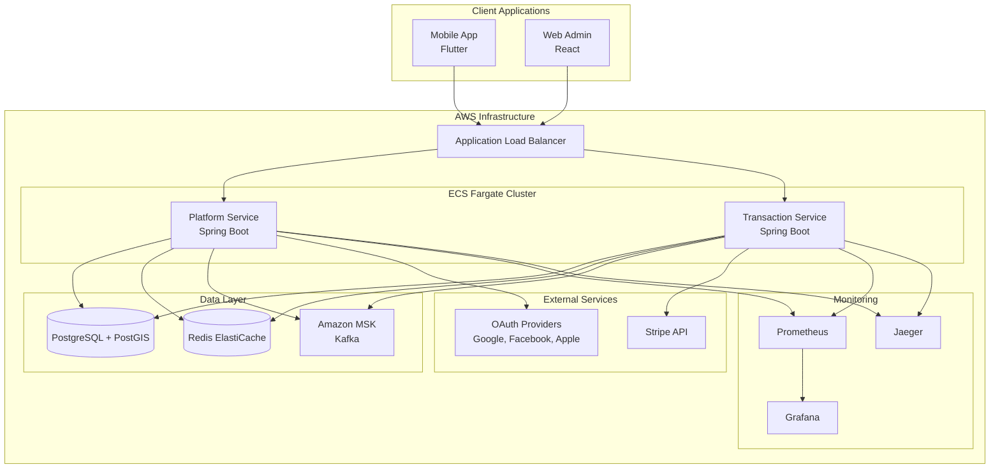

# Design Document: Court Booking Platform

## Overview

The court booking platform implements a microservices architecture using Spring Boot services deployed on AWS ECS Fargate. The system provides real-time court booking capabilities with conflict prevention, integrated payment processing, and comprehensive observability. The architecture separates concerns between platform management (authentication, fields) and transactional operations (bookings, payments) while maintaining data consistency through event-driven patterns and optimistic locking.

Key design principles:
- **Hybrid Sync/Async Architecture**: Synchronous operations for critical booking flows, asynchronous for notifications and analytics
- **Event-Driven Communication**: Amazon MSK (Kafka) for loose coupling between services
- **Optimistic Locking**: Prevents double bookings without blocking concurrent reads
- **Real-time Updates**: WebSocket connections for live availability changes
- **Geospatial Capabilities**: PostGIS for location-based field discovery
- **Comprehensive Observability**: OpenTelemetry integration across all services

## Architecture

### High-Level Architecture



### Service Boundaries

**Platform Service Responsibilities:**
- User authentication and authorization (OAuth integration)
- Field registration and management
- Geospatial queries for field discovery
- Availability management and caching
- Analytics and reporting
- Database schema management (Flyway migrations)

**Transaction Service Responsibilities:**
- Booking creation and management
- Payment processing (Stripe integration)
- Notification publishing and delivery
- Booking history and audit trails
- Revenue calculations and splits

### Communication Patterns

**Synchronous Communication:**
- Client → Platform Service: Authentication, field queries, availability checks
- Client → Transaction Service: Booking creation, payment processing
- Transaction Service → Platform Service: Field validation (via HTTP)
- Transaction Service → Stripe: Payment authorization and capture

**Asynchronous Communication:**
- Booking events: Transaction Service → MSK → Platform Service (cache updates)
- Notification events: Transaction Service → MSK → Notification handlers
- Analytics events: Both services → MSK → Analytics processors

## Components and Interfaces

### Platform Service Components

**Authentication Module:**
```java
@RestController
@RequestMapping("/api/auth")
public class AuthController {
    @PostMapping("/oauth/{provider}")
    public ResponseEntity<AuthResponse> authenticateOAuth(
        @PathVariable String provider,
        @RequestBody OAuthRequest request
    );
    
    @PostMapping("/refresh")
    public ResponseEntity<AuthResponse> refreshToken(
        @RequestBody RefreshTokenRequest request
    );
}

@Service
public class AuthService {
    public AuthResponse authenticateWithProvider(String provider, String code);
    public String generateJwtToken(User user);
    public boolean validateToken(String token);
}
```

**Field Management Module:**
```java
@RestController
@RequestMapping("/api/courts")
public class FieldController {
    @PostMapping
    public ResponseEntity<Field> createField(@RequestBody CreateFieldRequest request);
    
    @GetMapping("/search")
    public ResponseEntity<List<Field>> searchFields(
        @RequestParam Double latitude,
        @RequestParam Double longitude,
        @RequestParam Double radiusKm,
        @RequestParam(required = false) String fieldType
    );
    
    @GetMapping("/{courtId}/availability")
    public ResponseEntity<List<TimeSlot>> getAvailability(
        @PathVariable Long courtId,
        @RequestParam LocalDate startDate,
        @RequestParam LocalDate endDate
    );
}

@Service
public class FieldService {
    public Field createField(CreateFieldRequest request);
    public List<Field> findFieldsNearLocation(Double lat, Double lng, Double radius);
    public List<TimeSlot> getFieldAvailability(Long courtId, LocalDate start, LocalDate end);
}
```

**Geospatial Query Service:**
```java
@Repository
public class FieldRepository extends JpaRepository<Field, Long> {
    @Query(value = """
        SELECT f.*, ST_Distance(f.location, ST_SetSRID(ST_MakePoint(:longitude, :latitude), 4326)) as distance
        FROM fields f
        WHERE ST_DWithin(f.location, ST_SetSRID(ST_MakePoint(:longitude, :latitude), 4326), :radiusMeters)
        ORDER BY distance
        """, nativeQuery = true)
    List<Field> findFieldsWithinRadius(
        @Param("latitude") Double latitude,
        @Param("longitude") Double longitude,
        @Param("radiusMeters") Double radiusMeters
    );
}
```

### Transaction Service Components

**Booking Management Module:**
```java
@RestController
@RequestMapping("/api/bookings")
public class BookingController {
    @PostMapping
    public ResponseEntity<BookingResponse> createBooking(@RequestBody CreateBookingRequest request);
    
    @GetMapping("/user/{userId}")
    public ResponseEntity<List<Booking>> getUserBookings(@PathVariable Long userId);
    
    @PutMapping("/{bookingId}/cancel")
    public ResponseEntity<Void> cancelBooking(@PathVariable Long bookingId);
}

@Service
@Transactional
public class BookingService {
    public BookingResponse createBooking(CreateBookingRequest request);
    public void cancelBooking(Long bookingId);
    public List<Booking> getUserBookings(Long userId);
}
```

**Payment Processing Module:**
```java
@Service
public class PaymentService {
    public PaymentIntent createPaymentIntent(BigDecimal amount, String currency);
    public PaymentResult processPayment(String paymentIntentId);
    public void calculateRevenueSplit(Booking booking);
    public void processRefund(String paymentIntentId, BigDecimal amount);
}
```

**Event Publishing Module:**
```java
@Component
public class EventPublisher {
    @Autowired
    private KafkaTemplate<String, Object> kafkaTemplate;
    
    public void publishBookingCreated(BookingCreatedEvent event) {
        kafkaTemplate.send("booking-events", event);
    }
    
    public void publishNotificationRequest(NotificationEvent event) {
        kafkaTemplate.send("notification-events", event);
    }
}
```

### WebSocket Integration

**Real-time Availability Updates:**
```java
@Controller
public class AvailabilityWebSocketController {
    @MessageMapping("/field/{courtId}/subscribe")
    @SendTo("/topic/field/{courtId}/availability")
    public AvailabilityUpdate subscribeToFieldUpdates(@DestinationVariable Long courtId) {
        return availabilityService.getCurrentAvailability(courtId);
    }
}

@EventListener
public void handleBookingEvent(BookingCreatedEvent event) {
    AvailabilityUpdate update = createAvailabilityUpdate(event);
    messagingTemplate.convertAndSend(
        "/topic/field/" + event.getCourtId() + "/availability", 
        update
    );
}
```

## Data Models

### Core Entities

**User Entity:**
```java
@Entity
@Table(name = "users")
public class User {
    @Id
    @GeneratedValue(strategy = GenerationType.IDENTITY)
    private Long id;
    
    @Column(unique = true, nullable = false)
    private String email;
    
    @Enumerated(EnumType.STRING)
    private UserRole role; // FIELD_OWNER, CUSTOMER
    
    @OneToMany(mappedBy = "user")
    private List<OAuthProvider> oauthProviders;
    
    @CreationTimestamp
    private LocalDateTime createdAt;
    
    @UpdateTimestamp
    private LocalDateTime updatedAt;
}
```

**Field Entity:**
```java
@Entity
@Table(name = "fields")
public class Field {
    @Id
    @GeneratedValue(strategy = GenerationType.IDENTITY)
    private Long id;
    
    @Column(nullable = false)
    private String name;
    
    @Enumerated(EnumType.STRING)
    private FieldType fieldType; // TENNIS, PADEL, FOOTBALL_5X5
    
    @Column(columnDefinition = "geometry(Point,4326)")
    private Point location; // PostGIS geometry type
    
    @ManyToOne
    @JoinColumn(name = "owner_id")
    private User owner;
    
    @OneToMany(mappedBy = "field", cascade = CascadeType.ALL)
    private List<AvailabilityWindow> availabilityWindows;
    
    @Column(precision = 10, scale = 2)
    private BigDecimal basePrice;
    
    @Version
    private Long version; // For optimistic locking
}
```

**Booking Entity:**
```java
@Entity
@Table(name = "bookings")
public class Booking {
    @Id
    @GeneratedValue(strategy = GenerationType.IDENTITY)
    private Long id;
    
    @ManyToOne
    @JoinColumn(name = "court_id")
    private Field field;
    
    @ManyToOne
    @JoinColumn(name = "customer_id")
    private User customer;
    
    @Column(nullable = false)
    private LocalDateTime startTime;
    
    @Column(nullable = false)
    private LocalDateTime endTime;
    
    @Enumerated(EnumType.STRING)
    private BookingStatus status; // PENDING, CONFIRMED, CANCELLED
    
    @Column(precision = 10, scale = 2)
    private BigDecimal totalAmount;
    
    @Column(precision = 10, scale = 2)
    private BigDecimal platformFee;
    
    private String stripePaymentIntentId;
    
    @Version
    private Long version; // For optimistic locking
    
    @CreationTimestamp
    private LocalDateTime createdAt;
}
```

**Time Slot Availability:**
```java
@Entity
@Table(name = "availability_windows")
public class AvailabilityWindow {
    @Id
    @GeneratedValue(strategy = GenerationType.IDENTITY)
    private Long id;
    
    @ManyToOne
    @JoinColumn(name = "court_id")
    private Field field;
    
    @Enumerated(EnumType.STRING)
    private DayOfWeek dayOfWeek;
    
    @Column(nullable = false)
    private LocalTime startTime;
    
    @Column(nullable = false)
    private LocalTime endTime;
    
    @Column(precision = 10, scale = 2)
    private BigDecimal priceMultiplier; // For peak pricing
}
```

### Event Models

**Booking Events:**
```java
public class BookingCreatedEvent {
    private Long bookingId;
    private Long courtId;
    private Long customerId;
    private LocalDateTime startTime;
    private LocalDateTime endTime;
    private BigDecimal amount;
    private LocalDateTime timestamp;
}

public class BookingCancelledEvent {
    private Long bookingId;
    private Long courtId;
    private String reason;
    private LocalDateTime timestamp;
}
```

**Notification Events:**
```java
public class NotificationEvent {
    private Long userId;
    private NotificationType type; // EMAIL, PUSH, SMS
    private String subject;
    private String message;
    private Map<String, Object> templateData;
    private LocalDateTime scheduledFor;
}
```

### Database Schema Design

**Optimistic Locking Strategy:**
- All critical entities (Field, Booking, User) include version columns
- Booking creation uses version checking to prevent conflicts
- Failed optimistic locks trigger retry logic with exponential backoff

**Indexing Strategy:**
```sql
-- Geospatial index for location queries
CREATE INDEX idx_fields_location ON fields USING GIST (location);

-- Booking time range queries
CREATE INDEX idx_bookings_field_time ON bookings (court_id, start_time, end_time);

-- User booking history
CREATE INDEX idx_bookings_customer_created ON bookings (customer_id, created_at DESC);

-- Availability window queries
CREATE INDEX idx_availability_field_day ON availability_windows (court_id, day_of_week);
```

**Constraint Definitions:**
```sql
-- Prevent overlapping bookings for the same field
ALTER TABLE bookings ADD CONSTRAINT no_overlapping_bookings 
EXCLUDE USING gist (
    court_id WITH =,
    tsrange(start_time, end_time) WITH &&
) WHERE (status != 'CANCELLED');

-- Ensure booking times are valid
ALTER TABLE bookings ADD CONSTRAINT valid_booking_times 
CHECK (start_time < end_time);

-- Ensure availability windows are valid
ALTER TABLE availability_windows ADD CONSTRAINT valid_availability_times 
CHECK (start_time < end_time);
```

## Correctness Properties

*A property is a characteristic or behavior that should hold true across all valid executions of a system—essentially, a formal statement about what the system should do. Properties serve as the bridge between human-readable specifications and machine-verifiable correctness guarantees.*

### Property 1: OAuth Authentication Flow Integrity
*For any* OAuth provider and authentication request, successful authentication should result in a valid JWT token containing correct user role information and provider details.
**Validates: Requirements 1.1, 1.2, 1.3**

### Property 2: JWT Token Expiration Enforcement  
*For any* expired JWT token, all protected operations should be rejected and require re-authentication.
**Validates: Requirements 1.4**

### Property 3: Field Registration and Validation
*For any* field registration request with valid data, the system should store the field with correct geospatial coordinates and validate all type-specific attributes.
**Validates: Requirements 2.1, 2.3, 2.4**

### Property 4: Field Update Propagation
*For any* field information update, changes should be validated and propagated to all dependent services and caches.
**Validates: Requirements 2.2**

### Property 5: Availability Window Validation
*For any* set of availability windows for a field, overlapping time periods should be prevented and all time ranges should be valid.
**Validates: Requirements 2.5**

### Property 6: Geospatial Search Accuracy
*For any* location-based search with specified radius, all returned fields should be within the specified distance and include accurate distance calculations.
**Validates: Requirements 3.1, 3.2, 3.5**

### Property 7: Search Result Completeness
*For any* field search result, the response should include field coordinates, availability status, and all required field information for map rendering.
**Validates: Requirements 3.3, 3.4**

### Property 8: Real-time Availability Consistency
*For any* field availability request, all concurrent users should receive consistent availability information from cached data.
**Validates: Requirements 4.1, 4.3**

### Property 9: Availability Update Broadcasting
*For any* availability change event, WebSocket updates should be broadcast to all connected clients viewing the affected field.
**Validates: Requirements 4.2, 4.5**

### Property 10: Booking Process Temporary Locking
*For any* booking in progress, the requested time slot should be marked as temporarily unavailable until the booking process completes.
**Validates: Requirements 4.4**

### Property 11: Atomic Booking Creation with Conflict Prevention
*For any* booking request, the system should acquire optimistic locks, prevent concurrent bookings for the same time slot, and create bookings atomically with payment confirmation.
**Validates: Requirements 5.1, 5.2, 5.5**

### Property 12: Booking Conflict Detection and Rejection
*For any* conflicting booking attempt, the system should detect the conflict and reject the request with appropriate error messaging.
**Validates: Requirements 5.3**

### Property 13: Booking Completion Cleanup
*For any* completed booking, the system should release locks and publish booking events asynchronously.
**Validates: Requirements 5.4**

### Property 14: Payment Intent Creation and Processing
*For any* payment initiation, the system should create Stripe payment intents with correct booking amounts and confirm bookings before capturing payments.
**Validates: Requirements 6.1, 6.2**

### Property 15: Payment Failure Handling
*For any* failed payment, the system should release the reserved time slot and trigger customer notifications.
**Validates: Requirements 6.3**

### Property 16: Revenue Split Calculation
*For any* captured payment, the system should correctly calculate and record revenue splits between platform and field owner.
**Validates: Requirements 6.4**

### Property 17: Event-Driven Notification Publishing
*For any* booking confirmation, the system should publish notification events to Amazon MSK and deliver appropriate notifications based on user preferences.
**Validates: Requirements 7.1, 7.2, 7.5**

### Property 18: Scheduled Notification Delivery
*For any* booking with reminder requirements, the system should send automated reminders at the correct scheduled times.
**Validates: Requirements 7.3**

### Property 19: Notification Retry Logic
*For any* failed notification delivery, the system should implement exponential backoff retry logic.
**Validates: Requirements 7.4**

### Property 20: Booking History and Pagination
*For any* booking history request, the system should return correctly paginated booking records for the authenticated user with complete information.
**Validates: Requirements 8.1, 8.2**

### Property 21: Booking Lifecycle Management
*For any* booking modification or cancellation request, the system should validate availability, enforce policies, and process changes atomically.
**Validates: Requirements 8.3, 8.4**

### Property 22: Audit Trail Completeness
*For any* booking operation, the system should maintain complete audit trails with all necessary operation details.
**Validates: Requirements 8.5**

### Property 23: Analytics Data Aggregation
*For any* analytics request, the system should aggregate booking data correctly and calculate accurate performance metrics and revenue breakdowns.
**Validates: Requirements 9.1, 9.2**

### Property 24: Time-Based Analytics Accuracy
*For any* time-based analytics query, the system should show correct booking patterns and peak usage periods.
**Validates: Requirements 9.3**

### Property 25: Pricing Impact Analysis
*For any* pricing strategy evaluation, the system should accurately calculate and display revenue impact of different pricing configurations.
**Validates: Requirements 9.4**

### Property 26: Data Export Format Compliance
*For any* data export request, the system should generate reports in the requested standard formats (CSV, PDF) with complete data.
**Validates: Requirements 9.5**

### Property 27: OpenTelemetry Trace Generation
*For any* critical operation in either service, the system should emit appropriate OpenTelemetry traces with correct correlation information.
**Validates: Requirements 10.1, 10.2, 10.5**

### Property 28: Metrics Exposure and Error Logging
*For any* system operation, appropriate Prometheus metrics should be exposed and errors should generate structured logs with correlation IDs.
**Validates: Requirements 10.3, 10.4**

### Property 29: Database Migration Execution
*For any* service startup, Flyway migrations should execute successfully and maintain schema consistency with proper validation.
**Validates: Requirements 11.1, 11.2, 11.3**

### Property 30: Migration Rollback Support
*For any* rollback requirement, the system should support reversible migration scripts and maintain migration history.
**Validates: Requirements 11.4**

### Property 31: PostGIS Configuration Validation
*For any* system requiring geospatial capabilities, PostGIS extensions should be properly configured and functional.
**Validates: Requirements 11.5**

### Property 32: Cache Utilization and Refresh
*For any* frequently accessed data request, the system should serve from Redis cache when available and refresh from database when cache entries expire.
**Validates: Requirements 12.1, 12.2, 12.3**

### Property 33: Cache Invalidation Management
*For any* data change requiring cache updates, the system should remove stale entries and update dependent caches correctly.
**Validates: Requirements 12.4**

## Error Handling

### Exception Hierarchy

**Platform Service Exceptions:**
```java
public class PlatformServiceException extends RuntimeException {
    private final String errorCode;
    private final Map<String, Object> context;
}

public class AuthenticationException extends PlatformServiceException {
    // OAuth provider failures, token validation errors
}

public class FieldValidationException extends PlatformServiceException {
    // Field registration validation failures
}

public class GeospatialQueryException extends PlatformServiceException {
    // PostGIS query failures, coordinate validation errors
}
```

**Transaction Service Exceptions:**
```java
public class TransactionServiceException extends RuntimeException {
    private final String errorCode;
    private final Map<String, Object> context;
}

public class BookingConflictException extends TransactionServiceException {
    // Double booking attempts, optimistic lock failures
}

public class PaymentProcessingException extends TransactionServiceException {
    // Stripe API failures, payment validation errors
}

public class NotificationDeliveryException extends TransactionServiceException {
    // Push notification failures, email delivery errors
}
```

### Error Recovery Strategies

**Optimistic Lock Failures:**
```java
@Retryable(value = {OptimisticLockingFailureException.class}, 
           maxAttempts = 3, 
           backoff = @Backoff(delay = 100, multiplier = 2))
public BookingResponse createBooking(CreateBookingRequest request) {
    // Booking creation with retry logic
}
```

**Payment Processing Failures:**
```java
public class PaymentFailureHandler {
    public void handlePaymentFailure(PaymentProcessingException ex, Long bookingId) {
        // Release time slot reservation
        bookingService.releaseTimeSlot(bookingId);
        
        // Publish failure event for notifications
        eventPublisher.publishPaymentFailed(new PaymentFailedEvent(bookingId, ex.getMessage()));
        
        // Log structured error with correlation ID
        log.error("Payment processing failed", 
                 Map.of("bookingId", bookingId, 
                        "correlationId", MDC.get("correlationId"),
                        "error", ex.getMessage()));
    }
}
```

**External Service Failures:**
```java
@Component
public class ExternalServiceCircuitBreaker {
    
    @CircuitBreaker(name = "stripe-api", fallbackMethod = "fallbackPaymentProcessing")
    public PaymentResult processPayment(PaymentRequest request) {
        return stripeService.processPayment(request);
    }
    
    public PaymentResult fallbackPaymentProcessing(PaymentRequest request, Exception ex) {
        // Queue payment for retry processing
        paymentRetryQueue.enqueue(request);
        throw new PaymentProcessingException("Payment service temporarily unavailable");
    }
}
```

### Distributed Error Handling

**Event-Driven Error Recovery:**
```java
@KafkaListener(topics = "booking-events-dlq")
public void handleFailedBookingEvents(BookingEvent event) {
    try {
        // Attempt to reprocess failed event
        bookingEventProcessor.processEvent(event);
    } catch (Exception ex) {
        // Log failure and potentially move to manual review queue
        log.error("Failed to reprocess booking event after retry", 
                 Map.of("eventId", event.getId(), "error", ex.getMessage()));
    }
}
```

## Testing Strategy

### Dual Testing Approach

The system requires both unit testing and property-based testing for comprehensive coverage:

**Unit Tests:**
- Focus on specific examples, edge cases, and error conditions
- Test integration points between components
- Validate error handling and exception scenarios
- Test specific business logic implementations

**Property-Based Tests:**
- Verify universal properties across all inputs through randomization
- Test correctness properties defined in this design document
- Ensure system behavior holds for large input spaces
- Validate invariants and system constraints

### Property-Based Testing Configuration

**Framework Selection:**
- **Java**: Use jqwik library for property-based testing
- **Minimum 100 iterations** per property test due to randomization
- Each property test must reference its design document property
- Tag format: **Feature: court-booking-platform, Property {number}: {property_text}**

**Example Property Test Structure:**
```java
@Property
@Label("Feature: court-booking-platform, Property 11: Atomic Booking Creation with Conflict Prevention")
void atomicBookingCreationPreventsConflicts(
    @ForAll("validBookingRequests") CreateBookingRequest request1,
    @ForAll("validBookingRequests") CreateBookingRequest request2
) {
    // Arrange: Set up overlapping booking requests
    request2.setCourtId(request1.getCourtId());
    request2.setStartTime(request1.getStartTime());
    request2.setEndTime(request1.getEndTime());
    
    // Act: Attempt concurrent booking creation
    CompletableFuture<BookingResponse> booking1 = CompletableFuture.supplyAsync(
        () -> bookingService.createBooking(request1)
    );
    CompletableFuture<BookingResponse> booking2 = CompletableFuture.supplyAsync(
        () -> bookingService.createBooking(request2)
    );
    
    // Assert: Exactly one booking should succeed
    List<BookingResponse> results = Stream.of(booking1, booking2)
        .map(CompletableFuture::join)
        .filter(Objects::nonNull)
        .collect(Collectors.toList());
    
    assertThat(results).hasSize(1);
    assertThat(results.get(0).getStatus()).isEqualTo(BookingStatus.CONFIRMED);
}
```

**Test Data Generators:**
```java
@Provide
Arbitrary<CreateBookingRequest> validBookingRequests() {
    return Combinators.combine(
        Arbitraries.longs().between(1L, 1000L), // courtId
        Arbitraries.localDateTimes().between(
            LocalDateTime.now().plusHours(1),
            LocalDateTime.now().plusDays(30)
        ), // startTime
        Arbitraries.bigDecimals().between(
            BigDecimal.valueOf(10.00),
            BigDecimal.valueOf(200.00)
        ) // amount
    ).as((courtId, startTime, amount) -> {
        CreateBookingRequest request = new CreateBookingRequest();
        request.setCourtId(courtId);
        request.setStartTime(startTime);
        request.setEndTime(startTime.plusHours(1));
        request.setAmount(amount);
        return request;
    });
}
```

### Integration Testing Strategy

**Database Integration Tests:**
- Test PostGIS geospatial queries with real coordinate data
- Validate optimistic locking behavior under concurrent access
- Test Flyway migration execution and rollback scenarios

**Event-Driven Integration Tests:**
- Test Kafka event publishing and consumption
- Validate WebSocket real-time update delivery
- Test notification delivery across multiple channels

**External Service Integration Tests:**
- Test OAuth provider integration with mock responses
- Test Stripe payment processing with test API keys
- Test S3 file upload and retrieval operations

### Performance and Load Testing

**Booking Concurrency Tests:**
- Simulate high concurrent booking attempts for popular time slots
- Validate optimistic locking performance under load
- Test WebSocket connection scalability

**Geospatial Query Performance:**
- Test PostGIS query performance with large datasets
- Validate caching effectiveness for location-based searches
- Test index utilization for geospatial operations

**Cache Performance Tests:**
- Test Redis cache hit rates under various load patterns
- Validate cache invalidation performance
- Test cache warming strategies for frequently accessed data