```mermaid
graph TD
    START[App Launch] --> AUTH{Authenticated?}
    AUTH -->|No| LOGIN[Login Screen<br/>OAuth + Biometrics]
    AUTH -->|Yes| HOME[Home Screen<br/>Date & Time Selection]
    LOGIN --> TC{Terms Accepted?}
    TC -->|No| TERMS[Accept Terms & Conditions]
    TC -->|Yes| HOME
    TERMS --> HOME
    
    HOME --> WEATHER{Date within 7 days?}
    WEATHER -->|Yes| FORECAST[Show Weather Forecast<br/>Indoor/Outdoor Recommendation]
    WEATHER -->|No| NO_FORECAST[Forecast Not Yet Available]
    FORECAST --> MAP
    NO_FORECAST --> MAP
    
    MAP[Map View<br/>Court & Open Match Markers<br/>Type Tabs + Indoor/Outdoor Filter]
    
    MAP --> COURT_TAP{Tap Marker Type?}
    COURT_TAP -->|Court| PREVIEW[Court Preview Bottom Sheet<br/>Name Type Price Distance]
    COURT_TAP -->|Open Match| MATCH_PREVIEW[Match Preview<br/>Skill Level Players Cost]
    
    MATCH_PREVIEW --> JOIN_MATCH[Join Match Flow<br/>Pay Share]
    
    PREVIEW --> DETAILS[Court Details<br/>Images Ratings Amenities Slots]
    
    DETAILS --> SLOT{Slot Available?}
    SLOT -->|Available| CONFIRM[Booking Confirmation<br/>Duration People Open Match Split Pay Promo]
    SLOT -->|Fully Booked| WAITLIST[Join Waitlist]
    
    CONFIRM --> PAYMENT[Payment<br/>Stripe / Apple Pay / Google Pay]
    
    PAYMENT --> RESULT{Payment OK?}
    RESULT -->|No| RETRY[Error → Retry Payment]
    RETRY --> PAYMENT
    
    RESULT -->|Yes| MODE{Court Confirmation Mode?}
    MODE -->|Instant| SUCCESS[Booking Confirmed ✓<br/>Receipt + Calendar + Share]
    MODE -->|Manual| PENDING[Booking Pending ⏳<br/>Awaiting Owner Confirmation<br/>Push Notification on Decision]
    
    SUCCESS --> BOOKINGS[My Bookings Tab]
    PENDING --> BOOKINGS
    WAITLIST --> BOOKINGS
    JOIN_MATCH --> BOOKINGS
```

# Requirements Document

## Introduction

A comprehensive court booking platform that enables court owners to register and manage sports facilities (tennis, padel, basketball, 5x5 football) while allowing customers to discover, book, and pay for court reservations through mobile and web applications. The system implements a microservices architecture with real-time capabilities, geospatial queries, and robust payment processing.

## System Architecture Overview

### High-Level Architecture


### Service Responsibilities

**Platform Service (Spring Boot)**
- User authentication and authorization (OAuth integration with biometric support, JWT issuance with role-based claims, refresh token management)
- Role-based access control enforcement (CUSTOMER, COURT_OWNER, SUPPORT_AGENT, PLATFORM_ADMIN) per authorization matrix
- User registration with terms and conditions
- User account management (profile updates, account deletion, GDPR compliance)
- Player skill level management and matchmaking profiles
- Court registration, management, and deletion
- Court type configuration (duration, capacity, sport type, location type)
- Court owner verification and approval
- Court ratings and reviews
- Geospatial queries for court discovery
- Aggregated map API endpoint (courts + open matches + weather in single response)
- Availability management and caching
- Weather forecast integration and caching
- Dynamic pricing and promotional code management
- Analytics and revenue reporting (using read replica for heavy queries)
- Database schema management (Flyway migrations)
- Feature flag management (advertisements, premium features)
- Platform admin operations (user management, dispute escalation, platform-wide promo codes)
- Support ticket management (creation, assignment, responses, metrics)
- Multi-language content management
- Court owner subscription billing (Stripe Billing integration, trial management, tier upgrades/downgrades)

**Transaction Service (Spring Boot)**
- Customer booking creation and management
- Manual booking creation for court owners (via admin API)
- Recurring booking management
- Pending confirmation workflow
- Payment processing (Stripe integration, webhooks, disputes)
- Split payment management between players
- Booking modifications and cancellations
- Refund processing and tracking
- Notification publishing and delivery (push via FCM, in-app via WebSocket, email via SendGrid)
- WebSocket connection management backed by Redis Pub/Sub for horizontal scaling
- Open match management (creation, join requests, player coordination)
- Waitlist management (queue, auto-notify, slot holding)
- Scheduled job execution via Quartz Scheduler (timeouts, deadlines, reminders)
- Booking history and audit trails
- Revenue split calculations
- Invoice and receipt generation

**Health & Readiness (Both Services)**
- Both services expose Spring Boot Actuator endpoints for Kubernetes probes:
  - **Liveness probe**: `GET /actuator/health/liveness` — checks application is running (restarts pod if failing)
  - **Readiness probe**: `GET /actuator/health/readiness` — checks database connectivity, Redis connectivity, and Kafka broker availability (removes pod from load balancer if failing)
  - **Startup probe**: `GET /actuator/health` with 60-second initial delay — allows time for Flyway migrations and application warmup
- Custom health indicators for external dependencies: Stripe API reachability (Transaction Service), OAuth provider reachability (Platform Service), Weather API reachability (Platform Service)

### DigitalOcean Infrastructure Resources

**Compute Resources**
- **DOKS (Kubernetes)**: Managed Kubernetes cluster in Frankfurt (FRA1) region
- **Production Cluster**: Dedicated cluster with 3x 8GB RAM droplets, auto-scaling (3-6 nodes) to accommodate application pods, Istio sidecars, and observability stack
- **Dev/Test/Staging Cluster**: Shared cluster with namespace-based isolation, 2x 4GB RAM droplets with auto-scaling (2-4 nodes). Istio disabled in dev/test namespaces to conserve resources; enabled in staging namespace for pre-production validation
- **NGINX Ingress Controller**: Path-based routing with defined rules (`/api/auth/*`, `/api/courts/*`, `/api/users/*`, `/api/weather/*` → Platform Service; `/api/bookings/*`, `/api/payments/*`, `/api/notifications/*`, `/api/waitlist/*`, `/api/matches/*` → Transaction Service), SSL termination, rate limiting

**Data Storage**
- **Managed PostgreSQL with PostGIS**: 2GB RAM instance with automatic backups and read replica for analytics queries
  - **Backup Strategy**: Daily automated backups with 7-day retention, point-in-time recovery (PITR) enabled with 7-day window
  - **Recovery Targets**: Recovery Point Objective (RPO) = 1 hour (via WAL archiving), Recovery Time Objective (RTO) = 30 minutes (managed failover)
  - **Backup Testing**: Quarterly backup restoration tests to a temporary instance to validate data integrity
- **Managed Redis**: 2GB RAM instance with automatic failover (handles caching, waitlist queues, WebSocket session tracking, rate limiting, feature flags)
- **Spaces**: S3-compatible object storage with integrated CDN (250GB included)
- **Container Registry**: Private Docker image storage (5GB included)

**Event Streaming**
- **Upstash Kafka**: Serverless Kafka for MVP (pay-per-message, ~$10-30/month, zero operational overhead)
- Migration path to self-hosted Strimzi Kafka on Kubernetes when event volume justifies operational cost

**Networking & Security**
- **Load Balancer**: Automatic SSL/TLS with Let's Encrypt certificates
- **VPC**: Private networking between services
- **Firewall Rules**: Kubernetes network policies for service isolation
- **Secrets Management**: Application secrets (JWT signing key pair (RS256 private/public), Stripe API keys, Stripe webhook signing secrets (one per webhook endpoint — Transaction Service payments, Platform Service Connect/Billing), OAuth client secrets, database passwords, FCM server keys, SendGrid API keys, internal API key for service-to-service auth) stored as DigitalOcean environment variables or in a dedicated secrets store. Synced to Kubernetes via External Secrets Operator. For MVP, Kubernetes Sealed Secrets (encrypted in Git) are acceptable. Migration path to HashiCorp Vault when operational maturity justifies it.
- **Secret Rotation**: Database passwords and API keys should support rotation without service restart via External Secrets Operator refresh intervals

**Observability & Monitoring**
- **Prometheus**: Metrics collection and storage (self-hosted on production cluster; lightweight instance on shared cluster)
- **Grafana**: Visualization dashboards and alerting (self-hosted on production cluster). For MVP, consider Grafana Cloud free tier (50GB logs, 10k metrics series) to reduce cluster resource pressure
- **Jaeger**: Distributed tracing across microservices (self-hosted on production cluster; optional on shared cluster)
- **Loki**: Log aggregation and indexing (self-hosted on production cluster). For dev/test, DigitalOcean built-in monitoring + application log forwarding is sufficient
- **DigitalOcean Monitoring**: Built-in infrastructure metrics for all clusters
- **Resource Budget**: Observability stack should be allocated a dedicated node pool or resource quota (~4GB RAM, 2 CPU) on the production cluster to avoid competing with application pods

**DevOps & Deployment**
- **Terraform**: Infrastructure as Code for DigitalOcean resource provisioning. Terraform plan output posted as PR comment for review before apply.
- **GitHub Actions**: CI/CD pipeline with automated testing and progressive deployment
  - **PR Checks (gate for merge)**: Lint checks, compile, unit tests, property-based tests, integration tests, Flyway migration validation (`flyway validate` against temporary DB), container image vulnerability scan (Trivy)
  - **Image Tagging**: Git commit SHA for all builds; release candidate tags (`rc-v1.2.3`) after staging validation; final release tags (`v1.2.3`) on production deploy
  - **Progressive Deployment Pipeline**: merge to `develop` → auto-deploy to dev → auto-deploy to test → trigger QA functional regression (cross-repo via `repository_dispatch`) → if passed: auto-deploy to staging → smoke suite → stress suite → if passed: tag `rc-v1.2.3` → manual production deploy (promotes to `v1.2.3`)
  - **Cross-Repo QA Trigger**: Service repos trigger the `court-booking-qa` repo via GitHub Actions `repository_dispatch` events, passing deployed version, service name, and target environment as payload
  - **Terraform Review**: `terraform plan` output posted as PR comment; `terraform apply` requires manual approval for staging/production
- **Container Registry**: Private Docker registry integrated with DOKS
- **doctl CLI**: Command-line tool for DigitalOcean automation

**Local Development Environment**
- **Docker Compose**: Local infrastructure (PostgreSQL, Redis, Kafka) for development
- **Profile-based Configuration**: Spring profiles for local/dev/test/staging/prod environments
- **Remote Debugging**: IDE integration with cloud-hosted managed services
- **Hot Reload**: Spring Boot DevTools for rapid local development

### Communication Patterns

**Synchronous (REST APIs)**
- Client applications → NGINX Ingress (path-based routing) → Platform Service or Transaction Service
- **Routing Rules (NGINX Ingress):**
  - `/api/auth/*`, `/api/users/*`, `/api/courts/*`, `/api/weather/*`, `/api/analytics/*`, `/api/promo-codes/*`, `/api/feature-flags/*`, `/api/admin/*`, `/api/support/*` → Platform Service
  - `/api/bookings/*`, `/api/payments/*`, `/api/notifications/*`, `/api/waitlist/*`, `/api/matches/*`, `/api/split-payments/*` → Transaction Service
  - `/ws/*` (WebSocket upgrade) → Transaction Service
- **Auth token validation**: Both services validate JWT access tokens independently using a shared public key (RS256). NGINX Ingress performs initial token presence check; services perform full validation including signature verification, expiration check, and role-based authorization per the authorization matrix defined in Requirement 1. Token refresh is handled exclusively by Platform Service (`POST /api/auth/refresh`).
- Transaction Service → Platform Service (court validation, pricing rules, player skill levels) — internal HTTP calls within the cluster, bypassing ingress
- Transaction Service → Stripe (payment authorization and capture)
- Platform Service → OAuth Providers (authentication)
- Platform Service → Weather API (forecast data)

**Asynchronous (Kafka Events via Upstash)**
- Booking events: Transaction Service → Platform Service (cache invalidation, availability updates)
- Notification events: Transaction Service → FCM/SendGrid (push notifications, emails)
- Analytics events: Both services → Analytics processors
- Court/pricing updates: Platform Service → Transaction Service (pricing rule changes, court updates)
- Waitlist events: Transaction Service → Waitlist processor (cancellation triggers)
- Open match events: Transaction Service → Platform Service (match status updates for map display)
- **Partitioning Strategy:**
  - `booking-events` topic: partitioned by `courtId` to guarantee ordering per court (ensures availability updates are processed in sequence)
  - `notification-events` topic: partitioned by `userId` to guarantee notification ordering per user
  - `analytics-events` topic: partitioned by `courtId` for court-level aggregation
- **Latency Expectations**: Upstash Kafka operates over HTTPS, adding ~50-100ms latency per message compared to self-hosted. Availability updates should propagate to connected clients within 2 seconds of booking completion (see Requirement 19, criterion 11). If latency exceeds this threshold consistently, migrate to self-hosted Strimzi Kafka on Kubernetes.

**Real-time (WebSocket - Managed by Transaction Service, backed by Redis Pub/Sub)**
- Availability updates: Transaction Service → Connected clients (triggered by booking events)
- Booking status changes: Transaction Service → Court owners and customers
- In-app notifications: Transaction Service → Active app users
- Open match updates: Transaction Service → Players in match (join/leave events)
- Redis Pub/Sub enables horizontal WebSocket scaling across multiple Transaction Service pods
- **Connection Management:**
  - Maximum concurrent WebSocket connections per pod: 10,000 (configurable)
  - Heartbeat/ping interval: 30 seconds; connections closed after 2 missed heartbeats
  - Graceful shutdown: during rolling deployments, pods drain WebSocket connections with a 30-second grace period, sending reconnect signals to clients before termination
  - Clients implement automatic reconnection with exponential backoff (1s, 2s, 4s, max 30s)

**Scheduled Jobs (Quartz Scheduler in Transaction Service)**
- Pending booking confirmation timeouts (auto-cancel and refund)
- Split payment deadlines (charge booking creator for unpaid shares)
- Waitlist slot hold expiration (move to next in queue)
- Recurring booking creation (weekly advance scheduling)
- Booking reminders (pre-booking notifications)
- **Clustering**: Quartz SHALL use JDBC-based job store with `org.quartz.jobStore.isClustered=true` to ensure only one pod executes each scheduled job when running multiple Transaction Service replicas

**Database Ownership (Shared PostgreSQL, Separate Schemas)**
- Platform Service schema: users, oauth_providers, refresh_tokens, verification_requests, courts, availability_windows, availability_overrides, favorites, preferences, skill_levels, court_ratings ⏳, pricing_rules, special_date_pricing ⏳, cancellation_tiers, promo_codes ⏳, translations, feature_flags, support_tickets, support_messages, support_attachments, court_owner_audit_logs, reminder_rules, court_owner_notification_preferences, court_defaults
- Transaction Service schema: bookings, payments, audit_logs, notifications, device_tokens, waitlists ⏳, open_matches ⏳, match_players ⏳, match_join_requests ⏳, match_messages ⏳, split_payments ⏳, split_payment_shares ⏳, scheduled_jobs (Quartz)
- **Cross-schema access rule**: Transaction Service schema has read-only access to Platform Service schema through defined database views (e.g., `platform.v_court_summary`, `platform.v_user_basic`). This avoids HTTP round-trips for simple data lookups (receipt generation, booking display) while maintaining strict write ownership boundaries. Platform Service owns all write operations to its schema.
- Read replica used by Platform Service for analytics queries to avoid impacting booking performance

### Local Development Setup

**Docker Compose for Local Infrastructure:**
```yaml
# docker-compose.yml - Run locally for development
services:
  postgres:
    image: postgis/postgis:15-3.3
    ports: ["5432:5432"]
    environment:
      POSTGRES_DB: courtbooking
      POSTGRES_USER: dev
      POSTGRES_PASSWORD: dev
    volumes:
      - postgres_data:/var/lib/postgresql/data

  redis:
    image: redis:7-alpine
    ports: ["6379:6379"]

  kafka:
    image: confluentinc/cp-kafka:7.6.0
    ports: ["9092:9092"]
    environment:
      KAFKA_NODE_ID: 1
      KAFKA_PROCESS_ROLES: broker,controller
      KAFKA_LISTENERS: PLAINTEXT://0.0.0.0:9092,CONTROLLER://0.0.0.0:9093
      KAFKA_ADVERTISED_LISTENERS: PLAINTEXT://localhost:9092
      KAFKA_CONTROLLER_LISTENER_NAMES: CONTROLLER
      KAFKA_LISTENER_SECURITY_PROTOCOL_MAP: PLAINTEXT:PLAINTEXT,CONTROLLER:PLAINTEXT
      KAFKA_CONTROLLER_QUORUM_VOTERS: 1@kafka:9093
      KAFKA_OFFSETS_TOPIC_REPLICATION_FACTOR: 1
      CLUSTER_ID: "local-dev-cluster-id-001"
```

**Spring Boot Profile Configuration:**
- **local**: Uses Docker Compose services (PostgreSQL, Redis, Kafka)
- **dev**: Connects to DigitalOcean dev environment managed services
- **test**: Connects to DigitalOcean test environment managed services
- **staging**: Connects to DigitalOcean staging environment managed services
- **prod**: Full production configuration on Kubernetes

**Development Workflow:**
1. Run `docker-compose up` for local infrastructure
2. Run Spring Boot services locally with `local` profile
3. Debug in IDE (IntelliJ IDEA, VS Code) with breakpoints
4. Hot reload with Spring Boot DevTools for rapid iteration
5. Optional: Connect to cloud managed services for integration testing

### Repository Structure

The project uses a multi-repository architecture to enforce clear ownership boundaries and enable independent CI/CD pipelines:

**Application Repositories (GitHub)**
- **`court-booking-platform-service`**: Platform Service Spring Boot application (auth, users, courts, availability, analytics). Contains service code, unit tests, property-based tests (jqwik), Flyway migrations for the platform schema, and Dockerfile.
- **`court-booking-transaction-service`**: Transaction Service Spring Boot application (bookings, payments, notifications, waitlist, open matches). Contains service code, unit tests, property-based tests (jqwik), Flyway migrations for the transaction schema, and Dockerfile.
- **`court-booking-mobile-app`**: Flutter mobile application (iOS, Android, Web). Contains client code, widget tests, and integration tests.
- **`court-booking-admin-web`**: React admin web application (court owner portal). Contains client code, unit tests, and Playwright UI tests.
- **`court-booking-qa`**: QA test suite (pytest functional tests, Locust stress tests, contract tests). Independent from service repositories; tests APIs externally.

**Infrastructure Repository (GitHub)**
- **`court-booking-infrastructure`**: All Terraform code for DigitalOcean resource provisioning, organized by environment:
  - `modules/` — Reusable Terraform modules (DOKS cluster, managed PostgreSQL, managed Redis, Spaces, Load Balancer, VPC, DNS)
  - `environments/shared/` — Shared cluster configuration (dev/test/staging namespaces)
  - `environments/production/` — Production cluster configuration
  - `kubernetes/` — Kubernetes manifests, Helm charts, NGINX Ingress configuration, Istio configuration, namespace definitions
  - `scripts/` — Operational scripts (backup verification, secret rotation, cluster maintenance)
  - CI/CD: Terraform plan on PR, manual approval for apply. Separate GitHub Actions workflows per environment.

**Shared Libraries (optional, as needed)**
- **`court-booking-common`**: Shared Java library published to a private Maven repository (GitHub Packages). Contains shared DTOs, event schemas, exception types, and utility classes used by both services. Versioned independently with semantic versioning.

**Repository Conventions:**
- Each application repository has its own GitHub Actions CI/CD pipeline
- Docker images are tagged with Git commit SHA and pushed to DigitalOcean Container Registry
- Release candidate images tagged `rc-v1.2.3` after staging validation; promoted to `v1.2.3` on production deploy
- All repositories use semantic versioning (major.minor.patch) for releases
- Infrastructure changes require PR review with Terraform plan output before merge
- Branch strategy: `main` (production-ready), `develop` (integration), feature branches from `develop`, hotfix branches from `main`

**Branch Protection Rules (all repositories):**
- `main` branch: direct push forbidden; requires PR with at least 1 collaborator approval; requires passing CI checks (lint, unit tests, integration tests); merge via squash or merge commit
- `develop` branch: direct push forbidden; requires PR with at least 1 collaborator approval; requires passing CI checks (lint, unit tests, integration tests)
- Feature branches: created from `develop`, merged back to `develop` via PR
- Hotfix branches: created from `main` for critical production fixes; requires PR + approval; follows abbreviated pipeline (PR checks → merge to `main` → deploy to staging → smoke test → manual production deploy); must be back-merged to `develop` after production deploy

## Customer User Journey

### Overview
The customer booking journey is designed for simplicity and speed, allowing users to find and book courts in just a few taps.

### Journey Flow



### Detailed Step-by-Step Journey

**Step 1: Authentication**
- User opens mobile app
- If not authenticated: Login screen with OAuth options (Google, Facebook, Apple)
- Biometric authentication (fingerprint/face ID) for returning users — unlocks stored refresh token from device secure enclave, exchanges for new access token
- Terms and conditions acceptance for new users (must accept before proceeding)
- Role selection during first registration (CUSTOMER or COURT_OWNER)
- **Error cases:**
  - OAuth provider unavailable → show error with retry button and alternative provider options; do not block the login screen
  - Biometric unlock fails (wrong finger, face not recognized) → fall back to OAuth login screen after 3 failed attempts
  - Refresh token expired or revoked → redirect to OAuth login with "Session expired, please log in again" message
  - Network unavailable during login → show "No internet connection" banner with retry button; disable login buttons until connectivity is restored
  - Terms and conditions endpoint unreachable → show cached T&C version with "last updated" date; allow acceptance of cached version

**Step 2: Date & Time Selection**
- Prominent date picker (calendar view)
- Time range selector (start time and duration)
- Default duration based on most popular court type
- **Weather forecast preview** for selected date/time (temperature, rain probability, wind) — only shown for dates within 7-day forecast window
- **"Forecast not yet available"** message for dates beyond 7 days
- **Indoor/outdoor recommendation** based on weather conditions
- "Search Courts" button
- **Error cases:**
  - Weather API fails or times out (>3s) → show "Weather unavailable" placeholder with a retry icon; do not block the search flow
  - Date picker loads while offline → allow date/time selection from local state; weather section shows "Connect to see forecast"

**Step 3: Map View with Court Filters**
- Full-screen map centered on user's location
- **Weather forecast banner** showing conditions for selected date/time with indoor/outdoor recommendation
- Court markers color-coded by type
- **Open match markers** with "Join" badges showing available matches
- **Favorite courts highlighted with special icon/color**
- **Interactive map controls:**
  - Zoom in/out buttons or pinch gestures
  - Pan to explore different areas
  - Dynamic marker loading based on visible map bounds
  - Markers update as user zooms and pans
  - Distance filter slider (e.g., "Within 5km")
- Top tabs for filtering:
  - **All Courts** (default)
  - **Open Matches** 🤝 (matches seeking players)
  - **Favorites** ⭐ (if user has favorites)
  - **Tennis** 🎾
  - **Padel** 🏓
  - **Basketball** 🏀
  - **Football** ⚽
- Sub-filters: Indoor/Outdoor toggle
- Selecting a tab filters map markers in real-time
- Cluster markers for multiple courts in same area (expand on zoom)
- Current location button
- Search bar for location/address search
- Settings icon for personalization preferences
- **Loading & error cases:**
  - Initial map load → show shimmer/skeleton markers while court data loads; map tiles load independently from court data
  - Court search API fails → show "Couldn't load courts" banner with retry button; keep map tiles visible
  - Court search API slow (>2s) → show loading spinner overlay on markers area; cancel and re-request if user pans/zooms during load
  - Location permission denied → center map on default city (Athens) with prompt to enable location; show "Enable location for better results" banner
  - Location service unavailable → same as permission denied; allow manual location search via search bar
  - Poor connectivity (>5s response) → show cached court data from last successful load with "Showing cached results" indicator; auto-refresh when connectivity improves
  - Map tiles fail to load → show fallback list view of courts sorted by distance with "Map unavailable" message

**Step 4: Court Selection**
- User taps on court marker
- Bottom sheet slides up with court preview:
  - Court name and type
  - **Indoor/Outdoor badge**
  - Distance from user
  - Price per session (with dynamic pricing indicator if applicable)
  - Availability indicator (Available/Pending/Unavailable/Waitlist)
  - "View Details" button
- **Or user taps on open match marker:**
  - Match creator name and skill level
  - Court name and type
  - Players joined / spots remaining
  - Cost per player
  - "Join Match" button → triggers join request (auto-accept or manual approval)
- **Error cases:**
  - Bottom sheet data fails to load → show court name from marker cache with "Tap to retry" on details section
  - Court no longer exists (deleted between search and tap) → show "This court is no longer available" message and remove marker from map
  - Open match already full (race condition) → show "This match is now full" with option to join waitlist or find similar matches

**Step 5: Court Details**
- Full-screen court details:
  - Image carousel
  - Court name, type, and rating
  - **Indoor/Outdoor badge with weather forecast for outdoor courts**
  - **Favorite button (heart icon) to save court**
  - Address with "Get Directions" button
  - **Distance from user's current location**
  - **Court-specific settings:**
    - Session duration (e.g., "90 minutes")
    - Capacity (e.g., "4 people")
    - Price breakdown (with peak/off-peak indicators)
  - Amenities (parking, showers, equipment rental)
  - Owner information
  - **Reviews and ratings from other players**
  - Available time slots for selected date
  - **Waitlist indicator for fully booked slots** (if waitlist enabled by court owner)
  - **Cancellation policy summary** (e.g., "Full refund if cancelled 24h+ before")
  - "Book Now" button (or "Join Waitlist" if fully booked)
- **Loading & error cases:**
  - Court detail API slow → show skeleton layout with court name/type from preview cache; load images, ratings, and slots progressively
  - Court images fail to load → show placeholder image with court type icon; retry image load on scroll-into-view
  - Availability slots fail to load → show "Couldn't load availability" with retry button; keep rest of court details visible
  - Slot became unavailable between view and tap (race condition) → show "This slot was just booked" toast and refresh availability
  - Ratings/reviews fail to load → show "Reviews unavailable" placeholder; do not block booking flow

**Step 6: Booking Confirmation**
- Booking summary:
  - Court name and image
  - Selected date and time
  - Duration (auto-filled based on court type)
  - Number of people selector (max based on court capacity)
  - **Open match toggle** (make booking public for others to join)
    - If enabled: skill range selector for auto-accept
  - **Split payment option** (invite friends to share cost)
    - If enabled: invite players by username/email, show per-person cost
  - **Promo code field** (apply discount codes)
  - Total price calculation (with dynamic pricing and discounts shown)
  - Cancellation policy details
  - **Confirmation mode indicator** ("Instant confirmation" or "Requires owner approval")
- "Proceed to Payment" button
- **Error cases:**
  - Promo code validation fails (network error) → show "Couldn't validate code, try again" with retry; do not apply discount
  - Promo code invalid/expired → show specific reason: "Code expired", "Code already used", "Not valid for this court type"
  - Price changed between court detail view and confirmation (dynamic pricing update) → show "Price has been updated" alert with old and new price; require user to acknowledge before proceeding
  - Slot became unavailable during confirmation screen → show "This slot is no longer available" with option to pick another time or join waitlist

**Step 7: Payment**
- Stripe payment interface
- Saved payment methods
- Add new card option
- Apple Pay / Google Pay support
- "Confirm and Pay" button
- **Error cases:**
  - Card declined → show Stripe's decline reason (insufficient funds, expired card, etc.) with "Try another payment method" option
  - 3D Secure authentication fails → show "Authentication failed" with retry option; do not create booking
  - Network timeout during payment (>10s) → show "Payment is being processed, please wait..." spinner; do NOT allow duplicate submission; check payment status on reconnect
  - Stripe SDK fails to initialize → show "Payment system temporarily unavailable, please try again in a few minutes" with retry
  - Apple Pay / Google Pay not available on device → hide those options; show card entry only
  - Saved payment method expired → show "Your saved card has expired" with option to update or use a different method
  - Booking slot taken during payment (race condition) → cancel payment intent, show "This slot was just booked by another user" with option to pick another time

**Step 8: Booking Result**
- **If instant confirmation (court configured for instant):**
  - Success animation
  - Booking confirmation details
  - Digital receipt (also sent via email)
  - Add to calendar option
  - Share booking option
  - "View My Bookings" button
  
- **If pending confirmation (court configured for manual):**
  - Pending status message
  - "Your booking is awaiting owner confirmation"
  - Estimated confirmation time (based on court's timeout setting)
  - Payment held message
  - Push notification when confirmed/rejected
  - If timeout expires: automatic cancellation + full refund + notification

**Step 8a: Booking Error Recovery**
- **If payment succeeded but booking creation failed (server error after payment):**
  - Show "Your payment was received but we encountered an issue creating your booking. Our team has been notified and will resolve this within 1 hour. Your payment is safe."
  - Display booking reference (from payment intent) for support reference
  - Transaction Service reconciliation job (every 15 minutes) detects orphaned payments and auto-creates bookings or initiates refunds
  - Push notification sent when booking is created or refund is issued
- **If app crashes or closes during payment flow:**
  - On next app launch, check for pending/incomplete bookings via `GET /api/bookings?status=PENDING_PAYMENT`
  - If found: show "You have an incomplete booking" banner with resume or cancel options
  - If payment was captured but booking not confirmed: reconciliation job handles it (see above)

**Step 9: Post-Booking**
- Navigate to "My Bookings" tab
- View booking details (including recurring booking instances)
- Options to modify or cancel (with cancellation policy shown)
- Receive reminders before booking time
- Rate and review court after completed booking
- **Access to personalization settings:**
  - Manage favorite courts
  - Set preferred playing days/times
  - Configure maximum search distance
  - Notification preferences (booking events, favorites alerts, promotions)
  - Do-not-disturb hours configuration
  - **Help & Support access:**
    - Searchable FAQ / Help Center
    - Submit support ticket (with auto-attached booking context)
    - View existing tickets and conversation thread
    - Attach app diagnostic logs for technical issues

### Mobile App Error Handling and Connectivity Principles

The mobile app follows consistent error handling patterns across all screens:

**Network Error Handling:**
- **Transient failures (timeout, 5xx):** Show inline error banner with "Retry" button. Auto-retry GET requests once after 2 seconds. Never silently swallow errors.
- **Client errors (4xx):** Show specific, actionable error message from the API `message` field (localized). Do not auto-retry.
- **No internet connection:** Show persistent "No connection" banner at top of screen. Disable actions that require network (booking, payment, rating). Enable read-only browsing of cached data.
- **Connection restored:** Automatically dismiss "No connection" banner, refresh current screen data, and resume any queued operations (favorite toggles, preference saves).

**Latency Tolerance and Loading States:**
- **< 300ms:** No loading indicator shown (perceived as instant).
- **300ms – 2s:** Show subtle loading indicator (spinner on button, shimmer on content area). Content area shows skeleton placeholders matching the expected layout.
- **2s – 5s:** Show prominent loading overlay with "Loading..." text. For map view, show "Searching for courts..." message.
- **> 5s:** Show "This is taking longer than usual" message with cancel/retry option. For payment flows, show "Please wait, do not close the app" with progress indicator.
- **> 10s:** Auto-cancel the request (except payment flows). Show "Something went wrong" with retry button and "Contact Support" link.

**Offline Behavior:**
- **Cached data:** The app caches the last successful response for: court search results (map markers), court detail pages, user profile, user preferences, favorite courts list, and booking history. Cache is stored locally using SQLite/Hive with a 24-hour TTL.
- **Offline browsing:** Users can browse cached court details, view their booking history, and access favorite courts while offline. Stale data is indicated with "Last updated X minutes ago" label.
- **Offline-blocked actions:** Booking creation, payment, cancellation, rating submission, waitlist join, and match join require network connectivity. These buttons show a disabled state with "Requires internet" tooltip when offline.
- **Queued actions:** Favorite toggle and preference changes are queued locally and synced when connectivity returns. Queued actions show a "Pending sync" indicator.
- **WebSocket disconnection:** When the WebSocket connection drops, the app shows a subtle "Live updates paused" indicator. Availability data may be stale. On reconnect, the app fetches a full availability refresh for any court currently being viewed.

**Optimistic UI Updates:**
- **Favorite toggle:** Update UI immediately on tap; revert if server request fails with error toast.
- **Preference changes:** Apply locally immediately; sync to server in background; revert on failure.
- **Booking cancellation:** Show "Cancelling..." state immediately; confirm or revert based on server response.

**Payment Flow Resilience:**
- **Idempotency:** All booking creation requests include a client-generated idempotency key (UUID v4) to prevent duplicate bookings on retry.
- **Double-tap prevention:** "Confirm and Pay" button is disabled immediately on first tap and shows a spinner. Re-enabled only on explicit failure.
- **Background/kill during payment:** On next app launch, the app checks for in-flight payments and resolves them (see Step 8a).

**Error Message Localization:**
- All error messages from the API are returned in the user's preferred language (Greek or English) via the `Accept-Language` header.
- Client-side error messages (network errors, timeouts) are also localized.
- Error messages use friendly, non-technical language: "We couldn't complete your booking" instead of "HTTP 500 Internal Server Error".

**Rate Limiting (Client-Side):**
- The app respects `429 Too Many Requests` responses by reading the `Retry-After` header and disabling the action with a countdown timer.
- The app implements client-side request throttling: map pan/zoom debounces court search requests to max 1 request per 500ms; availability refresh is throttled to max 1 request per 5 seconds per court.

**Session Expiry:**
- When a `401 Unauthorized` response is received, the app attempts a silent token refresh using the stored refresh token.
- If the refresh also fails (expired/revoked), the app redirects to the login screen with "Your session has expired, please log in again" message.
- The app preserves the user's current navigation state (screen + scroll position) and restores it after successful re-authentication.

## Court Owner Admin Journey

### Overview
The court owner admin journey covers the complete lifecycle from registration through daily court management, designed for the React web admin portal. Court owners are the supply side of the platform — their experience must be frictionless, powerful, and trustworthy to drive adoption before the mobile app is promoted to customers.

### Journey Flow


### Detailed Step-by-Step Journey

**Step 1: Registration & Verification**
- Court owner opens admin web portal
- Registers via OAuth (Google, Facebook, Apple) with COURT_OWNER role
- Accepts terms and conditions
- Enters business information for verification:
  - Legal business name, tax ID (AFM for Greece), contact phone, business address
  - Business type (sole proprietor, company, association)
  - Proof of court ownership or lease (document upload, max 10MB PDF/image)
- Verification status: Pending → can set up courts but they remain hidden from customers
- Verification status: Approved → courts become publicly visible
- Verification status: Rejected → clear rejection reason displayed, option to re-submit with corrections
- **Error cases:**
  - OAuth provider unavailable → show error with retry option and alternative providers
  - Document upload fails → show file size/format requirements, allow retry without losing form data
  - Duplicate business registration detected → prompt to contact support with existing account reference

**Step 2: Stripe Connect Onboarding**
- Prominent banner: "Complete payment setup to accept customer bookings"
- Redirects to Stripe's hosted onboarding flow
- Identity verification (government ID, business details)
- Bank account linking for payouts
- Status tracking: Pending → Active → (Restricted if compliance issues)
- Until complete: manual bookings work, customer bookings blocked
- **Error cases:**
  - Stripe onboarding abandoned mid-flow → save progress, show "Resume Setup" button on next login
  - Identity verification fails → display Stripe's specific requirements, link to re-submit
  - Bank account verification fails → show clear instructions for IBAN format, allow retry
  - Stripe account restricted → display restriction reason from Stripe, link to resolution steps

**Step 3: Trial & Subscription**
- 30-day free trial starts on registration
- Trial banner shows remaining days with countdown
- When trial expires: prompt to subscribe (Basic/Pro tiers) with feature comparison
- If subscription lapses: read-only access to existing data, no new manual bookings, customer-facing courts remain visible
- **Error cases:**
  - Payment method declined during subscription → show decline reason, allow alternative payment method
  - Subscription webhook delayed → grace period of 7 days, show "Payment processing" status

**Step 4: Dashboard**
- Overview metrics: today's bookings, pending confirmations, revenue this month
- Quick actions: confirm pending bookings, create manual booking
- Notifications feed: new bookings, cancellations, payment disputes
- Payout status and next scheduled payout date
- **Smart reminder alerts:** configurable alerts for bookings that need attention (e.g., unpaid bookings approaching their date)
- **Action required badges:** count of items needing attention (pending confirmations, unpaid bookings, expiring promos)

**Step 5: Court Management**
- **Add Court:**
  - Court name and description (multi-language: Greek + English)
  - Court type selection (Tennis, Padel, Basketball, 5x5 Football)
  - Location type (Indoor/Outdoor)
  - Address with map pin for geospatial coordinates
  - Image upload (validated formats: JPEG, PNG, WebP; max 5MB per image, max 10 images per court)
  - Booking duration (override type default or use standard)
  - Maximum capacity (override type default or use standard)
  - Base price setting
  - Booking confirmation mode (Instant / Manual)
  - Waitlist enabled/disabled
  - **Error cases:**
    - Invalid address / geocoding fails → show map for manual pin placement
    - Image upload fails → show format/size requirements, allow retry without losing other form data
    - Duplicate court name for same owner → warn but allow (courts distinguished by address)
- **Edit Court:** Update any field, with validation that changes don't break existing bookings
  - **Error cases:**
    - Reducing capacity below existing booking's player count → block change, show affected bookings
    - Changing duration with existing future bookings → warn, require confirmation, notify affected customers
- **Remove Court:** Only allowed if no future confirmed bookings exist
  - **Error cases:**
    - Court has future bookings → show list of affected bookings, require cancellation first
    - Court has pending payouts → block deletion until payouts settle
- **Availability Management:**
  - Recurring weekly schedule (e.g., Mon-Fri 8:00-22:00, Sat-Sun 9:00-20:00)
  - Manual date/time overrides for maintenance, holidays, private events
  - Visual calendar showing availability windows and existing bookings
  - **Bulk availability update:** apply schedule changes to multiple courts at once
- **Bulk Operations (Power-User):**
  - Select multiple courts → apply pricing changes, availability windows, or policy updates in one action
  - Bulk enable/disable courts (e.g., seasonal closure)
  - Copy settings from one court to another

**Step 6: Booking Management**
- **Calendar View:** Daily/weekly/monthly view of all bookings across all courts
  - Color-coded by status: Confirmed (green), Pending (yellow), Cancelled (red), Manual (blue), Unpaid (orange)
  - Filter by court, court type, status, payment status
  - **Export calendar** to iCal format for external calendar integration
- **Pending Bookings Queue:**
  - List of bookings awaiting confirmation (for courts in "manual" mode)
  - Customer details, requested time, payment held amount
  - Confirm or Reject buttons with optional message to customer
  - Countdown timer showing time until auto-cancellation
  - **Bulk confirm/reject** for multiple pending bookings
- **Manual Booking Creation:**
  - Select court and time slot
  - Optional customer name/phone/email for records
  - No payment processing — just blocks the slot
  - Same conflict prevention as customer bookings
  - **Recurring manual booking** option (weekly repeat)
- **Booking Details:** Full view with customer info, payment status, audit trail
  - Complete history of all status changes with timestamps and actor
  - Payment timeline: authorized → captured → transferred → paid out
- **Smart Reminder Notifications:**
  - Dashboard widget showing bookings that match reminder rules
  - Example: "Court A booked for Saturday, not paid, 3 days away — check if still valid"
  - One-click actions: contact customer (email compose or click-to-call), cancel booking, mark as paid, extend deadline

**Step 7: Pricing & Policies**
- **Dynamic Pricing:**
  - Configure peak/off-peak multipliers by day of week and time of day
  - Special pricing for holidays and events
  - Preview how pricing affects displayed prices
  - **Bulk pricing:** apply same pricing rules to multiple courts
- **Cancellation Policy:**
  - Configure time-based refund tiers (e.g., 24h+ = 100%, 12-24h = 50%, <12h = 0%)
  - Platform fee always non-refundable (shown as info)
  - Default policy applied if not configured
- **Promotional Codes:**
  - Create codes with discount type (% or fixed), validity period, usage limits
  - Track usage and redemption analytics
  - Applicable court type restrictions
  - **Duplicate/clone** existing promo codes with modifications

**Step 8: Analytics & Revenue**
- **Revenue Dashboard:**
  - Total earnings, platform fees deducted, net payouts
  - Payout history and schedule (daily/weekly/monthly via Stripe Connect)
  - Revenue breakdown by court and court type
  - **Comparison periods:** this month vs last month, this year vs last year
- **Usage Analytics:**
  - Booking patterns: peak hours, busiest days
  - Occupancy rates per court
  - Customer demographics and repeat booking rates
  - **No-show tracking:** bookings where customers didn't appear (manual flag by court owner)
- **Export:** Download reports in CSV or PDF format
  - **Scheduled reports:** configure automatic weekly/monthly email reports

**Step 9: Personal Settings**
- **Profile & Business Information:**
  - Display name, business name, tax ID, contact phone, business address
  - Profile photo / business logo upload
  - Linked OAuth providers management (add/remove)
  - Language preference (Greek / English)
- **Notification Preferences:**
  - Channel preferences per event type (email, push, in-app):
    - New booking received
    - Booking cancelled
    - Pending booking awaiting confirmation
    - Payment received / payout completed
    - Payment dispute opened
    - Reminder check alerts (see below)
    - Subscription billing events
  - Do-not-disturb hours (e.g., 23:00-07:00)
  - Email digest option: receive daily summary instead of individual emails
- **Reminder Check Rules (Configurable Smart Alerts):**
  - Court owners can create custom reminder rules for proactive booking management
  - Each rule defines: trigger condition, notification timing, and action suggestions
  - **Default rule (pre-configured, editable):** "If a booking is not paid X days before the event, send me a reminder Y hours before that threshold"
  - **Configurable parameters per rule:**
    - Days before event threshold (e.g., 3 days)
    - Hours before threshold to send reminder (e.g., 10 hours)
    - Which courts the rule applies to (all courts, or specific courts)
    - Notification channels for this rule (push, email, in-app)
    - Active/inactive toggle per rule
  - **Example scenario:** Court booked for Saturday 10:00. Rule: "unpaid 3 days before → remind 10 hours before threshold." Wednesday 10:00 is 3 days before. Reminder fires Tuesday 00:00 (10 hours before Wednesday 10:00): "Court A is booked for Saturday 10:00 and not paid. 3 days until event. Check if still valid."
  - **Additional rule templates:**
    - "Pending confirmation not acted on for X hours" → reminder
    - "Manual booking with no customer contact info for X days" → reminder
    - "Court with no bookings for next X days" → suggestion to create promo
  - Maximum 10 active rules per court owner
- **Court Defaults:**
  - Default booking duration, capacity, confirmation mode, cancellation policy for new courts
  - Default availability template (apply to new courts automatically)
- **Security & Privacy:**
  - Active sessions list with device info, last activity, and "Revoke" button
  - Two-factor authentication option (TOTP via authenticator app)
  - Data export request (GDPR: download all personal data as JSON/CSV)
  - Account deletion request with clear consequences explained
  - Audit log of all security-sensitive actions (login, password change, session revocation)
- **Keyboard Shortcuts (Power-User):**
  - Quick navigation shortcuts displayed in settings
  - `Ctrl+N` → new manual booking, `Ctrl+K` → search bookings, `Ctrl+Shift+C` → calendar view
- **Help & Support access:**
  - Searchable FAQ / Help Center
  - Submit support ticket (with auto-attached Stripe/subscription context)
  - Dedicated "Payout Issues" category
  - View existing tickets and conversation thread

### Admin UI Error Handling Principles

The admin web portal follows consistent error handling patterns:
- **Form validation:** Inline field-level validation with clear error messages. Never lose user input on validation failure.
- **Network errors:** Toast notification with retry option. Auto-retry for idempotent operations (GET requests) with exponential backoff.
- **Concurrent edit conflicts:** If another session modified the same resource, show a diff and let the court owner choose which version to keep.
- **Session expiry:** Redirect to login with "session expired" message. Preserve the current URL for redirect after re-authentication.
- **Rate limiting:** Show "Too many requests, please wait" with countdown timer. Never silently drop user actions.
- **Partial failures in bulk operations:** Show per-item success/failure status. Allow retry of failed items only.

### Admin UI Security Principles

- **Personal data masking:** Customer phone numbers and emails are partially masked in booking lists (e.g., `+30 69** *** *45`, `k***@gmail.com`). Full details visible only in booking detail view with audit log entry.
- **Session timeout:** Auto-logout after 30 minutes of inactivity with warning at 25 minutes.
- **Audit trail:** Every court owner action (create, update, delete, confirm, reject, export) is logged with timestamp, actor, IP address, and before/after values for data changes.
- **Data export controls:** Revenue and customer data exports are logged and rate-limited (max 10 exports per day).
- **Role isolation:** Court owners can only see and manage their own courts, bookings, and data. No cross-owner data leakage.

### Court Owner Audit Log

Every action performed by a court owner in the admin portal is recorded in an immutable audit log:

| Field | Description |
|-------|-------------|
| `timestamp` | ISO 8601 timestamp of the action |
| `actorId` | Court owner's user ID |
| `actorIp` | IP address of the request |
| `action` | Action type (e.g., `COURT_CREATED`, `BOOKING_CONFIRMED`, `PRICING_UPDATED`, `DATA_EXPORTED`) |
| `resourceType` | Entity type (e.g., `COURT`, `BOOKING`, `PROMO_CODE`, `SETTING`) |
| `resourceId` | ID of the affected entity |
| `before` | JSON snapshot of the entity before the change (null for creates) |
| `after` | JSON snapshot of the entity after the change (null for deletes) |
| `metadata` | Additional context (e.g., rejection reason, export format) |

- Court owners can view their own audit log in the admin portal (read-only, filterable by date range, action type, resource type)
- Platform admins can view audit logs for any court owner
- Audit logs are retained for 2 years and are immutable (no edit or delete)

## Glossary

- **Platform_Service**: Spring Boot microservice handling authentication, user management, and court management
- **Transaction_Service**: Spring Boot microservice handling booking management, payment processing, and notifications
- **Court_Owner**: User who owns and manages sports courts on the platform. Has sub-states: unverified/verified, Stripe connected/not connected, trial/subscribed/expired
- **Customer**: User who books and pays for court reservations
- **Platform_Admin**: Administrative user with platform-wide privileges (user management, dispute escalation, platform promo codes, feature flags). Not self-registerable
- **Support_Agent**: Read-only support role with access to security alerts, support tickets, and user activity. Cannot modify security configuration or manage users. Created by PLATFORM_ADMIN only
- **Court**: Sports facility (tennis court, padel court, basketball court, or 5x5 football court) available for booking
- **Court_Type**: Category of court with specific attributes (duration, capacity, sport type)
- **Court_Location_Type**: Attribute indicating if a court is in an open space (outdoor) or closed area (indoor)
- **Weather_Forecast**: Real-time weather prediction for the selected booking date and time
- **Booking**: Reservation of a court for a specific time slot
- **Manual_Booking**: Booking created by court owner through admin interface without payment processing
- **Time_Slot**: Specific date and time period when a court can be booked
- **Booking_Duration**: Configurable time length for court reservations (e.g., 60 mins, 90 mins)
- **Court_Capacity**: Maximum number of people allowed per booking (configurable per court type)
- **Payment_Authorization**: Initial payment validation before booking confirmation
- **Booking_Conflict**: Situation where multiple users attempt to book the same time slot
- **Availability_Window**: Time period when a court is available for booking
- **Revenue_Split**: Distribution of payment between platform and court owner
- **Geospatial_Query**: Location-based search using PostGIS extension
- **Real_Time_Update**: Immediate propagation of availability changes via WebSocket
- **Async_Operation**: Background processing via Kafka event streaming
- **Sync_Operation**: Immediate processing requiring direct response
- **PENDING_CONFIRMATION**: Booking status when court owner confirmation is required
- **Confirmation_Timeout**: Configured time period for court owner to confirm pending bookings
- **Cancellation_Policy**: Court owner-defined rules for refund calculations based on cancellation timing
- **Terms_and_Conditions**: Legal agreement users must accept during registration
- **Structured_Logs**: JSON-formatted logs with consistent fields including trace IDs, span IDs, user IDs, and contextual information
- **Trace_ID**: A unique identifier (W3C Trace Context format) that follows a single user request across all services, Kafka events, and external calls for end-to-end traceability
- **Span_ID**: A unique identifier for a single operation within a trace (e.g., one HTTP call, one database query)
- **W3C_Trace_Context**: Industry standard for propagating trace context across services via the `traceparent` HTTP header
- **OpenTelemetry**: Vendor-neutral observability framework for generating, collecting, and exporting traces, metrics, and logs
- **Log_Indexing**: Process of organizing logs for efficient searching and filtering
- **Alert_Threshold**: Configurable criteria that trigger administrator notifications
- **Device_Registration_Token**: Unique identifier for a user's mobile device used for push notifications (FCM for Android, APNs for iOS)
- **Push_Notification**: Notification sent to a user's device when the app is closed or in background
- **In_App_Notification**: Real-time notification delivered via WebSocket when the app is active
- **DOKS**: DigitalOcean Kubernetes Service - managed Kubernetes cluster
- **Spaces**: DigitalOcean's S3-compatible object storage service with integrated CDN
- **Droplet**: DigitalOcean virtual machine instance
- **NGINX_Ingress**: Kubernetes ingress controller for routing and load balancing
- **Docker_Compose**: Tool for defining and running multi-container Docker applications locally
- **Spring_Profile**: Configuration profile for different environments (local, dev, prod)
- **Hot_Reload**: Automatic application restart on code changes during development
- **Biometric_Authentication**: Fingerprint or face recognition for mobile app login
- **Court_Filter**: Tab-based filtering of courts by type on the map interface
- **User_Journey**: Step-by-step flow of customer interactions from search to booking confirmation
- **Favorite_Court**: Court marked by customer for quick access and priority in search results
- **Preferred_Time**: Customer's saved default days and times for court searches
- **Search_Distance**: Maximum radius from customer's location for court discovery
- **Map_Bounds**: Visible geographic area on the map that determines which courts are loaded
- **Dynamic_Loading**: Real-time loading of court markers as the user zooms and pans the map
- **Recurring_Booking**: Repeated booking of the same court at the same time on a weekly basis
- **Booking_Window**: Maximum number of days in advance a booking can be made
- **Minimum_Notice**: Minimum time before court start time that a booking can be created
- **Payment_Dispute**: Chargeback or dispute initiated by a customer through their payment provider
- **Digital_Receipt**: Automatically generated payment confirmation document with booking and transaction details
- **Account_Deletion**: GDPR-compliant process of removing user data and anonymizing records
- **Court_Rating**: Customer-submitted score and review for a court after a completed booking
- **Court_Verification**: Approval process for new court owners before their courts become publicly visible
- **Do_Not_Disturb**: User-configured quiet hours during which non-urgent notifications are queued
- **Open_Match**: A booking created by a player seeking other players to join and share the court
- **Player_Skill_Level**: Self-declared or verified skill rating (1-7 scale) used for matchmaking
- **Split_Payment**: Feature allowing booking cost to be divided among multiple players
- **Waitlist**: Queue of customers waiting for a fully booked time slot to become available
- **Promo_Code**: Discount code created by court owners or platform for promotional pricing
- **Dynamic_Pricing**: Automatic price adjustment based on peak/off-peak hours and demand
- **Functional_Test**: External API test that validates end-to-end business workflows
- **Stress_Test**: Performance test that validates system behavior under high load
- **UI_Test**: Automated test that validates user interface behavior and interactions
- **Test_Environment**: Isolated environment for running QA tests without affecting production
- **Istio**: Service mesh providing traffic management, security, and observability for microservices
- **Service_Mesh**: Infrastructure layer that handles service-to-service communication
- **Pod_Replica**: Instance of a containerized service running in Kubernetes
- **Environment_Promotion**: Process of deploying code from one environment to the next (dev → test → staging → production)
- **Advertisement**: Promotional content displayed to users within the application
- **Feature_Flag**: Configuration toggle that enables or disables specific features without code deployment
- **Ad_Placement**: Designated location within the UI where advertisements can be displayed
- **Ad_Provider**: Third-party service that supplies advertisement content (e.g., Google AdMob, Facebook Audience Network)
- **Stripe_Connect**: Stripe's platform for marketplace payments, enabling court owners to receive payouts directly to their bank accounts
- **Stripe_Connect_Express**: A Stripe Connect account type where Stripe hosts the onboarding flow for identity verification and bank account linking
- **Booking_Confirmation_Mode**: Court-level setting that determines whether bookings are confirmed instantly or require manual court owner approval
- **Cancellation_Policy_Tier**: A time-based refund rule specifying a threshold (hours before booking) and corresponding refund percentage
- **Trial_Period**: Free access period granted to new court owners for full platform features including manual booking management
- **Reminder_Check_Rule**: Court owner-configurable rule that triggers proactive notifications about bookings needing attention (e.g., unpaid bookings approaching their date)
- **Audit_Trail**: Immutable log of all court owner actions with timestamps, actor, IP, and before/after state snapshots for accountability and dispute resolution
- **Bulk_Operation**: Admin action applied to multiple courts or bookings simultaneously (e.g., bulk pricing update, bulk confirm/reject)
- **Personal_Data_Masking**: Partial redaction of customer PII (phone, email) in list views to protect privacy; full data accessible only in detail views with audit logging
- **Court_Defaults**: Court owner-configured default settings (duration, capacity, policies) automatically applied when creating new courts
- **Verification_Request**: Court owner submission of business documents for platform review, tracked through states: PENDING_REVIEW → APPROVED / REJECTED
- **No_Show**: A completed booking where the customer did not appear, manually flagged by the court owner within 24 hours after the booking's scheduled end time
- **Web_Push**: Browser-based push notifications (W3C Push API with VAPID keys) used to deliver notifications to court owners via the admin web portal when the browser is closed
- **Paid_Externally**: Status flag on manual bookings indicating the court owner received offline payment (cash, bank transfer), clearing unpaid booking reminder triggers
- **Notification_Urgency_Level**: Classification of notifications as CRITICAL (always immediate), STANDARD (respects quiet hours), or PROMOTIONAL (respects opt-out)
- **Access_Token**: Short-lived JWT (15 minutes) containing user identity and role claims, validated independently by both services using a shared public key (RS256)
- **Refresh_Token**: Long-lived token (30 days) stored server-side, used to obtain new access tokens without re-authentication. Rotated on each use with replay detection
- **Authorization_Matrix**: Role-to-operation mapping that defines which actions each role (CUSTOMER, COURT_OWNER, SUPPORT_AGENT, PLATFORM_ADMIN) can perform
- **Secure_Enclave**: Device-level secure storage (iOS Keychain / Android Keystore) used to store refresh tokens for biometric authentication
- **Service_To_Service_Auth**: Authentication between Platform Service and Transaction Service — mTLS via Istio in staging/production, shared API key in dev/test
- **OpenAPI_Specification**: Formal REST API contract (OpenAPI 3.1) defining endpoints, request/response schemas, authentication, and error responses for each service
- **Contract_First_Development**: Development approach where API specifications are defined and agreed upon before implementation begins
- **API_Code_Generation**: Automated generation of client SDKs (Dart for Flutter, TypeScript for React) from OpenAPI specification files
- **Support_Ticket**: User-submitted issue report with category, description, attachments, and context metadata, tracked through a lifecycle (OPEN → IN_PROGRESS → RESOLVED → CLOSED)
- **Diagnostic_Log**: Sanitized app logs (network requests, errors, navigation events) collected from the mobile device and attached to support tickets for debugging
- **Support_Hub**: In-app and admin portal interface providing FAQ, ticket submission, and ticket tracking
- **Platform_Commission**: Percentage-based fee (default 10%) deducted from each customer booking payment before transferring the court owner's share via Stripe Connect
- **Stripe_Customer**: Stripe object created for each platform user on first payment, used to store saved payment methods and track payment history
- **Stripe_SetupIntent**: Stripe API object used to securely save a customer's payment method for future use without an immediate charge
- **PaymentIntent_Capture_Method**: Stripe configuration determining whether payment is captured immediately (`automatic`) or held for later capture (`manual`/authorize-then-capture)
- **Authorization_Hold**: Temporary hold on a customer's payment method for the booking amount, used in manual confirmation mode. Expires after 7 days per Stripe's policy
- **Destination_Charge**: Stripe Connect payment pattern where the platform creates a PaymentIntent with `transfer_data.destination` set to the court owner's connected account, automatically splitting funds at capture time
- **Application_Fee_Amount**: The platform commission amount specified on a Stripe PaymentIntent, automatically retained by the platform when funds are transferred to the court owner's connected account
- **Split_Payment_Status**: Per-player tracking state in a split-payment booking: INVITED → PAYMENT_PENDING → PAID / EXPIRED / REFUNDED / DISPUTED
- **Stripe_Billing**: Stripe's subscription management product used for court owner subscription billing (separate from customer booking payments)
- **Subscription_Grace_Period**: 7-day window after a failed subscription payment during which the court owner retains full access before being restricted to expired status
- **Euro_Cents**: Integer representation of EUR amounts (e.g., €25.50 = 2550) used throughout the API, database, and Stripe calls to avoid floating-point rounding issues
- **Idempotency_Key**: Client-generated UUID included with state-changing API requests to prevent duplicate operations on retry (e.g., duplicate bookings, duplicate payments)
- **Optimistic_UI_Update**: UI pattern where the interface updates immediately on user action before server confirmation, reverting if the server request fails
- **Skeleton_UI**: Placeholder layout (shimmer effect) shown while content is loading, matching the expected content structure to reduce perceived latency
- **Exponential_Backoff**: Retry strategy where wait time doubles between attempts (e.g., 1s, 2s, 4s, 8s) to avoid overwhelming a recovering server
- **Thundering_Herd**: Problem where many clients reconnect simultaneously after an outage; mitigated by adding random jitter to reconnection delays
- **Offline_Queue**: Local queue of pending user actions (favorites, preferences) that are synced to the server when connectivity is restored
- **Cache_TTL**: Time-to-live for locally cached data; after expiration, data is considered stale and refreshed on next access
- **Silent_Token_Refresh**: Transparent background refresh of an expired access token using the stored refresh token, without interrupting the user's current action
- **Request_Debounce**: Client-side technique that delays sending a request until user input stabilizes (e.g., waiting 500ms after last map pan before searching)
- **Partial_Failure**: API response where some parts succeed and others fail (e.g., `207 Multi-Status` for recurring bookings with some date conflicts)

## Phase Roadmap

### MVP (Phase 1)

The MVP delivers the core booking platform: court owners register and manage courts, customers discover and book courts with payments via Stripe Connect, real-time availability, notifications, and the admin portal. Recurring bookings and configurable reminder rules are included in MVP.

### Phase 2 (Post-MVP)

The following features are fully specified in this document but excluded from MVP implementation. The architecture and data models should accommodate these features to avoid breaking changes when they are introduced.

| # | Feature | Requirements | Rationale for Deferral |
|---|---------|-------------|----------------------|
| 1 | Split payments | Req 25 | Complex payment orchestration; core booking works without it |
| 2 | Open match join/create | Req 24 | Matchmaking adds significant complexity; needs user base first |
| 3 | Dynamic pricing configuration | Req 27.7–27.11 | Court owners can set a flat price for MVP; demand-based pricing needs usage data |
| 4 | Promo code management | Req 27.1–27.6 | Marketing tool; not needed until customer acquisition phase |
| 5 | Advertisement system | Req 23 | Already feature-flagged; needs user traffic to monetize |
| 6 | Waitlist | Req 26 | Courts won't be fully booked in early days |
| 7 | Court ownership transfer | Req 2.29–2.32 | Rare edge case for early platform |
| 8 | Scheduled reports | Req 15.6–15.9 | Court owners can check dashboard manually |
| 9 | Court ratings and reviews | Req 2.19–2.20 | Needs booking volume before reviews are meaningful |
| 10 | 2FA / TOTP | Req 15a.14–15a.17 | OAuth provides sufficient security for MVP |
| 11 | Keyboard shortcuts | Req 15a.21–15a.22 | Power-user polish; not essential for launch |
| 12 | Court owner subscription billing | Req 9a | Free access for MVP to drive adoption; monetize later |

**Phase 2 implementation notes:**
- All Phase 2 requirements remain in this document as the specification for future work
- Database schemas should include placeholder columns/tables where needed to avoid migrations that alter existing tables
- API versioning (Req 29.13–29.14) supports adding Phase 2 endpoints without breaking existing clients
- Kafka event contracts already include events for Phase 2 features (match-events, waitlist-events, analytics promo events) — consumers should ignore unknown event types gracefully

**Subscription stub strategy (Phases 1–9, before Phase 10 implements Req 9a):**
- All court owners are treated as having an active subscription. The `subscription_status` column defaults to `'ACTIVE'` and the `subscriptionStatus` JWT claim is set to `ACTIVE` for every COURT_OWNER.
- No subscription checks are enforced. Manual bookings, court visibility, and all admin features work without restriction regardless of subscription state.
- Trial banners, trial countdown UI, subscription tier selection, and Stripe Billing integration are NOT implemented until Phase 10.
- The "Trial Active" and "Trial Expired / No Subscription" court owner sub-states described in Requirement 1 are effectively bypassed — all court owners behave as "Subscribed" until Phase 10.
- When Phase 10 lands, the hardcoded `ACTIVE` default is replaced with real trial/billing logic: `TRIAL` on registration with `trial_ends_at` set 30 days out, Stripe Billing webhooks updating status, and enforcement of expired-state restrictions.

## Requirements

### Requirement 1: User Registration, Authentication, Authorization, and Account Management

**User Story:** As a new user, I want to register and authenticate using OAuth providers and biometrics, and manage my account including deletion, so that I can access the platform securely and maintain control over my personal data.

#### Roles and Permissions

The platform defines four roles with distinct permission boundaries:

| Role | Description | Granted Via |
|------|-------------|-------------|
| **CUSTOMER** | Books courts, joins matches, manages personal bookings | Self-registration with role selection |
| **COURT_OWNER** | Manages courts, availability, pricing, manual bookings, analytics | Self-registration with role selection + verification |
| **SUPPORT_AGENT** | Views/responds to support tickets, views user activity for diagnosis, views security alerts (read-only). Cannot manage feature flags, users, system config, or security actions | Assigned by PLATFORM_ADMIN via admin user management |
| **PLATFORM_ADMIN** | Platform-wide operations: user management, dispute escalation, platform promo codes, feature flags, system configuration, security management | Seeded in database or assigned by another PLATFORM_ADMIN — not self-registerable |

**Court Owner Sub-States** (affect available operations within the COURT_OWNER role):
- **Unverified**: Can set up courts (hidden from customers), access admin dashboard. Cannot have courts publicly visible.
- **Verified**: Courts become publicly visible. Full admin features available.
- **Stripe Not Connected**: Manual bookings work. Customer bookings blocked (courts not bookable by customers).
- **Stripe Connected**: Full payment flow enabled.
- **Trial Active**: Full feature access with trial banner. ⏳ Phase 2 — until Phase 10, all court owners default to ACTIVE (see subscription stub strategy above).
- **Trial Expired / No Subscription**: Read-only access to existing data. No new manual bookings. ⏳ Phase 2 — not enforced until Phase 10.

#### Authorization Matrix

| Operation | CUSTOMER | COURT_OWNER | SUPPORT_AGENT | PLATFORM_ADMIN |
|-----------|----------|-------------|---------------|----------------|
| Register / Login | ✓ | ✓ | ✓ | ✓ |
| Book a court | ✓ | ✗ | ✗ | ✗ |
| Join open match | ✓ | ✗ | ✗ | ✗ |
| Create open match | ✓ | ✗ | ✗ | ✗ |
| Join waitlist | ✓ | ✗ | ✗ | ✗ |
| View/manage own bookings | ✓ | ✗ | ✗ | ✗ |
| Rate/review courts | ✓ | ✗ | ✗ | ✗ |
| Manage favorites/preferences | ✓ | ✗ | ✗ | ✗ |
| Create/edit/remove courts | ✗ | ✓ (own courts) | ✗ | ✗ |
| Configure availability/pricing | ✗ | ✓ (own courts) | ✗ | ✗ |
| Bulk court operations | ✗ | ✓ (own courts) | ✗ | ✗ |
| Create manual bookings | ✗ | ✓ (own courts, active subscription) | ✗ | ✗ |
| Confirm/reject pending bookings | ✗ | ✓ (own courts) | ✗ | ✗ |
| Bulk confirm/reject bookings | ✗ | ✓ (own courts) | ✗ | ✗ |
| View analytics/revenue | ✗ | ✓ (own courts) | ✗ | ✓ (platform-wide) |
| Export data (CSV/PDF) | ✗ | ✓ (own courts, rate-limited) | ✗ | ✓ (platform-wide) |
| Create court-level promo codes | ✗ | ✓ (own courts) | ✗ | ✗ |
| Create platform-wide promo codes | ✗ | ✗ | ✗ | ✓ |
| Manage personal settings | ✓ (own) | ✓ (own) | ✓ (own) | ✓ (own) |
| Configure reminder rules | ✗ | ✓ (own rules) | ✗ | ✗ |
| View own audit log | ✗ | ✓ (own actions) | ✗ | ✗ |
| View any audit log | ✗ | ✗ | ✗ | ✓ |
| Manage feature flags | ✗ | ✗ | ✗ | ✓ |
| Manage users (suspend/unsuspend) | ✗ | ✗ | ✗ | ✓ |
| Review verification requests | ✗ | ✗ | ✗ | ✓ |
| Handle escalated disputes | ✗ | ✗ | ✗ | ✓ |
| View system health/observability | ✗ | ✗ | ✗ | ✓ |
| Configure platform settings | ✗ | ✗ | ✗ | ✓ |
| Submit support tickets | ✓ | ✓ | ✗ | ✗ |
| View own support tickets | ✓ | ✓ | ✗ | ✗ |
| View/respond to all support tickets | ✗ | ✗ | ✓ | ✓ |
| View security alerts dashboard | ✗ | ✗ | ✓ (read-only) | ✓ |
| Manage security settings (IP blocks, thresholds) | ✗ | ✗ | ✗ | ✓ |

#### JWT Token Structure

WHEN authentication is complete, THE Platform_Service SHALL issue a JWT access token containing the following claims:
- `sub`: User ID (UUID)
- `role`: One of `CUSTOMER`, `COURT_OWNER`, `SUPPORT_AGENT`, `PLATFORM_ADMIN`
- `email`: User's email address
- `verified`: Boolean — court owner verification status (only for COURT_OWNER)
- `stripeConnected`: Boolean — Stripe Connect onboarding status (only for COURT_OWNER)
- `subscriptionStatus`: One of `TRIAL`, `ACTIVE`, `EXPIRED`, `NONE` (only for COURT_OWNER)
- `iat`: Issued at timestamp
- `exp`: Expiration timestamp

#### Token Lifecycle

- **Access token lifetime**: 15 minutes (short-lived, stateless validation)
- **Refresh token lifetime**: 30 days (stored server-side, rotated on each use)
- **Refresh token rotation**: Each refresh request issues a new refresh token and invalidates the previous one. If a previously-invalidated refresh token is used (replay detection), ALL refresh tokens for that user are revoked, forcing re-authentication.
- **Token refresh endpoint**: `POST /api/auth/refresh` — accepts refresh token, returns new access + refresh token pair
- **Logout**: Revokes all refresh tokens for the user's current device

#### Biometric Authentication

WHEN a mobile user enables biometric authentication, THE Platform_Service SHALL issue a long-lived refresh token that is stored in the device's secure enclave (iOS Keychain / Android Keystore) — not the user's actual credentials. Biometric unlock (fingerprint/face ID) gates access to this stored refresh token, which is then exchanged for a new access token via the standard refresh flow.

#### Service-to-Service Authentication

Internal HTTP calls between Platform Service and Transaction Service (within the Kubernetes cluster) SHALL use one of the following mechanisms:
- **With Istio (staging/production)**: Mutual TLS (mTLS) via Istio sidecar proxies provides automatic service identity verification. No additional auth headers needed.
- **Without Istio (dev/test)**: A shared internal API key passed via `X-Internal-Api-Key` header, rotated via the secrets management pipeline. Internal endpoints are not exposed through NGINX Ingress.

#### Acceptance Criteria

1. WHEN a user initiates registration, THE Platform_Service SHALL offer OAuth registration options (Google, Facebook, Apple ID)
2. WHEN a user registers via OAuth, THE Platform_Service SHALL create a new user profile with provider information and selected role (CUSTOMER or COURT_OWNER)
3. WHEN registration is initiated, THE Platform_Service SHALL present terms and conditions that must be accepted before account creation
4. WHEN terms and conditions are not accepted, THE Platform_Service SHALL prevent account creation and registration completion
5. WHEN a user selects OAuth login, THE Platform_Service SHALL redirect to the selected provider (Google, Facebook, Apple ID)
6. WHEN OAuth authentication succeeds, THE Platform_Service SHALL create or update the user profile with provider information
7. WHEN authentication is complete, THE Platform_Service SHALL issue a JWT access token (15-minute lifetime) and a refresh token (30-day lifetime, stored server-side) with role-based claims as defined in the JWT Token Structure above
8. WHEN a JWT access token expires, THE client SHALL use the refresh token to obtain a new access token without requiring the user to re-authenticate. WHEN the refresh token is also expired or revoked, THE Platform_Service SHALL require full re-authentication
9. WHERE a user has multiple OAuth providers linked, THE Platform_Service SHALL allow login through any linked provider
10. WHEN a mobile user enables biometric authentication, THE Platform_Service SHALL issue a refresh token stored in the device's secure enclave (iOS Keychain / Android Keystore), gated by biometric unlock — not the user's actual credentials
11. WHEN a returning mobile user opens the app, THE Platform_Service SHALL offer biometric authentication (fingerprint or face recognition) as a login option
12. WHEN biometric authentication succeeds, THE Platform_Service SHALL use the stored refresh token to obtain a new access token without requiring OAuth flow
13. WHEN a user requests account deletion, THE Platform_Service SHALL process the request in compliance with GDPR right to be forgotten
14. WHEN account deletion is requested, THE Platform_Service SHALL cancel all future bookings, process refunds, and anonymize personal data
15. WHEN a court owner requests account deletion, THE Platform_Service SHALL validate that all future bookings are resolved before allowing deletion
16. WHEN account deletion is processed, THE Platform_Service SHALL anonymize the user's personal data in historical records (bookings, reviews, payments) while preserving the records themselves for analytics and audit trail integrity
17. WHEN a court owner's account is deleted, THE Platform_Service SHALL retain anonymized court and revenue data for platform analytics and reassign or archive courts as appropriate
18. THE Platform_Service SHALL limit concurrent active sessions to a configurable maximum (default: 5 devices) tracked via refresh tokens
19. WHEN the concurrent session limit is exceeded, THE Platform_Service SHALL invalidate the oldest session's refresh token
20. THE Platform_Service SHALL implement rate limiting on authentication endpoints to prevent brute force attacks
21. WHEN an OAuth provider becomes unavailable, THE Platform_Service SHALL allow users to link an alternative provider for account recovery
22. THE Platform_Service SHALL support user profile updates including name, email, phone number, and notification preferences
23. THE PLATFORM_ADMIN role SHALL NOT be self-registerable. Platform admin accounts are seeded in the database or created by an existing PLATFORM_ADMIN
24. WHEN any API request is received, THE Platform_Service and Transaction_Service SHALL validate the JWT access token, extract the role claim, and enforce the authorization matrix before processing the request
25. WHEN a COURT_OWNER attempts an operation requiring active subscription (e.g., manual booking creation), THE Platform_Service SHALL check the `subscriptionStatus` claim and reject the request if expired
26. WHEN a COURT_OWNER's courts are accessed for customer booking, THE Transaction_Service SHALL verify `stripeConnected` status and reject customer bookings if Stripe Connect is not active

### Requirement 2: Court Registration and Management with Type Configuration

**User Story:** As a court owner, I want to register and manage my sports courts with flexible configuration for duration, capacity, location type, and availability, so that customers can book them according to my specific requirements and make informed decisions based on indoor/outdoor preferences.

#### Acceptance Criteria

1. WHEN a court owner registers a new court, THE Platform_Service SHALL validate court information and store it with geospatial coordinates.
   - **Input:** `{ name: string, description: { el: string, en: string }, courtType: enum(TENNIS|PADEL|BASKETBALL|FOOTBALL_5X5), locationType: enum(INDOOR|OUTDOOR), address: string, latitude: number, longitude: number, bookingDurationMinutes: number, maxCapacity: number, basePriceCents: number, confirmationMode: enum(INSTANT|MANUAL), waitlistEnabled: boolean, images: File[] }`
   - **Output (success):** `201 Created` with `{ courtId: UUID, status: "HIDDEN"|"VISIBLE", createdAt: ISO8601 }`
   - **Output (validation error):** `400 Bad Request` with `{ errors: [{ field: string, message: string }] }`
   - **Output (unauthorized/unverified):** `403 Forbidden` with `{ error: "COURT_OWNER_NOT_VERIFIED" }` (court is created but hidden)
2. WHEN a court owner adds multiple courts, THE Platform_Service SHALL support adding courts of the same or different types (tennis, padel, basketball, 5x5 football)
3. WHEN a court owner configures a court, THE Platform_Service SHALL require selection of location type (indoor or outdoor)
4. WHEN a court owner configures a court type, THE Platform_Service SHALL allow setting default booking duration (e.g., 60 minutes, 90 minutes, 120 minutes)
5. WHEN a court owner configures a court type, THE Platform_Service SHALL allow setting maximum capacity (number of people allowed per booking)
6. WHEN a court owner configures court-specific settings, THE Platform_Service SHALL allow overriding default type settings for individual courts
7. WHEN a court owner removes a court, THE Platform_Service SHALL validate that no future confirmed bookings exist before allowing deletion
   - **Input:** `DELETE /api/courts/{courtId}`
   - **Output (success):** `204 No Content`
   - **Output (has future bookings):** `409 Conflict` with `{ error: "COURT_HAS_FUTURE_BOOKINGS", bookingCount: number, nextBookingDate: ISO8601 }`
   - **Output (has pending payouts):** `409 Conflict` with `{ error: "COURT_HAS_PENDING_PAYOUTS", pendingAmount: number }`
8. WHEN court information is updated, THE Platform_Service SHALL validate changes and propagate updates to all dependent services
   - **Input:** `PUT /api/courts/{courtId}` with partial update body (same fields as create, all optional). Includes `version: number` for optimistic locking.
   - **Output (success):** `200 OK` with updated court object including new `version` number
   - **Output (conflict):** `409 Conflict` with `{ error: "CONCURRENT_MODIFICATION", currentVersion: number }` when version mismatch
   - **Output (affects bookings):** `422 Unprocessable Entity` with `{ error: "CHANGE_AFFECTS_BOOKINGS", affectedBookings: [{ bookingId, date, impact: string }], requiresConfirmation: true }` — client must re-submit with `{ confirmed: true }` to proceed
9. THE Platform_Service SHALL support multiple court types (tennis, padel, basketball, 5x5 football) with type-specific attributes
10. WHEN court images are uploaded, THE Platform_Service SHALL store them in Spaces and validate file formats and sizes
11. WHEN availability windows are configured, THE Platform_Service SHALL provide an intuitive interface for setting recurring availability patterns (daily, weekly, custom)
12. WHEN availability windows are configured, THE Platform_Service SHALL validate time ranges and prevent overlapping unavailable periods
13. WHEN a court owner needs to block specific dates or times, THE Platform_Service SHALL allow manual availability overrides for maintenance or private events
14. WHEN court type defaults are defined, THE Platform_Service SHALL include standard configurations (e.g., Padel: 90 mins, 4 people; Basketball: 60 mins, 10 people)
15. WHEN a new court owner registers, THE Platform_Service SHALL require a verification process before courts become publicly visible
16. WHEN court owner verification is pending, THE Platform_Service SHALL allow court setup but restrict public visibility
17. WHEN court type settings are changed, THE Platform_Service SHALL validate that existing future bookings are not affected or notify affected customers
18. THE Platform_Service SHALL support court ownership transfer to another verified court owner account
19. ⏳ **PHASE 2** — THE Platform_Service SHALL allow customers to rate and review courts after completed bookings
20. ⏳ **PHASE 2** — THE Platform_Service SHALL display average ratings and recent reviews on court detail pages

**Court Owner Verification Process:**
21. WHEN a court owner submits verification documents (business name, tax ID, proof of court ownership/lease), THE Platform_Service SHALL create a verification request with status `PENDING_REVIEW` and notify PLATFORM_ADMIN users
   - **Input:** `{ businessName: string, taxId: string, businessType: enum(SOLE_PROPRIETOR|COMPANY|ASSOCIATION), businessAddress: string, proofDocument: File (PDF/JPEG/PNG, max 10MB) }`
   - **Output (success):** `201 Created` with `{ verificationRequestId: UUID, status: "PENDING_REVIEW", submittedAt: ISO8601 }`
   - **Output (already pending):** `409 Conflict` with `{ error: "VERIFICATION_ALREADY_PENDING", existingRequestId: UUID }`
22. THE Platform_Service SHALL provide PLATFORM_ADMIN users with a verification queue showing all pending verification requests, sortable by submission date
23. WHEN a PLATFORM_ADMIN reviews a verification request, THE Platform_Service SHALL allow approval or rejection with a mandatory reason field (rejection reason is displayed to the court owner)
   - **Approve Input:** `POST /api/admin/verifications/{requestId}/approve` with `{ notes?: string }`
   - **Approve Output:** `200 OK` with `{ requestId: UUID, status: "APPROVED", courtOwnerId: UUID, approvedAt: ISO8601 }`
   - **Reject Input:** `POST /api/admin/verifications/{requestId}/reject` with `{ reason: string }` (required)
   - **Reject Output:** `200 OK` with `{ requestId: UUID, status: "REJECTED", reason: string, rejectedAt: ISO8601 }`
24. WHEN a verification request is approved, THE Platform_Service SHALL update the court owner's `verified` status to `true`, refresh the JWT claim on next token refresh, and make all their courts publicly visible
25. WHEN a verification request is rejected, THE Platform_Service SHALL notify the court owner via email and in-app notification with the rejection reason and a "Re-submit" option
26. WHEN a court owner re-submits after rejection, THE Platform_Service SHALL create a new verification request linked to the previous one so the reviewer can see the history
27. THE Platform_Service SHALL target a verification turnaround SLA of 48 hours from submission. WHEN a verification request has been pending for more than 48 hours, THE Platform_Service SHALL send a reminder notification to PLATFORM_ADMIN users
28. WHEN a court owner updates business information that was part of the original verification (business name, tax ID, business address), THE Platform_Service SHALL flag the profile for re-verification review without revoking current verified status — courts remain visible during re-review

**Court Ownership Transfer:** ⏳ PHASE 2
29. WHEN a court owner initiates a transfer of court ownership, THE Platform_Service SHALL require the target account to be a verified court owner with active Stripe Connect
   - **Initiate Input:** `POST /api/courts/{courtId}/transfer` with `{ targetOwnerEmail: string }`
   - **Initiate Output (success):** `200 OK` with `{ transferId: UUID, status: "PENDING_TARGET_CONFIRMATION", targetOwnerEmail: string(masked), expiresAt: ISO8601 }`
   - **Initiate Output (invalid target):** `422 Unprocessable Entity` with `{ error: "TARGET_NOT_ELIGIBLE", reason: "NOT_VERIFIED"|"STRIPE_NOT_CONNECTED"|"USER_NOT_FOUND" }`
   - **Confirm Input (by target):** `POST /api/courts/transfers/{transferId}/confirm`
   - **Confirm Output:** `200 OK` with `{ transferId: UUID, status: "COMPLETED", courtId: UUID, newOwnerId: UUID }`
30. WHEN court ownership is transferred, THE Platform_Service SHALL reassign all future bookings to the new owner's Stripe Connect account for payout purposes, transfer all court configuration and availability settings, and record the transfer in both owners' audit logs
31. WHEN court ownership is transferred, THE Platform_Service SHALL NOT transfer the original owner's subscription, analytics history, or personal settings — only the court entity and its future bookings
32. THE Platform_Service SHALL require both the source and target court owners to confirm the transfer before it is executed

### Requirement 3: Location-Based Court Discovery

**User Story:** As a customer, I want to discover courts near my location, so that I can find convenient booking options.

#### Acceptance Criteria

1. WHEN a customer searches by location, THE Platform_Service SHALL execute geospatial queries using PostGIS to find nearby courts
2. WHEN search results are returned, THE Platform_Service SHALL include distance calculations and court availability status
3. WHEN map integration is requested, THE Platform_Service SHALL provide court coordinates for map rendering
4. WHERE search filters are applied, THE Platform_Service SHALL combine geospatial and attribute-based filtering
5. WHEN search radius is specified, THE Platform_Service SHALL limit results to courts within the specified distance
6. WHEN the court search API returns zero results for the user's location and filters, THE Platform_Service SHALL return an empty results array with a `suggestion` field: `{ courts: [], suggestion: "EXPAND_RADIUS" | "REMOVE_FILTERS" | "TRY_DIFFERENT_DATE" }` so the mobile app can show actionable guidance (e.g., "No courts found within 5km — try expanding your search")
7. WHEN the aggregated map endpoint (`GET /api/courts/map`) partially fails (e.g., courts load but weather or open matches fail), THE Platform_Service SHALL return the successful data with `null` for failed sections and include a `warnings` array: `{ courts: [...], openMatches: null, weather: null, warnings: ["WEATHER_UNAVAILABLE", "MATCHES_UNAVAILABLE"] }` so the mobile app can render partial results with appropriate placeholders
8. WHEN the court search request includes invalid coordinates (outside valid lat/lng range), THE Platform_Service SHALL return `400 Bad Request` with `{ error: "INVALID_COORDINATES", message: "Latitude must be between -90 and 90, longitude between -180 and 180" }`

### Requirement 4: Customer Search and Booking User Journey

**User Story:** As a customer, I want an intuitive search and booking experience with date/time selection, weather forecast display, map-based court discovery with type and location filters, zoom controls, and personalized settings, so that I can quickly find and reserve courts that match my preferences and weather conditions.

#### Acceptance Criteria

1. WHEN a customer opens the mobile app, THE Platform_Service SHALL present a date and time range selector as the primary interface
2. WHEN a customer selects a date and time range, THE Platform_Service SHALL fetch and display weather forecast for the selected date and time
3. WHEN weather forecast is displayed, THE Platform_Service SHALL show temperature, precipitation probability, wind conditions, and weather icon
4. WHEN a customer views the weather forecast, THE Platform_Service SHALL provide visual indicators suggesting indoor or outdoor court suitability
5. WHEN a customer initiates search, THE Platform_Service SHALL display a map view centered on the customer's current location with court markers
6. WHEN the map view is displayed, THE Platform_Service SHALL show court type filter tabs at the top (All, Tennis, Padel, Basketball, Football)
7. WHEN the map view is displayed, THE Platform_Service SHALL provide location type filters (All, Indoor, Outdoor)
8. WHEN a customer selects a court type tab, THE Platform_Service SHALL filter map markers in real-time to show only courts of the selected type
9. WHEN a customer selects a location type filter, THE Platform_Service SHALL filter map markers to show only indoor or outdoor courts
10. WHEN a customer zooms in or out on the map, THE Platform_Service SHALL dynamically load and display courts within the visible map bounds
11. WHEN a customer pans the map to explore different areas, THE Platform_Service SHALL update court markers based on the new visible region
12. WHEN multiple courts exist in close proximity, THE Platform_Service SHALL cluster markers and expand clusters when the user zooms in
13. WHEN a customer taps a court marker, THE Platform_Service SHALL display a bottom sheet with court preview information including location type (indoor/outdoor)
14. WHEN a customer views court details, THE Platform_Service SHALL display court-specific configuration including duration, capacity, and location type
15. WHEN a customer proceeds to booking, THE Platform_Service SHALL pre-fill booking duration based on the court type's default configuration
16. WHEN a customer selects number of people, THE Platform_Service SHALL enforce the maximum capacity defined for that court type
17. WHEN a customer completes booking, THE Platform_Service SHALL display appropriate confirmation or pending status based on court owner settings
18. WHEN a booking requires confirmation, THE Platform_Service SHALL clearly communicate the pending status and expected confirmation timeline

### Requirement 5: User Personalization and Preferences

**User Story:** As a customer, I want to save my favorite courts, preferred times, and search distance settings, so that I can quickly find and book courts that match my regular playing habits.

#### Acceptance Criteria

1. WHEN a customer views a court, THE Platform_Service SHALL provide an option to mark the court as a favorite
2. WHEN a customer marks a court as favorite, THE Platform_Service SHALL save the preference and display a visual indicator on the court
3. WHEN a customer accesses their favorites, THE Platform_Service SHALL display a list of all favorited courts with quick booking options
4. WHEN a customer sets preferred playing days and times, THE Platform_Service SHALL save these preferences and use them as default search parameters
5. WHEN a customer configures maximum search distance, THE Platform_Service SHALL apply this filter to all court searches and map displays
6. WHEN a customer has saved preferences, THE Platform_Service SHALL pre-populate search fields with preferred days, times, and distance on app launch
7. WHEN a customer searches for courts, THE Platform_Service SHALL prioritize favorite courts in search results and highlight them on the map
8. WHEN a customer updates personalization settings, THE Platform_Service SHALL immediately apply changes to the current search and map view
9. THE Platform_Service SHALL allow customers to configure notification preferences for favorite courts (e.g., availability alerts, price changes)
10. WHEN a favorite court becomes available at the customer's preferred time, THE Platform_Service SHALL optionally send a notification based on user preferences

### Requirement 6: Weather Forecast Integration

**User Story:** As a customer, I want to see weather forecasts for my selected booking time, so that I can make informed decisions about booking indoor or outdoor courts.

#### Acceptance Criteria

1. WHEN a customer selects a date and time for court search, THE Platform_Service SHALL integrate with a weather API to fetch forecast data for dates within the reliable forecast window (up to 7 days ahead)
2. WHEN the selected date is beyond the weather API's reliable forecast range (more than 7 days ahead), THE Platform_Service SHALL display a "Forecast not yet available — check back closer to your booking date" message instead of weather data
3. WHEN weather data is retrieved, THE Platform_Service SHALL display temperature, precipitation probability, wind speed, humidity, and weather conditions
4. WHEN weather conditions indicate rain or extreme temperatures, THE Platform_Service SHALL display a recommendation badge suggesting indoor courts
5. WHEN weather conditions are favorable, THE Platform_Service SHALL display a recommendation badge highlighting outdoor courts
6. WHEN weather forecast is unavailable or fails to load, THE Platform_Service SHALL gracefully handle the error and allow search to continue without weather data
7. WHEN a customer views court details for an outdoor court, THE Platform_Service SHALL display the weather forecast prominently
8. WHEN a customer views court details for an indoor court, THE Platform_Service SHALL optionally show weather for context but emphasize indoor protection
9. THE Platform_Service SHALL cache weather forecast data for reasonable periods to minimize API calls and improve performance
10. WHEN weather conditions change significantly, THE Platform_Service SHALL update the forecast and notify users with existing bookings for outdoor courts
11. THE Platform_Service SHALL support multiple weather data providers (e.g., OpenWeatherMap, WeatherAPI) with configurable fallback options

### Requirement 7: Real-Time Availability Management

**User Story:** As a customer, I want to see real-time court availability, so that I can make informed booking decisions.

#### Acceptance Criteria

1. WHEN availability is requested, THE Platform_Service SHALL return current time slot status from cached data
2. WHEN availability changes occur, THE Transaction_Service SHALL broadcast updates via WebSocket to all connected clients
3. WHEN multiple users view the same court, THE Platform_Service SHALL ensure all users see consistent availability information
4. WHILE a booking is in progress, THE Transaction_Service SHALL mark the time slot as temporarily unavailable and broadcast the change
5. WHEN a booking is completed or cancelled, THE Transaction_Service SHALL immediately update availability status and broadcast via WebSocket
6. WHEN a booking event changes availability, THE Transaction_Service SHALL publish a Kafka event to Platform_Service for cache invalidation
7. WHEN the WebSocket connection drops for a connected client, THE Transaction_Service SHALL clean up the subscription after 2 missed heartbeats (60 seconds) and free server resources
8. WHEN a client reconnects after a WebSocket disconnection, THE Transaction_Service SHALL send a full availability snapshot for the court(s) the client was subscribed to, rather than incremental updates, to ensure consistency
9. WHEN the availability cache (Redis) is stale or unavailable, THE Platform_Service SHALL fall through to a direct PostgreSQL query and include a `cacheStatus: "MISS"` field in the response so the mobile app can show a "Data may be slightly delayed" indicator
10. WHEN a temporarily held slot (booking in progress) is not confirmed within 5 minutes, THE Transaction_Service SHALL release the hold and broadcast the slot as available again

### Requirement 8: Atomic Booking Creation with Conflict Prevention

**User Story:** As a customer, I want my booking to be processed atomically with proper time constraints, so that double bookings are prevented and bookings are made within reasonable timeframes.

#### Acceptance Criteria

1. WHEN a booking request is received, THE Transaction_Service SHALL acquire an optimistic lock on the requested time slot
2. WHEN payment authorization succeeds, THE Transaction_Service SHALL create the booking record atomically with payment confirmation
3. IF a booking conflict is detected, THEN THE Transaction_Service SHALL reject the request and return a conflict error
   - **Output:** `409 Conflict` with `{ error: "TIME_SLOT_UNAVAILABLE", conflictingSlot: { date: ISO8601-date, startTime: HH:mm }, alternativeSlots: [{ startTime: HH:mm, endTime: HH:mm, price: number }] }` — the response includes up to 3 alternative available slots on the same date to help the customer rebook quickly
4. WHEN booking creation completes, THE Transaction_Service SHALL release the lock and publish booking events asynchronously
5. WHILE processing a booking, THE Transaction_Service SHALL prevent other bookings for the same time slot
6. THE Transaction_Service SHALL enforce a configurable maximum advance booking window (default: 30 days)
   - **Output (exceeded):** `422 Unprocessable Entity` with `{ error: "BOOKING_WINDOW_EXCEEDED", maxAdvanceDays: 30, requestedDate: ISO8601-date }`
7. THE Transaction_Service SHALL enforce a configurable minimum booking notice period (default: 1 hour before start time)
   - **Output (too late):** `422 Unprocessable Entity` with `{ error: "MINIMUM_NOTICE_NOT_MET", minimumNoticeHours: 1, bookingStartTime: ISO8601 }`
8. THE Transaction_Service SHALL support recurring bookings allowing customers to reserve the same court at the same time on a weekly basis for a configurable duration (default: 4 weeks, maximum: 12 weeks)
9. WHEN a recurring booking is created, THE Transaction_Service SHALL validate availability for all requested dates and create individual booking records, each charged separately at the time of creation
10. WHEN a recurring booking conflicts with an existing booking on some dates, THE Transaction_Service SHALL inform the customer of the conflicting dates and allow partial recurring booking creation for available dates only
11. WHEN a court owner blocks a date that conflicts with an existing recurring booking, THE Transaction_Service SHALL cancel the affected individual booking, process a refund per the cancellation policy (court-owner-initiated = full refund), and notify the customer
12. WHEN pricing changes after a recurring booking is created, THE Transaction_Service SHALL apply the new pricing only to future unconfirmed recurring instances and notify the customer of the price change
13. THE Transaction_Service SHALL allow customers to cancel individual instances of a recurring booking independently without affecting other instances
14. THE Transaction_Service SHALL operate in the court's configured timezone for all booking time calculations
15. WHEN a customer and court are in different timezones, THE Transaction_Service SHALL display times in the court's local timezone with the customer's timezone shown for reference

### Requirement 9: Manual Booking Creation by Court Owners

**User Story:** As a court owner, I want to create manual bookings through the admin interface, so that I can manage walk-in customers and phone reservations independently.

#### Acceptance Criteria

1. WHEN a court owner creates a manual booking, THE Transaction_Service SHALL validate availability and create the booking without payment processing
   - **Input:** `{ courtId: UUID, date: ISO8601-date, startTime: HH:mm, durationMinutes: number, customerName?: string, customerPhone?: string, customerEmail?: string, notes?: string, recurring?: { frequencyWeeks: 1, durationWeeks: number(1-12) } }`
   - **Output (success):** `201 Created` with `{ bookingId: UUID, status: "CONFIRMED", type: "MANUAL", paymentStatus: "NOT_REQUIRED", createdAt: ISO8601 }` (or array of bookings if recurring)
   - **Output (conflict):** `409 Conflict` with `{ error: "TIME_SLOT_UNAVAILABLE", conflictingBookingId: UUID }`
   - **Output (partial recurring conflict):** `207 Multi-Status` with `{ created: [{ bookingId, date }], conflicts: [{ date, reason }] }`
2. WHEN a manual booking is created, THE Transaction_Service SHALL mark the time slot as unavailable for customer bookings
3. WHEN a court owner creates a manual booking, THE Transaction_Service SHALL allow optional customer information entry for record-keeping: `customerName`, `customerPhone`, `customerEmail`, and free-text `notes`
4. WHEN manual bookings are created, THE Transaction_Service SHALL maintain the same conflict prevention mechanisms as customer bookings
5. THE admin web application SHALL provide court owners with a standalone booking management interface that works independently of the customer-facing platform
6. WHEN a new court owner registers, THE Platform_Service SHALL grant a configurable free trial period (default: 30 days) for full platform access including manual booking features
7. WHEN the trial period expires, THE Platform_Service SHALL require the court owner to subscribe to a paid plan to continue using the admin interface and manual booking features
8. WHEN the trial period is active, THE Platform_Service SHALL display remaining trial days prominently in the admin interface
9. THE Platform_Service SHALL support configurable subscription tiers (e.g., Basic, Pro) with different feature access levels, managed through the admin portal
10. WHEN a court owner's subscription lapses, THE Platform_Service SHALL restrict access to manual booking creation while preserving existing booking data and customer-facing court visibility

**Recurring Manual Bookings:**
11. THE Transaction_Service SHALL allow court owners to create recurring manual bookings on a weekly basis for a configurable duration (default: 4 weeks, maximum: 12 weeks)
12. WHEN a recurring manual booking is created, THE Transaction_Service SHALL validate availability for all requested dates and create individual manual booking records
13. WHEN a recurring manual booking conflicts with existing bookings on some dates, THE Transaction_Service SHALL inform the court owner of the conflicting dates and allow partial creation for available dates only
14. THE Transaction_Service SHALL allow court owners to cancel individual instances of a recurring manual booking independently

### Requirement 9a: Court Owner Subscription Billing ⏳ PHASE 2

**User Story:** As a court owner, I want to subscribe to a platform plan after my trial expires so that I can continue managing my courts and bookings through the admin portal.

#### Subscription Tiers

| Tier | Monthly Price | Features |
|------|--------------|----------|
| Basic | €19.99/month | Manual bookings, booking calendar, basic analytics, standard support |
| Pro | €39.99/month | Everything in Basic + dynamic pricing, promotional codes, advanced analytics, priority support |

Prices are indicative and configurable via Platform_Service admin API. All prices are in EUR.

#### Billing Model

Court owner subscriptions are managed through Stripe Billing (Stripe Subscriptions API), separate from the customer booking payment flow:

- **Stripe Products and Prices**: Each subscription tier is a Stripe Product with a recurring Price object
- **Billing cycle**: Monthly, starting from the date the court owner subscribes
- **Payment method**: Court owner's personal payment method (card), separate from their Stripe Connect account used for receiving payouts
- **Invoices**: Stripe generates invoices automatically; accessible via the admin dashboard

#### Acceptance Criteria

1. WHEN a court owner's 30-day trial expires, THE Platform_Service SHALL prompt them to select a subscription tier (Basic or Pro) and enter a payment method
2. WHEN a court owner subscribes, THE Platform_Service SHALL create a Stripe Subscription using the Stripe Billing API with the selected tier's Price ID and the court owner's payment method
3. THE Platform_Service SHALL store the Stripe Subscription ID and current tier in the court owner's profile and update the `subscriptionStatus` JWT claim to `ACTIVE` on the next token refresh
4. WHEN a subscription payment succeeds, THE Platform_Service SHALL process the `invoice.paid` webhook and maintain the court owner's active status
5. WHEN a subscription payment fails, THE Platform_Service SHALL process the `invoice.payment_failed` webhook, notify the court owner via email and push notification, and allow a 7-day grace period before restricting access
6. WHEN the 7-day grace period expires without successful payment, THE Platform_Service SHALL update `subscriptionStatus` to `EXPIRED`, restrict admin features (no new manual bookings, no pricing changes), and keep customer-facing courts visible with existing bookings honored
7. WHEN a court owner with an expired subscription makes a successful payment, THE Platform_Service SHALL immediately restore full access and update `subscriptionStatus` to `ACTIVE`
8. WHEN a court owner upgrades from Basic to Pro, THE Platform_Service SHALL prorate the charge for the remaining billing cycle via Stripe's proration
9. WHEN a court owner downgrades from Pro to Basic, THE Platform_Service SHALL apply the change at the end of the current billing cycle (no immediate proration)
10. WHEN a court owner cancels their subscription, THE Platform_Service SHALL allow access until the end of the current paid period, then transition to `EXPIRED` status
11. THE Platform_Service SHALL provide court owners with a billing management page showing: current tier, next billing date, payment method on file, invoice history, and upgrade/downgrade/cancel options
12. THE Platform_Service SHALL handle Stripe Billing webhooks: `customer.subscription.updated`, `customer.subscription.deleted`, `invoice.paid`, `invoice.payment_failed`, `invoice.upcoming` (send reminder 3 days before billing)

### Requirement 10: Pending Booking Confirmation Workflow

**User Story:** As a customer, I want my booking to be held pending court owner confirmation when immediate availability cannot be guaranteed, so that I have a chance to secure the court even if there are uncertainties.

#### Acceptance Criteria

1. THE Platform_Service SHALL allow court owners to configure a booking confirmation mode per court: "instant confirmation" (default) or "manual confirmation required"
2. WHEN a court is configured with "manual confirmation required" mode, THE Transaction_Service SHALL create a Stripe PaymentIntent with `capture_method: manual` (authorize only), place the booking in PENDING_CONFIRMATION status, and hold the authorized amount until the court owner confirms or the timeout expires
3. WHEN a court is configured with "instant confirmation" mode, THE Transaction_Service SHALL create a Stripe PaymentIntent with `capture_method: automatic` (immediate capture) and confirm the booking immediately upon successful payment
4. WHEN a booking enters PENDING_CONFIRMATION status, THE Transaction_Service SHALL send confirmation request notifications to the court owner via push notification, email, and web platform
5. WHEN a pending booking is not confirmed, THE Transaction_Service SHALL send reminder notifications to the court owner at configured intervals (default: 1 hour, 4 hours, 12 hours after booking creation)
6. WHEN the confirmation timeout period expires without court owner response, THE Transaction_Service SHALL automatically cancel the booking, cancel the Stripe PaymentIntent (releasing the authorization hold), and notify the customer
7. WHEN a court owner confirms a pending booking, THE Transaction_Service SHALL capture the previously authorized PaymentIntent, change the booking status to CONFIRMED, and initiate the Stripe Connect transfer to the court owner's connected account
   - **Input:** `POST /api/bookings/{bookingId}/confirm` with optional `{ message?: string }` (message sent to customer)
   - **Output (success):** `200 OK` with `{ bookingId: UUID, status: "CONFIRMED", paymentStatus: "CAPTURED", capturedAmount: number, courtOwnerNet: number }`
   - **Output (hold expired):** `422 Unprocessable Entity` with `{ error: "AUTHORIZATION_EXPIRED", expiredAt: ISO8601 }`
8. WHEN a court owner rejects a pending booking, THE Transaction_Service SHALL cancel the Stripe PaymentIntent (releasing the authorization hold) and notify the customer immediately
   - **Input:** `POST /api/bookings/{bookingId}/reject` with `{ reason: string }` (reason sent to customer)
   - **Output (success):** `200 OK` with `{ bookingId: UUID, status: "REJECTED", holdReleased: true }`
9. THE Platform_Service SHALL allow configuration of confirmation timeout periods per court or court owner (default: 24 hours, maximum: 144 hours / 6 days). The maximum is constrained by Stripe's 7-day authorization hold window — the timeout MUST be at least 24 hours shorter than the hold expiration to allow for processing time
10. WHEN a court owner changes confirmation mode from "instant" to "manual", THE Platform_Service SHALL apply the change only to future bookings
11. WHEN a Stripe authorization hold is approaching expiration (24 hours before), THE Transaction_Service SHALL auto-cancel the pending booking and release the hold rather than risk a failed capture

### Requirement 11: Integrated Payment Processing

**User Story:** As a customer, I want to pay for bookings securely with proper receipt generation and dispute handling, so that my reservations are confirmed and I have a clear payment record.

#### Payment Flow Patterns

The platform uses two distinct Stripe payment flows depending on the court's confirmation mode:

| Confirmation Mode | Stripe Pattern | PaymentIntent `capture_method` | When Capture Happens |
|-------------------|---------------|-------------------------------|---------------------|
| Instant | Immediate capture | `automatic` | At payment time |
| Manual (pending) | Authorize then capture | `manual` | When court owner confirms |

#### Platform Fee Model

The platform charges a percentage-based commission on each customer booking:

| Fee Component | Value | Configurable? |
|---------------|-------|---------------|
| Platform commission | 10% of booking amount (default) | Yes — configurable per subscription tier via Platform_Service admin API |
| Stripe processing fee | ~1.5% + €0.25 per transaction (Stripe's standard EU rate) | No — set by Stripe |
| Platform commission on refund | Non-refundable | N/A |
| Stripe processing fee on refund | Non-refundable | N/A |

The platform commission is deducted before transferring the court owner's share via Stripe Connect. Example: €50 booking → €5 platform commission → €45 transferred to court owner (minus Stripe's processing fee which is deducted by Stripe automatically).

#### Payment Method Management

The platform uses Stripe Elements (client-side tokenization) to maintain PCI SAQ-A compliance. Card numbers never touch the backend.

- **Stripe Customer objects**: Created for each registered user on first payment. Stored as `stripeCustomerId` in the users table.
- **Saved payment methods**: Managed via Stripe SetupIntents. Customers can save cards during checkout or from their profile. Saved methods are stored on the Stripe Customer object, not in the platform database.
- **Apple Pay / Google Pay**: Handled through Stripe's Payment Request Button — no additional PCI scope.

#### Currency and Amount Handling

All monetary amounts are stored and transmitted as integers in the smallest currency unit (euro cents). Example: €25.50 is stored as `2550`. This avoids floating-point rounding issues and aligns with Stripe's API format. Display formatting (e.g., "€25,50" for Greek locale) is handled by client applications.

#### Acceptance Criteria

1. WHEN payment is initiated for an instant-confirmation court, THE Transaction_Service SHALL create a Stripe PaymentIntent with `capture_method: automatic`, the booking amount in euro cents, the platform commission as `application_fee_amount`, and the court owner's Stripe Connect account as the `transfer_data.destination`
2. WHEN payment is initiated for a manual-confirmation court, THE Transaction_Service SHALL create a Stripe PaymentIntent with `capture_method: manual` (authorize only), holding the full amount until the court owner confirms
3. WHEN payment authorization succeeds, THE Transaction_Service SHALL confirm the booking (instant mode) or place it in PENDING_CONFIRMATION status (manual mode)
4. WHEN payment fails, THE Transaction_Service SHALL release the time slot and notify the customer with the Stripe decline reason
5. WHEN payment is captured (either immediately or after court owner confirmation), THE Transaction_Service SHALL record the platform commission amount and the court owner's net amount in the payments table
6. THE Transaction_Service SHALL maintain PCI SAQ-A compliance by using Stripe Elements for all client-side card tokenization — raw card numbers SHALL never be sent to or stored on platform servers
7. THE Transaction_Service SHALL implement Stripe webhook handlers for asynchronous payment events: `payment_intent.succeeded`, `payment_intent.payment_failed`, `payment_intent.canceled`, `charge.dispute.created`, `charge.dispute.closed`, `charge.refunded`
8. WHEN a Stripe webhook is received, THE Transaction_Service SHALL verify the webhook signature using the Stripe webhook signing secret and reject unsigned or tampered events
9. WHEN a Stripe webhook is missed or fails, THE Transaction_Service SHALL implement idempotent retry logic and a reconciliation job (Quartz, every 15 minutes) that checks for PaymentIntents in inconsistent states
10. WHEN a payment dispute or chargeback is received via `charge.dispute.created` webhook, THE Transaction_Service SHALL freeze the booking, notify the court owner with dispute details, and provide an API for the court owner to submit dispute evidence (booking confirmation, court usage logs)
11. THE Transaction_Service SHALL operate in EUR (euro cents) as the single configured currency. All amounts in the API, database, and Stripe calls use integer cents. Multi-currency support can be added in the future by introducing a currency field per court and using Stripe's multi-currency PaymentIntents
12. WHEN a booking is confirmed, THE Transaction_Service SHALL generate a digital receipt containing: booking ID, court name and address, date/time, duration, gross amount, platform fee, net amount, payment method last 4 digits, and Stripe transaction ID. IF the court owner is VAT-registered (`vat_registered = true` in the court owner's profile, read via `v_user_basic`), the receipt SHALL additionally display: the court owner's VAT number, and a "VAT included" line calculated as `gross_amount - (gross_amount / 1.24)` (Greek standard 24% VAT rate, hardcoded). The platform does not file VAT — this is display-only for the customer's records; VAT obligations remain with the court owner.
13. WHEN a receipt is generated, THE Transaction_Service SHALL send it via email (SendGrid) and make it available in the booking history API
14. WHEN a customer's saved payment method expires or is removed between booking creation and pending confirmation capture, THE Transaction_Service SHALL notify the customer to update their payment method within 24 hours. If not updated, the pending booking is auto-cancelled and the authorization hold is released
15. THE Transaction_Service SHALL support Apple Pay and Google Pay as payment methods through Stripe's Payment Request Button API
16. WHEN a Stripe Customer object does not exist for a user, THE Transaction_Service SHALL create one on the user's first payment and store the `stripeCustomerId` in the platform schema users table
17. WHEN a customer saves a payment method during checkout, THE Transaction_Service SHALL create a Stripe SetupIntent to securely store the card on the Stripe Customer object for future use

### Requirement 11a: Court Owner Payment Onboarding (Stripe Connect)

**User Story:** As a court owner, I want to set up my payment account so that I can receive payouts from customer bookings directly to my bank account.

#### Acceptance Criteria

1. WHEN a court owner completes registration and verification, THE Platform_Service SHALL initiate Stripe Connect onboarding using Stripe Connect Express accounts
2. WHEN Stripe Connect onboarding is initiated, THE Platform_Service SHALL redirect the court owner to Stripe's hosted onboarding flow for identity verification and bank account linking
3. WHEN a court owner has not completed Stripe Connect onboarding, THE Platform_Service SHALL prevent their courts from accepting customer bookings (manual bookings remain available)
4. WHEN Stripe Connect onboarding is incomplete, THE Platform_Service SHALL display a prominent banner in the admin interface prompting the court owner to complete setup
5. WHEN Stripe sends account update webhooks (`account.updated`), THE Platform_Service SHALL update the court owner's payment status accordingly (pending, active, restricted, disabled) and refresh the `stripeConnected` claim on the next token refresh
6. WHEN a court owner's Stripe account becomes restricted (e.g., due to compliance issues), THE Platform_Service SHALL pause customer bookings for their courts and notify the court owner with Stripe's specific requirements for resolution
7. THE Platform_Service SHALL provide a dashboard section where court owners can view their payout schedule, payout history, balance, and Stripe account status — data fetched via Stripe Connect API on demand
8. THE Transaction_Service SHALL use Stripe Connect destination charges (`transfer_data.destination`) to automatically route the court owner's share of each payment at capture time. The platform commission is deducted as `application_fee_amount` on the PaymentIntent
9. THE Platform_Service SHALL support configurable payout schedules (daily, weekly, monthly) through Stripe Connect settings, with the default being the Stripe standard schedule for the court owner's country

### Requirement 12: Booking Modification and Cancellation

**User Story:** As a customer or court owner, I want to modify or cancel bookings with appropriate refund handling, so that I can manage changes to my reservations.

#### Refund Calculation Model

When a cancellation occurs, the refund is calculated as follows:

1. Determine the applicable refund percentage from the court owner's cancellation policy tiers
2. The platform commission (default 10%) is always non-refundable
3. Stripe's processing fee is always non-refundable (absorbed by the platform or court owner, not the customer)
4. The refundable amount = (booking amount − platform commission) × refund percentage

Example: €50 booking, 50% refund tier:
- Platform commission: €5 (non-refundable)
- Court owner's share: €45
- Refund to customer: €45 × 50% = €22.50
- Court owner receives: €45 − €22.50 = €22.50
- Platform keeps: €5 commission

For split-payment bookings, the same calculation applies to the total booking amount. Each co-player who has already paid receives their proportional share of the refund directly to their original payment method. The booking creator's refund covers any unpaid shares.

#### Acceptance Criteria

1. WHEN a customer requests booking modification, THE Transaction_Service SHALL validate new time slot availability before processing the change
   - **Output (slot unavailable):** `409 Conflict` with `{ error: "NEW_SLOT_UNAVAILABLE", alternativeSlots: [...] }`
2. WHEN a booking modification is approved, THE Transaction_Service SHALL update the booking atomically and adjust payment if pricing differs — creating a new PaymentIntent for additional charges or issuing a partial refund for price decreases
   - **Output (price increase):** `200 OK` with `{ bookingId: UUID, status: "MODIFIED", priceDifferenceCents: number, additionalPaymentRequired: true, paymentIntentClientSecret: string }`
   - **Output (price decrease):** `200 OK` with `{ bookingId: UUID, status: "MODIFIED", refundAmountCents: number, refundStatus: "PROCESSING" }`
3. WHEN a customer cancels a booking, THE Transaction_Service SHALL apply the court owner's cancellation policy to determine refund amount using the refund calculation model above
   - **Output:** `200 OK` with `{ bookingId: UUID, status: "CANCELLED", refundAmountCents: number, refundPercentage: number, policyTierApplied: { thresholdHours: number, refundPercentage: number }, refundStatus: "PROCESSING"|"NONE" }`
   - **Output (already cancelled):** `422 Unprocessable Entity` with `{ error: "BOOKING_ALREADY_CANCELLED" }`
   - **Output (booking completed):** `422 Unprocessable Entity` with `{ error: "BOOKING_ALREADY_COMPLETED", completedAt: ISO8601 }`
4. WHEN a court owner cancels a confirmed booking, THE Transaction_Service SHALL issue a full refund of the court owner's share to the customer (platform commission remains non-refundable) and reverse the Stripe Connect transfer
5. WHEN a cancellation is processed, THE Transaction_Service SHALL initiate the refund through Stripe's Refund API, update booking status to CANCELLED, and record the refund amount, reason, and timestamp in the payments table
6. WHEN a refund is initiated, THE Transaction_Service SHALL track refund status via `charge.refunded` webhook and notify the customer when the refund is completed (typically 5-10 business days)
7. THE Platform_Service SHALL allow court owners to configure cancellation policies as a set of time-based refund tiers, each specifying: a time threshold (hours before booking start) and a refund percentage (0-100%). Example: [{threshold: 24h, refund: 100%}, {threshold: 12h, refund: 50%}, {threshold: 0h, refund: 0%}]. Tiers must be ordered by descending threshold with no gaps
8. THE Platform_Service SHALL enforce a platform minimum: the platform commission is always non-refundable regardless of the court owner's cancellation policy or who initiates the cancellation
9. WHEN a booking is cancelled within the no-refund window (0% tier), THE Transaction_Service SHALL still process the cancellation but issue no refund — the court owner retains their full share
10. WHEN partial refunds are calculated, THE Transaction_Service SHALL deduct the platform commission first, then apply the refund percentage to the court owner's share only
11. WHEN a court owner has not configured a cancellation policy, THE Platform_Service SHALL apply a default policy: 100% refund if cancelled 24+ hours before, 50% if 12-24 hours, 0% if less than 12 hours

### Requirement 13: Asynchronous Notification System

**User Story:** As a user, I want to receive timely notifications about my bookings both when the app is active and when it's closed, so that I stay informed about important events regardless of app state.

#### Acceptance Criteria

1. WHEN a user logs into the mobile app, THE Transaction_Service SHALL register the device token via Firebase Cloud Messaging (FCM) and associate it with the customer ID
2. WHEN a user logs in from multiple devices, THE Transaction_Service SHALL maintain multiple device registration tokens per customer ID
3. WHEN a user logs out or uninstalls the app, THE Transaction_Service SHALL remove the device registration token from the customer's profile
4. WHEN a booking event occurs, THE Transaction_Service SHALL publish notification events to Kafka
5. WHEN notification events are processed and the user's app is CLOSED or in BACKGROUND, THE Transaction_Service SHALL send push notifications to all registered devices using their device tokens
6. WHEN notification events are processed and the user's app is ACTIVE, THE Transaction_Service SHALL send in-app notifications via WebSocket connection
7. WHEN a user has the app active, THE Transaction_Service SHALL maintain a persistent WebSocket connection for real-time notifications
8. WHEN a WebSocket connection is established, THE Transaction_Service SHALL authenticate the connection using the user's JWT token
9. WHEN booking reminders are due, THE Transaction_Service SHALL send notifications through both push (if app closed) and WebSocket (if app active)
10. WHERE push notification delivery fails, THE Transaction_Service SHALL implement retry logic with exponential backoff
11. WHERE WebSocket delivery fails, THE Transaction_Service SHALL fall back to push notification delivery
12. WHEN users configure notification preferences, THE Transaction_Service SHALL respect user preferences for notification types and channels. Notification preferences are managed centrally through the user's profile (see Requirement 5, criterion 9) and apply across all notification types including booking events, favorite court alerts, and promotional notifications
13. THE Transaction_Service SHALL categorize notifications into urgency levels: CRITICAL (booking confirmations, payment failures, cancellations — always delivered immediately), STANDARD (reminders, waitlist updates — respect do-not-disturb), and PROMOTIONAL (availability alerts, price changes — respect opt-out preferences)
14. WHEN a booking enters PENDING_CONFIRMATION status, THE Transaction_Service SHALL send confirmation request notifications to court owners via both push and WebSocket
15. WHEN pending bookings are not confirmed, THE Transaction_Service SHALL send reminder notifications at configured intervals
16. WHEN bookings are cancelled by either party, THE Transaction_Service SHALL send cancellation notifications to all affected parties
17. WHEN refunds are processed, THE Transaction_Service SHALL send refund confirmation notifications to customers
18. THE Transaction_Service SHALL store device registration tokens securely with encryption at rest
19. WHEN device tokens expire or become invalid, THE Transaction_Service SHALL automatically remove them and request re-registration on next app launch
20. WHEN users configure do-not-disturb hours, THE Transaction_Service SHALL queue non-urgent notifications and deliver them after the quiet period ends
21. THE Transaction_Service SHALL send email notifications to court owners for all booking-related events in addition to push and in-app notifications

**Court Owner Web Push Notifications:**
22. WHEN a court owner logs into the admin web portal, THE admin web application SHALL request browser push notification permission via the Web Push API (W3C Push API with VAPID keys)
23. WHEN browser push permission is granted, THE Transaction_Service SHALL register the browser push subscription endpoint and associate it with the court owner's user ID, alongside any FCM mobile device tokens
24. WHEN a notification event targets a court owner, THE Transaction_Service SHALL deliver via all registered channels: browser push (if admin portal is closed), WebSocket (if admin portal is open), email, and FCM mobile push (if the court owner also has the mobile app installed)
25. WHEN a court owner revokes browser push permission or clears browser data, THE Transaction_Service SHALL detect the expired subscription on next delivery failure and remove it

### Requirement 14: Booking Management and History

**User Story:** As a customer, I want to view and manage my booking history, so that I can track my reservations and make changes when needed.

#### Acceptance Criteria

1. WHEN booking history is requested, THE Transaction_Service SHALL return paginated booking records for the authenticated user
   - **Input (customer):** `GET /api/bookings?page=0&size=20&status=CONFIRMED,COMPLETED&courtType=TENNIS&from=2026-01-01&to=2026-12-31&sort=date,desc`
   - **Input (court owner):** `GET /api/bookings?page=0&size=20&courtId={uuid}&status=...&paymentStatus=PAID,UNPAID&from=...&to=...&sort=date,desc`
   - **Output:** `200 OK` with `{ content: [BookingSummary], page: number, size: number, totalElements: number, totalPages: number }`
   - **BookingSummary:** `{ bookingId: UUID, courtId: UUID, courtName: string, date: ISO8601-date, startTime: HH:mm, durationMinutes: number, status: enum, type: enum(CUSTOMER|MANUAL), paymentStatus: enum, totalAmountCents: number, customerName?: string (masked in list for court owners) }`
2. WHEN booking details are viewed, THE Transaction_Service SHALL display complete booking information including court details and payment status
   - **Input:** `GET /api/bookings/{bookingId}`
   - **Output (for court owner):** `200 OK` with:
     ```
     {
       bookingId: UUID, courtId: UUID, courtName: string,
       date: ISO8601-date, startTime: HH:mm, durationMinutes: number,
       status: enum(CONFIRMED|PENDING_CONFIRMATION|CANCELLED|COMPLETED|REJECTED),
       type: enum(CUSTOMER|MANUAL),
       customer: { name: string, phone: string, email: string } | null,  // full details (triggers CUSTOMER_DATA_ACCESSED audit)
       paymentStatus: enum(CAPTURED|AUTHORIZED|REFUNDED|NOT_REQUIRED|PAID_EXTERNALLY),
       totalAmountCents: number, platformFeeCents: number, courtOwnerNetCents: number,
       paymentTimeline: [{ event: string, timestamp: ISO8601, details?: string }],
       noShow: boolean, noShowFlaggedAt?: ISO8601,
       externalPayment?: { method: string, notes: string, paidAt: ISO8601 },
       statusHistory: [{ status: string, changedAt: ISO8601, changedBy: UUID, reason?: string }],
       createdAt: ISO8601, updatedAt: ISO8601, version: number
     }
     ```
3. WHERE cancellation is allowed, THE Transaction_Service SHALL process cancellations according to court owner policies
4. WHEN booking modifications are requested, THE Transaction_Service SHALL validate availability and process changes atomically
5. THE Transaction_Service SHALL maintain complete audit trails for all booking operations
6. WHEN court owners view their bookings, THE Transaction_Service SHALL display both customer bookings and manual bookings in a unified interface
7. WHEN court owners need to confirm pending bookings, THE Transaction_Service SHALL provide a clear API for confirming or rejecting pending bookings
8. THE Transaction_Service SHALL support filtering bookings by status (confirmed, pending, cancelled, completed)
9. THE Transaction_Service SHALL support filtering bookings by date range, court, and court type

**No-Show Tracking:**
10. THE Transaction_Service SHALL allow court owners to flag a completed booking as a "no-show" via the admin portal within 24 hours after the booking's scheduled end time
   - **Input:** `POST /api/bookings/{bookingId}/no-show` with optional `{ notes?: string }`
   - **Output (success):** `200 OK` with `{ bookingId: UUID, noShow: true, flaggedAt: ISO8601 }`
   - **Output (too late):** `422 Unprocessable Entity` with `{ error: "NO_SHOW_WINDOW_EXPIRED", windowClosedAt: ISO8601 }`
   - **Output (wrong status):** `422 Unprocessable Entity` with `{ error: "BOOKING_NOT_COMPLETED", currentStatus: string }`
11. WHEN a booking is flagged as no-show, THE Transaction_Service SHALL record the no-show in the booking record and the customer's booking history (no automatic financial penalty — the court owner already received payment)
12. THE Platform_Service SHALL include no-show counts in the court owner's analytics dashboard (total no-shows, no-show rate per court, repeat no-show customers)
13. THE Platform_Service SHALL NOT automatically penalize customers for no-shows. Court owners may use no-show data to inform their cancellation policy decisions. Future: configurable no-show fees can be added as a platform feature

**Manual Booking Payment Tracking:**
14. THE Transaction_Service SHALL allow court owners to mark manual bookings as "paid externally" with an optional payment note (e.g., "cash", "bank transfer") to track offline payments
   - **Input:** `POST /api/bookings/{bookingId}/mark-paid` with `{ paymentMethod: string, notes?: string }` (e.g., `{ paymentMethod: "cash", notes: "Paid at reception" }`)
   - **Output (success):** `200 OK` with `{ bookingId: UUID, paymentStatus: "PAID_EXTERNALLY", paidAt: ISO8601 }`
   - **Output (not manual):** `422 Unprocessable Entity` with `{ error: "NOT_A_MANUAL_BOOKING" }`
15. WHEN a manual booking is marked as paid externally, THE Transaction_Service SHALL update the booking's payment status and clear any `UNPAID_BOOKING` reminder triggers for that booking

### Requirement 15: Analytics and Revenue Tracking

**User Story:** As a court owner, I want to track booking analytics and revenue, so that I can optimize my court management and pricing.

#### Acceptance Criteria

1. WHEN analytics are requested, THE Platform_Service SHALL aggregate booking data and calculate key performance metrics
   - **Input:** `GET /api/analytics?from=2026-01-01&to=2026-01-31&courtId={uuid?}&courtType={type?}`
   - **Output:** `200 OK` with:
     ```
     {
       period: { from: ISO8601-date, to: ISO8601-date },
       totalBookings: number,
       confirmedBookings: number,
       cancelledBookings: number,
       noShows: number,
       occupancyRate: number (0.0-1.0),
       revenueGrossCents: number,
       platformFeesCents: number,
       revenueNetCents: number,
       peakHours: [{ dayOfWeek: string, hour: number, bookingCount: number }],
       courtBreakdown: [{ courtId: UUID, courtName: string, bookings: number, revenueCents: number, occupancyRate: number }],
       previousPeriodComparison: { bookingsChange: number, revenueChange: number } (percentage)
     }
     ```
2. WHEN revenue reports are generated, THE Platform_Service SHALL include detailed breakdowns of earnings and platform fees
3. THE Platform_Service SHALL provide time-based analytics showing booking patterns and peak usage periods
4. WHEN pricing strategies are evaluated, THE Platform_Service SHALL show revenue impact of different pricing configurations
5. WHERE data export is requested, THE Platform_Service SHALL generate reports in standard formats (CSV, PDF)

**Scheduled Reports:** ⏳ PHASE 2
6. THE Platform_Service SHALL allow court owners to configure automated report delivery: weekly summary (every Monday) and/or monthly summary (1st of each month), sent via email
   - **Input:** `PUT /api/settings/scheduled-reports` with `{ weeklyEnabled: boolean, monthlyEnabled: boolean, courtIds: UUID[] | "ALL", recipientEmail?: string (defaults to account email) }`
   - **Output (success):** `200 OK` with saved configuration
7. EACH scheduled report SHALL include: total bookings, revenue breakdown (gross, platform fees, net), occupancy rate per court, no-show count, and comparison with the previous period
8. THE Platform_Service SHALL allow court owners to enable/disable scheduled reports and choose which courts to include
9. THE Platform_Service SHALL generate scheduled reports using the read replica to avoid impacting booking performance

**Dashboard Overview:**
10. THE Platform_Service SHALL provide a dashboard summary endpoint for court owners
   - **Input:** `GET /api/dashboard`
   - **Output:** `200 OK` with:
     ```
     {
       todayBookings: number,
       pendingConfirmations: number,
       revenueThisMonthCents: number,
       nextPayoutDate: ISO8601-date | null,
       nextPayoutAmountCents: number | null,
       actionRequired: {
         pendingBookings: number,
         unpaidManualBookings: number,
         expiringPromos: number,
         reminderAlerts: number
       },
       recentNotifications: [{ id: UUID, type: string, message: string, createdAt: ISO8601, read: boolean }]
     }
     ```

### Requirement 15a: Court Owner Personal Settings and Profile Management

**User Story:** As a court owner, I want to manage my personal settings, business profile, security preferences, and court defaults from a centralized settings page, so that I can control my experience and keep my business information up to date.

#### Acceptance Criteria

**Profile & Business Information:**
1. THE Platform_Service SHALL allow court owners to update their display name, business name, tax ID (AFM), contact phone, and business address
   - **Input:** `PUT /api/users/me/profile` with `{ displayName?: string, businessName?: string, taxId?: string, contactPhone?: string, businessAddress?: string, language?: enum(EL|EN) }` (partial updates allowed — only provided fields are updated)
   - **Output (success):** `200 OK` with updated profile object including `{ userId, displayName, businessName, taxId, contactPhone, businessAddress, language, verified, reVerificationRequired: boolean }`
   - **Output (validation error):** `400 Bad Request` with `{ errors: [{ field, message }] }`
   - If `businessName`, `taxId`, or `businessAddress` are changed and the owner is verified, the response includes `reVerificationRequired: true`
2. THE Platform_Service SHALL allow court owners to upload a profile photo or business logo (max 2MB, JPEG/PNG/WebP)
3. THE Platform_Service SHALL allow court owners to manage linked OAuth providers (add additional providers, view linked providers)
4. THE Platform_Service SHALL allow court owners to set their preferred language (Greek / English) which applies to the admin portal UI and email notifications
5. WHEN a court owner updates business information that was part of the original verification, THE Platform_Service SHALL flag the change for re-verification review without disrupting current operations

**Notification Preferences:**
6. THE Platform_Service SHALL allow court owners to configure notification channel preferences (email, push, in-app) independently for each event type: new booking, cancellation, pending confirmation, payment received, payout completed, payment dispute, reminder alerts, subscription billing
   - **Input:** `PUT /api/settings/notification-preferences` with:
     ```
     {
       preferences: [{
         eventType: enum(NEW_BOOKING|CANCELLATION|PENDING_CONFIRMATION|PAYMENT_RECEIVED|PAYOUT_COMPLETED|PAYMENT_DISPUTE|REMINDER_ALERT|SUBSCRIPTION_BILLING),
         channels: { email: boolean, push: boolean, inApp: boolean }
       }],
       doNotDisturb?: { enabled: boolean, startTime: HH:mm, endTime: HH:mm },
       emailDigest?: { enabled: boolean, frequency: enum(DAILY) }
     }
     ```
   - **Output (success):** `200 OK` with saved preferences object
7. THE Platform_Service SHALL allow court owners to configure do-not-disturb hours during which non-critical notifications are queued
8. THE Platform_Service SHALL allow court owners to opt into a daily email digest that summarizes all events instead of individual notification emails
9. WHEN do-not-disturb is active, THE Transaction_Service SHALL still deliver CRITICAL notifications (payment disputes, Stripe account restrictions) immediately

**Court Defaults:**
10. THE Platform_Service SHALL allow court owners to configure default settings for new courts: default booking duration, default capacity, default confirmation mode, default cancellation policy, and default availability template
   - **Input:** `PUT /api/settings/court-defaults` with:
     ```
     {
       defaultDurationMinutes?: number,
       defaultCapacity?: number,
       defaultConfirmationMode?: enum(INSTANT|MANUAL),
       defaultCancellationPolicy?: { tiers: [{ thresholdHours: number, refundPercent: number }] },
       defaultAvailabilityTemplate?: { windows: [{ dayOfWeek: enum, startTime: HH:mm, endTime: HH:mm }] }
     }
     ```
   - **Output (success):** `200 OK` with saved defaults object
11. WHEN a court owner creates a new court, THE Platform_Service SHALL pre-populate the court configuration with the court owner's saved defaults (editable before saving)

**Security & Privacy:**
12. THE Platform_Service SHALL display a list of active sessions for the court owner showing device type, browser, IP address (partially masked), and last activity timestamp
13. THE Platform_Service SHALL allow court owners to revoke any active session individually, immediately invalidating that session's refresh token
14. ⏳ **PHASE 2** — THE Platform_Service SHALL support optional two-factor authentication (TOTP) via authenticator apps (Google Authenticator, Authy) for court owner accounts
15. ⏳ **PHASE 2** — WHEN 2FA is enabled and a court owner completes OAuth authentication, THE Platform_Service SHALL NOT issue JWT tokens immediately. Instead, THE Platform_Service SHALL redirect to a TOTP verification page where the court owner must enter a valid TOTP code. Only after successful TOTP verification SHALL the Platform_Service issue the access and refresh tokens. This applies to every new login session (not to token refresh).
16. ⏳ **PHASE 2** — WHEN a court owner enables 2FA for the first time, THE Platform_Service SHALL display a QR code for the authenticator app and require the court owner to enter a valid TOTP code to confirm setup before activation
17. ⏳ **PHASE 2** — THE Platform_Service SHALL provide backup recovery codes (one-time use, 10 codes) when 2FA is enabled, in case the court owner loses access to their authenticator app
18. THE Platform_Service SHALL allow court owners to request a full data export (GDPR Article 20) containing all personal data, court data, booking history, and revenue data in JSON and CSV formats
19. THE Platform_Service SHALL rate-limit data exports to a maximum of 10 per day per court owner and log each export request in the audit trail
20. THE Platform_Service SHALL auto-logout court owner sessions after 30 minutes of inactivity, with a warning prompt at 25 minutes allowing session extension

**Keyboard Shortcuts (Power-User):** ⏳ PHASE 2
21. ⏳ **PHASE 2** — THE admin web application SHALL support configurable keyboard shortcuts for frequent actions: new manual booking (`Ctrl+N`), search bookings (`Ctrl+K`), calendar view (`Ctrl+Shift+C`), pending bookings queue (`Ctrl+P`)
22. ⏳ **PHASE 2** — THE admin web application SHALL display a keyboard shortcut reference accessible via `?` key or from the settings page

### Requirement 15b: Court Owner Configurable Reminder Notifications

**User Story:** As a court owner, I want to configure smart reminder rules that alert me about bookings needing attention (e.g., unpaid bookings approaching their date), so that I can proactively manage my courts and avoid no-shows or revenue loss.

#### Acceptance Criteria

**Reminder Rule Configuration:**
1. THE Platform_Service SHALL allow court owners to create, update, and delete reminder check rules from their personal settings
   - **Create Input:** `POST /api/settings/reminder-rules` with:
     ```
     {
       triggerType: enum(UNPAID_BOOKING|PAYMENT_HELD_NOT_CAPTURED|PENDING_CONFIRMATION|NO_CONTACT_MANUAL|LOW_OCCUPANCY),
       daysBeforeEvent: number (1-30),
       hoursBeforeThreshold: number (1-72),
       courtIds: UUID[] | "ALL",
       channels: enum(PUSH|EMAIL|IN_APP)[],  // at least one required
       active: boolean
     }
     ```
   - **Create Output (success):** `201 Created` with `{ ruleId: UUID, ...inputFields, createdAt: ISO8601 }`
   - **Create Output (limit reached):** `422 Unprocessable Entity` with `{ error: "MAX_RULES_REACHED", limit: 10, currentCount: 10 }`
   - **Update Input:** `PUT /api/settings/reminder-rules/{ruleId}` with same body as create
   - **Delete Input:** `DELETE /api/settings/reminder-rules/{ruleId}`
   - **List Input:** `GET /api/settings/reminder-rules`
   - **List Output:** `200 OK` with `{ rules: [ReminderRule], totalCount: number }`
2. EACH reminder rule SHALL define: a trigger condition type, a days-before-event threshold, a hours-before-threshold notification lead time, applicable courts (all or specific), notification channels (push, email, in-app), and an active/inactive toggle
3. THE Platform_Service SHALL support the following trigger condition types:
   - `UNPAID_BOOKING`: A manual booking (created by the court owner without payment processing) where the court owner expects offline payment but has not manually marked it as "paid." This does NOT apply to customer bookings which always have payment processed through Stripe. Court owners can mark manual bookings as "paid externally" from the booking detail view to clear this trigger.
   - `PAYMENT_HELD_NOT_CAPTURED`: A customer booking on a manual-confirmation court where the Stripe authorization hold exists but the court owner has not yet confirmed (captured) the payment — useful as an additional reminder beyond the standard pending confirmation notifications
   - `PENDING_CONFIRMATION`: Booking is awaiting court owner confirmation for longer than X hours
   - `NO_CONTACT_MANUAL`: Manual booking has no customer contact information for X days
   - `LOW_OCCUPANCY`: Court has no bookings for the next X days (suggestion to create promotion)
4. THE Platform_Service SHALL enforce a maximum of 10 active reminder rules per court owner
5. THE Platform_Service SHALL validate rule parameters: days-before-event must be between 1 and 30, hours-before-threshold must be between 1 and 72, and at least one notification channel must be selected

**Reminder Evaluation and Delivery:**
6. THE Transaction_Service SHALL run a scheduled job (Quartz, every 30 minutes) that evaluates all active reminder rules against current booking data
7. WHEN a booking matches a reminder rule's trigger condition AND the current time falls within the notification window (hours-before-threshold before the days-before-event deadline), THE Transaction_Service SHALL generate a reminder notification
8. THE reminder notification SHALL include: court name, booking date/time, customer name (if available), trigger reason, and suggested actions (contact customer, cancel booking, extend deadline)
9. THE Transaction_Service SHALL NOT send duplicate reminders for the same booking-rule combination — each rule fires at most once per booking
10. WHEN a reminder is delivered, THE Transaction_Service SHALL record it in the notification history with the rule ID, booking ID, and delivery timestamp

**Default Rules:**
11. WHEN a new court owner account is created, THE Platform_Service SHALL create one default reminder rule: trigger=`UNPAID_BOOKING`, days-before-event=3, hours-before-threshold=10, courts=all, channels=push+in-app, active=true
12. THE court owner SHALL be able to modify or deactivate the default rule

**Dashboard Integration:**
13. THE admin web application SHALL display a "Needs Attention" widget on the dashboard showing all bookings that currently match active reminder rules
14. THE "Needs Attention" widget SHALL provide one-click actions: view booking details, contact customer (opens email compose with pre-filled subject and booking context if email is available, or displays phone number with click-to-call link if phone is available), cancel booking, or dismiss the alert
15. WHEN a court owner dismisses a reminder alert, THE Platform_Service SHALL record the dismissal and not re-trigger the same rule for that booking

### Requirement 15c: Court Owner Audit Trail

**User Story:** As a court owner, I want a complete audit log of all actions performed on my account and courts, so that I can track changes, resolve disputes, and maintain accountability.

#### Acceptance Criteria

1. THE Platform_Service SHALL record an immutable audit log entry for every court owner action: court CRUD, booking confirm/reject/create, pricing changes, policy changes, promo code changes, settings changes, data exports, and session management
2. EACH audit log entry SHALL contain: timestamp (ISO 8601), actor user ID, actor IP address (stored hashed for privacy), action type, resource type, resource ID, before-state JSON snapshot (null for creates), after-state JSON snapshot (null for deletes), and optional metadata (e.g., rejection reason)
3. THE Platform_Service SHALL provide court owners with a read-only audit log view in the admin portal, filterable by date range, action type, and resource type
   - **Input:** `GET /api/audit-log?page=0&size=50&from=2026-01-01&to=2026-01-31&actionType=COURT_CREATED,BOOKING_CONFIRMED&resourceType=COURT,BOOKING&sort=timestamp,desc`
   - **Output:** `200 OK` with:
     ```
     {
       content: [{
         id: UUID,
         timestamp: ISO8601,
         actorId: UUID,
         actionType: string,
         resourceType: string,
         resourceId: UUID,
         before: object | null,
         after: object | null,
         metadata: object | null
       }],
       page: number, size: number, totalElements: number, totalPages: number
     }
     ```
   - Note: `actorIp` is NOT returned to the court owner (stored hashed internally for platform admin use only)
4. THE audit log SHALL be append-only — court owners and platform admins SHALL NOT be able to edit or delete audit entries
5. THE Platform_Service SHALL retain audit log entries for a minimum of 2 years
6. WHEN a court owner views customer personal information (full phone number, full email) in a booking detail view, THE Platform_Service SHALL record an audit entry of type `CUSTOMER_DATA_ACCESSED` with the booking ID
7. WHEN a court owner exports data (CSV, PDF reports), THE Platform_Service SHALL record an audit entry of type `DATA_EXPORTED` with the export format and date range
8. THE Platform_Service SHALL allow PLATFORM_ADMIN users to view audit logs for any court owner for dispute resolution and compliance purposes
9. WHEN a booking dispute is escalated, THE Platform_Service SHALL include the relevant audit log entries as evidence in the dispute record

### Requirement 15d: Court Owner Admin UI Security and Data Protection

**User Story:** As a court owner, I want my customers' personal information to be protected in the admin interface, so that I handle data responsibly and comply with privacy regulations.

#### Acceptance Criteria

**Personal Data Masking:**
1. WHEN court owners view booking lists or calendar views, THE admin web application SHALL mask customer personal information: phone numbers displayed as `+30 69** *** *45`, emails as `k***@gmail.com`
2. WHEN a court owner opens a specific booking detail view, THE admin web application SHALL display full customer contact information and THE Platform_Service SHALL log this access in the audit trail
3. THE admin web application SHALL never display customer payment card details — only last 4 digits and card brand as provided by Stripe

**Concurrent Access Protection:**
4. WHEN two sessions attempt to modify the same resource (court, booking, pricing), THE Platform_Service SHALL detect the conflict using optimistic locking (version field) and return a 409 Conflict response
5. WHEN a conflict is detected, THE admin web application SHALL display both versions (current server state and the user's attempted change) and allow the court owner to choose which to keep or merge manually

**Rate Limiting and Abuse Prevention:**
6. THE Platform_Service SHALL rate-limit court owner API endpoints to prevent abuse: max 100 requests/minute for read operations, max 30 requests/minute for write operations
7. THE Platform_Service SHALL rate-limit data export requests to max 10 per day per court owner
8. WHEN rate limits are exceeded, THE admin web application SHALL display a clear message with a countdown timer and SHALL NOT silently drop requests

**Session Security:**
9. THE admin web application SHALL implement CSRF protection on all state-changing operations
10. THE admin web application SHALL set secure cookie attributes: `HttpOnly`, `Secure`, `SameSite=Strict`
11. WHEN a court owner's session expires due to inactivity, THE admin web application SHALL preserve the current URL and redirect back after re-authentication

### Requirement 15e: Court Owner Bulk Operations and Power-User Workflows

**User Story:** As a court owner managing multiple courts, I want to perform bulk operations and use keyboard shortcuts, so that I can manage my business efficiently without repetitive manual work.

#### Acceptance Criteria

**Bulk Court Operations:**
1. THE admin web application SHALL allow court owners to select multiple courts and apply changes in a single operation: pricing updates, availability window changes, cancellation policy updates, confirmation mode changes, and enable/disable toggles
2. WHEN a bulk operation is submitted, THE Platform_Service SHALL validate each court independently and return per-court success/failure results
   - **Input:** `POST /api/courts/bulk-update` with `{ courtIds: UUID[], changes: { basePriceCents?: number, confirmationMode?: enum, waitlistEnabled?: boolean, cancellationPolicy?: object, availabilityTemplate?: object } }`
   - **Output:** `207 Multi-Status` with `{ results: [{ courtId: UUID, status: "SUCCESS"|"FAILED", error?: { code: string, message: string } }], successCount: number, failureCount: number }`
3. WHEN a bulk operation partially fails, THE admin web application SHALL display which courts succeeded and which failed with specific error reasons, and allow retry of failed items only
4. THE admin web application SHALL allow court owners to copy all settings from one court to another (clone court configuration)

**Bulk Booking Operations:**
5. THE admin web application SHALL allow court owners to select multiple pending bookings and confirm or reject them in a single action
6. WHEN bulk confirming/rejecting bookings, THE Transaction_Service SHALL process each booking independently and return per-booking results
   - **Input:** `POST /api/bookings/bulk-action` with `{ bookingIds: UUID[], action: enum(CONFIRM|REJECT), message?: string, reason?: string }`
   - **Output:** `207 Multi-Status` with `{ results: [{ bookingId: UUID, status: "SUCCESS"|"FAILED", error?: { code: string, message: string } }], successCount: number, failureCount: number }`

**Calendar Integration:**
7. THE admin web application SHALL allow court owners to export their booking calendar in iCal format for integration with external calendar applications (Google Calendar, Outlook)
8. THE Transaction_Service SHALL provide an API endpoint that generates the iCal feed from booking data (Transaction Service owns booking records), filtered by the authenticated court owner's courts
9. THE iCal export SHALL include booking details: court name, time, customer name (if available), and booking status

**Quick Search:**
10. THE admin web application SHALL provide a global search (`Ctrl+K`) that searches across bookings (by ID, customer name, date), courts (by name), and promo codes (by code)
   - **Input:** `GET /api/search?q={query}&types=BOOKING,COURT,PROMO_CODE&limit=10`
   - **Output:** `200 OK` with `{ results: { bookings: [{ bookingId, courtName, date, status }], courts: [{ courtId, name, type }], promoCodes: [{ code, discount, active }] }, totalCount: number }`
11. THE search results SHALL be grouped by category and support keyboard navigation for selection

### Requirement 16: System Observability, Monitoring, and End-to-End Traceability

**User Story:** As a platform administrator (PLATFORM_ADMIN), I want comprehensive monitoring and end-to-end tracing, so that every user-initiated request is traceable across all services within one click and I can debug production issues quickly.

#### Acceptance Criteria

**OpenTelemetry Instrumentation:**
1. THE Platform_Service SHALL emit OpenTelemetry traces for all critical operations including authentication and court management
2. THE Transaction_Service SHALL emit OpenTelemetry traces for all booking and payment operations
3. WHEN system metrics are collected, BOTH services SHALL expose Prometheus metrics for performance monitoring
4. BOTH services SHALL integrate with Jaeger for distributed tracing visualization

**End-to-End Trace Propagation:**
5. WHEN a user-initiated request arrives at the NGINX Ingress, THE ingress layer SHALL generate a unique trace ID (W3C Trace Context `traceparent` header) if one is not already present
6. BOTH services SHALL propagate the trace ID across all synchronous HTTP calls (including internal service-to-service calls between Platform Service and Transaction Service)
7. WHEN a service publishes a Kafka event, THE producing service SHALL include the trace ID in the Kafka message headers so that consumers can continue the same trace
8. WHEN a WebSocket message is sent to a client, THE Transaction_Service SHALL include the originating trace ID in the message metadata
9. BOTH services SHALL propagate the trace ID to all external service calls (Stripe, SendGrid, FCM, OAuth providers, Weather API) as outgoing span context
10. WHEN a scheduled job (Quartz) executes, THE Transaction_Service SHALL create a new trace linked to the original booking trace ID stored in the job data

**Unified Trace ID in Logs:**
11. ALL structured log entries from BOTH services SHALL include the active trace ID (`traceId`) and span ID (`spanId`) as top-level fields
12. THE mobile app SHALL generate a client trace ID on each user action and send it as the `X-Request-ID` header; the backend SHALL link this to the OpenTelemetry trace as a span attribute (`client.request.id`)
13. THE admin web app SHALL similarly include `X-Request-ID` on all API requests

**One-Click Trace Lookup:**
14. THE Grafana dashboards SHALL provide a "Trace ID" search field that, given a single trace ID, displays the full end-to-end journey: ingress → service spans → Kafka events → downstream calls → response
15. THE Loki log queries SHALL be linkable from Jaeger trace views, so that clicking a span in Jaeger opens the corresponding logs filtered by that trace ID and time window
16. WHEN an error is logged, THE structured log entry SHALL include a deep link (or enough metadata to construct one) to the Jaeger trace view for that request

**User-Centric Trace Correlation:**
17. BOTH services SHALL tag every trace with the authenticated user's `userId` as a span attribute (`user.id`)
18. THE Grafana dashboards SHALL support querying all traces for a specific user ID within a time range, enabling "show me everything this user did in the last hour" debugging
19. WHEN a support ticket is submitted, THE system SHALL capture the most recent trace IDs from the user's session and attach them to the ticket metadata for instant debugging context

### Requirement 17: Centralized Logging and Alerting

**User Story:** As a platform administrator (PLATFORM_ADMIN), I want centralized logging with indexing and alerting capabilities, so that I can quickly identify and respond to system issues.

#### Acceptance Criteria

**Structured Log Format:**
1. WHEN any service operation occurs, THE Platform_Service and Transaction_Service SHALL produce structured JSON logs with consistent formatting
2. WHEN logs are generated, BOTH services SHALL include: `traceId`, `spanId`, `userId` (if authenticated), `requestId`, timestamp, log level, service name, and contextual information
3. BOTH services SHALL use a consistent log schema so that logs from different services are queryable with the same Loki/Grafana queries

**Log Aggregation and Search:**
4. THE system SHALL integrate with Loki for centralized log aggregation from all services and infrastructure components
5. WHEN logs are collected, THE logging system SHALL index logs for efficient searching and filtering by trace ID, user ID, service name, log level, and time range
6. WHEN administrators search logs, THE logging system SHALL provide full-text search capabilities across all indexed fields
7. THE Grafana log explorer SHALL support jumping from a log entry directly to the associated Jaeger trace (via trace ID link)

**Alerting:**
8. WHEN ERROR or WARN level logs exceed configurable thresholds, THE logging system SHALL trigger alerts to notify administrators
9. THE Platform_Service SHALL provide configurable alert thresholds for different error types and severity levels
10. WHEN critical errors occur, THE logging system SHALL send immediate notifications via multiple channels (email, Slack, PagerDuty)

**Retention and Compliance:**
11. THE Platform_Service SHALL maintain log retention policies compliant with data protection regulations
12. THE system SHALL retain production logs for a minimum of 30 days with full searchability, and archive logs for 90 days in compressed storage

### Requirement 18: Database Management and Migrations

**User Story:** As a developer, I want automated database schema management with clear service ownership, so that deployments are consistent and reliable.

#### Acceptance Criteria

1. WHEN the Platform_Service starts, THE Platform_Service SHALL execute Flyway migrations to ensure schema consistency
2. WHEN schema changes are deployed, THE Platform_Service SHALL validate migration scripts before execution
3. THE Platform_Service SHALL maintain migration history and prevent conflicting schema changes
4. WHERE rollback is required, THE Platform_Service SHALL support reversible migration scripts
5. WHEN PostGIS extensions are required, THE Platform_Service SHALL ensure geospatial capabilities are properly configured
6. THE database SHALL use separate schemas per service (platform schema and transaction schema) to enforce clear data ownership
7. THE Platform_Service schema SHALL own users, courts, availability_windows, favorites, preferences, and oauth_providers tables
8. THE Transaction_Service schema SHALL own bookings, payments, notifications, device_tokens, and audit_logs tables
9. THE Transaction_Service SHALL execute its own Flyway migrations independently from Platform_Service

### Requirement 19: Performance, Scalability, and Caching

**User Story:** As a user, I want fast response times for court searches, map interactions, and availability checks, so that I have a smooth booking experience. As a platform operator, I want the system to handle expected traffic loads reliably.

#### Non-Functional Performance Requirements

**Response Time SLAs:**
1. ALL API endpoints SHALL respond within 500ms average response time under normal load conditions
2. ALL API endpoints SHALL respond within 1000ms (1 second) under high load / peak traffic conditions
3. THE Platform_Service availability check endpoint (`GET /api/courts/{courtId}/availability`) SHALL respond within 200ms (p95) under normal load
4. THE Platform_Service court search endpoint (`GET /api/courts`) SHALL respond within 500ms (p95) under normal load
5. THE Transaction_Service booking creation endpoint (`POST /api/bookings`) SHALL respond within 1000ms (p95) under normal load
6. THE Transaction_Service payment processing endpoints SHALL respond within 2000ms (p95) under normal load (includes Stripe API round-trip)

**Throughput and Concurrency Targets:**
7. THE system SHALL support 10 concurrent requests per second as the average sustained load
8. THE system SHALL support 50 concurrent requests per second during peak traffic periods without degradation beyond the 1-second response time SLA
9. THE system SHALL be stress-tested at 100 concurrent requests per second as the initial stress testing baseline
10. THE system SHALL maintain less than 1% error rate under normal load (10 req/s) and less than 5% error rate under peak load (50 req/s)

**Real-Time Performance:**
11. WHEN a booking is created or cancelled, THE availability update SHALL propagate to connected WebSocket clients within 2 seconds
12. THE WebSocket infrastructure SHALL support up to 10,000 concurrent connections per Transaction Service pod

#### Caching Strategy

13. WHEN court data is requested, THE Platform_Service SHALL serve frequently accessed data from Redis cache
14. WHEN availability is checked, THE Platform_Service SHALL use cached availability data with real-time updates
15. WHEN cache entries expire, THE Platform_Service SHALL refresh data from the primary database
16. WHERE cache invalidation is needed, THE Platform_Service SHALL remove stale entries and update dependent caches
17. WHEN high load occurs, THE Platform_Service SHALL maintain performance through effective caching strategies
18. WHEN the map view is loaded, THE Platform_Service SHALL provide an aggregated API endpoint that returns courts, open matches, and weather data in a single response to minimize round trips
19. THE Platform_Service SHALL cache weather forecast data in Redis with a 5-10 minute TTL to minimize external API calls
20. THE Platform_Service SHALL cache court data in Redis with event-driven invalidation (courts change infrequently)
21. THE Transaction_Service SHALL use Redis for waitlist queue management with fast enqueue/dequeue operations
22. THE Transaction_Service SHALL use Redis Pub/Sub as the WebSocket backend to enable horizontal scaling of real-time connections across multiple pods
23. THE Platform_Service SHALL use the PostgreSQL read replica for analytics and reporting queries to avoid impacting booking performance
24. THE Platform_Service SHALL cache open match data in Redis with short TTL and Kafka-driven invalidation on match status changes

#### Graceful Degradation

25. WHEN Redis becomes unavailable, THE system SHALL degrade gracefully: cache misses fall through to PostgreSQL queries, rate limiting switches to in-memory per-pod limits, WebSocket connections continue on the local pod but without cross-pod broadcasting via Pub/Sub, and waitlist operations return a temporary unavailability error with retry guidance to the client
26. WHEN Redis recovers from an outage, THE Platform_Service SHALL automatically resume caching and THE Transaction_Service SHALL re-establish Pub/Sub subscriptions without requiring pod restarts

### Requirement 20: Local Development Environment

**User Story:** As a developer, I want to run the entire application stack locally with easy debugging capabilities, so that I can develop and test features efficiently without deploying to the cloud.

#### Acceptance Criteria

1. WHEN a developer runs the local setup, THE system SHALL provide a Docker Compose configuration that starts all required infrastructure services (PostgreSQL, Redis, Kafka)
2. WHEN Spring Boot services are started locally, THE services SHALL support profile-based configuration (local, dev, prod) for different environments
3. WHEN running in local mode, THE services SHALL connect to local Docker Compose infrastructure by default
4. WHEN running in dev mode, THE services SHALL optionally connect to DigitalOcean managed services for integration testing
5. WHEN debugging is needed, THE services SHALL support IDE integration (IntelliJ IDEA, VS Code) with breakpoints and hot reload
6. WHEN frontend applications are run locally, THE applications SHALL connect to locally running backend services via configurable API endpoints
7. WHEN local infrastructure is started, THE Docker Compose setup SHALL include sample data seeding for development
8. THE local development setup SHALL include a README with clear instructions for setup, running, and debugging
9. WHEN developers need to test cloud integrations, THE system SHALL support hybrid mode connecting local services to cloud-hosted managed databases

### Requirement 21: QA Testing Framework and Automation

**User Story:** As a QA engineer, I want a comprehensive testing framework with functional API tests, stress tests, and UI tests, so that I can validate system quality and performance before production releases.

#### Acceptance Criteria

**Functional API Testing:**
1. THE QA framework SHALL use pytest for external API testing, maintained as a separate project in the QA repository independent of service unit tests
2. WHEN functional tests are executed, THE framework SHALL test APIs externally through the load balancer/ingress endpoint
3. THE QA framework SHALL include end-to-end test scenarios covering complete user workflows (registration, search, booking, payment, cancellation)
4. WHEN API tests run, THE framework SHALL validate response status codes, response schemas, and business logic correctness
5. THE QA framework SHALL test authentication flows including OAuth providers (using mock OAuth server in test environment) and biometric authentication simulation
6. THE QA framework SHALL test booking conflict scenarios and verify atomic transaction behavior
7. THE QA framework SHALL test payment processing flows using Stripe test mode API keys, including success, failure, and refund scenarios
8. THE QA framework SHALL test notification delivery for both push notifications (using FCM test tokens) and WebSocket messages
9. THE QA framework SHALL test geospatial queries and verify correct distance calculations and filtering
10. THE QA framework SHALL test weather API integration using a mock weather service (Wiremock) with deterministic responses

**External Service Test Strategy:**
11. THE test environment SHALL use Stripe test mode for all payment-related tests (no real charges)
12. THE test environment SHALL use a mock OAuth server (e.g., Keycloak in test mode or custom mock) for authentication flow testing
13. THE test environment SHALL use Wiremock or equivalent for Weather API and FCM mocking with configurable response scenarios (success, failure, timeout)
14. THE QA framework SHALL support configurable test profiles: "mocked" (all external services mocked for speed) and "integration" (real test-mode APIs for pre-release validation)

**Stress and Performance Testing:**
15. THE QA framework SHALL include stress tests using Locust for load testing with detailed reporting
16. WHEN stress tests are executed, THE framework SHALL simulate high concurrent booking attempts for the same time slot
17. THE QA framework SHALL define three load profiles: "normal" (10 concurrent requests/second), "peak" (50 concurrent requests/second), and "stress" (100 concurrent requests/second)
18. WHEN stress tests run, THE framework SHALL measure response times (avg, p50, p95, p99), throughput, and error rates
19. THE QA framework SHALL enforce performance baselines aligned with Requirement 19: average response time < 500ms under normal load, < 1000ms under peak load; p95 < 200ms for availability checks, < 500ms for court search, < 1000ms for booking creation, < 2000ms for payment processing
20. THE QA framework SHALL verify that error rate stays below 1% under normal load (10 req/s) and below 5% under peak load (50 req/s)
21. THE QA framework SHALL test WebSocket connection scalability with multiple concurrent connections (target: 5,000 concurrent connections)
22. THE QA framework SHALL test database connection pool behavior under high load
23. THE QA framework SHALL test cache performance and hit rates under various load patterns
24. WHEN performance degradation is detected, THE framework SHALL generate detailed performance reports with Locust HTML reports

**Contract Testing:**
24. THE QA framework SHALL include contract tests (using Pact or Spring Cloud Contract) to validate API compatibility between Platform Service and Transaction Service
25. WHEN a service changes its API, THE contract tests SHALL detect breaking changes in CI before deployment
26. THE contract tests SHALL cover both synchronous HTTP APIs and asynchronous Kafka event schemas between services

**UI Testing:**
27. THE QA framework SHALL include UI tests for the admin web application using Playwright
28. THE QA framework SHALL include UI tests for the mobile application using Flutter integration_test package (with Patrol for native interaction testing)
29. WHEN UI tests are executed, THE framework SHALL test complete user journeys from login to booking confirmation
30. THE QA framework SHALL test map interactions including zoom, pan, marker selection, and filtering
31. THE QA framework SHALL test form validations, error messages, and user feedback
32. THE QA framework SHALL test responsive design across different screen sizes and devices
33. THE QA framework SHALL test accessibility compliance (WCAG 2.1 Level AA)
34. WHEN UI tests run, THE framework SHALL capture screenshots and videos for failed tests

**Test Environment and CI/CD Integration:**
35. THE QA framework SHALL run against the dedicated test namespace in the shared DOKS cluster, separate from production
36. THE test namespace SHALL use a persistent infrastructure (PostgreSQL, Redis) with automated data reset (truncate + reseed) between test runs rather than full environment provisioning
37. THE QA framework SHALL be triggered automatically via GitHub Actions `repository_dispatch` events from service repositories after deployment to the test environment, receiving the deployed version, service name, and target environment as payload
38. THE QA framework SHALL also support manual trigger via `workflow_dispatch` for ad-hoc test runs against any environment
39. WHEN tests fail, THE framework SHALL provide detailed failure reports with logs, screenshots, and reproduction steps
40. THE QA framework SHALL support test data management with setup and teardown fixtures using factory patterns (e.g., pytest-factoryboy)
41. THE QA framework SHALL generate test coverage reports showing API endpoint coverage
42. WHEN the functional regression suite passes on the test environment, THE CI/CD pipeline SHALL automatically promote the deployment to staging
43. WHEN deployed to staging, THE QA framework SHALL first run a smoke suite (critical path: auth → search → book → cancel) before the full stress suite
44. WHEN the staging smoke suite and stress suite both pass, THE CI/CD pipeline SHALL tag the Docker image as a release candidate (`rc-v{major}.{minor}.{patch}`)
45. THE QA framework SHALL support smoke tests for quick validation after production deployments (subset of functional tests targeting critical paths)
46. WHEN the QA framework reports results, THE results SHALL be posted back to the originating service repository as a GitHub Actions check or PR comment


### Requirement 22: Multi-Environment Deployment with Service Mesh

**User Story:** As a DevOps engineer, I want to deploy the application across multiple environments (dev, test, staging, production) with Istio service mesh and appropriate resource allocation, so that I can ensure proper testing, staging, and production operations.

#### Acceptance Criteria

**Environment Configuration:**
1. THE deployment infrastructure SHALL support four distinct environments: dev, test, staging, and production
2. THE deployment infrastructure SHALL use two DOKS clusters: one shared cluster for dev/test/staging (namespace-based isolation) and one dedicated cluster for production, to optimize costs while maintaining production isolation
3. WHEN services are deployed to dev environment, THE system SHALL run 1 pod replica per service in the `dev` namespace
4. WHEN services are deployed to test environment, THE system SHALL run 1 pod replica per service in the `test` namespace
5. WHEN services are deployed to staging environment, THE system SHALL run 3 pod replicas per service in the `staging` namespace
6. WHEN services are deployed to production environment, THE system SHALL run 3 pod replicas per service in the dedicated production cluster
7. WHEN multiple replicas are deployed, THE system SHALL distribute pods across different worker nodes for high availability
8. THE staging namespace SHALL mirror production configuration exactly (same resource limits, same replica count)

**Istio Service Mesh Integration:**
9. THE deployment infrastructure SHALL install and configure Istio service mesh in the staging namespace and production cluster. Dev and test namespaces SHALL use NGINX Ingress with Kubernetes NetworkPolicies instead of Istio to conserve resources.
10. WHEN services are deployed to staging or production, THE system SHALL inject Istio sidecar proxies into all service pods automatically
11. WHEN Istio is configured, THE system SHALL enable mutual TLS (mTLS) for service-to-service communication
11. THE Istio configuration SHALL implement traffic management rules including retry policies, timeouts, and circuit breakers
12. THE Istio configuration SHALL implement canary deployments for gradual rollout of new versions
13. WHEN traffic routing is configured, THE system SHALL support A/B testing and blue-green deployments through Istio VirtualServices
14. THE Istio configuration SHALL collect distributed tracing data and send to Jaeger
15. THE Istio configuration SHALL collect service mesh metrics and expose to Prometheus
16. WHEN service mesh is active, THE system SHALL provide traffic visualization through Kiali dashboard

**Environment-Specific Configuration:**
17. THE dev namespace SHALL use minimal resource limits (0.5 CPU, 1GB RAM per pod) for cost optimization
18. THE test namespace SHALL use minimal resource limits (0.5 CPU, 1GB RAM per pod) for cost optimization
19. THE staging namespace SHALL use production-equivalent resource limits (1 CPU, 2GB RAM per pod)
20. THE production cluster SHALL use production resource limits (1 CPU, 2GB RAM per pod) with auto-scaling enabled
21. WHEN auto-scaling is configured, THE production cluster SHALL scale from 3 to 10 replicas based on CPU and memory utilization
22. THE staging namespace SHALL use separate managed databases (PostgreSQL, Redis) from production
23. THE dev and test namespaces SHALL share managed database instances with separate schemas

**Environment Promotion and CI/CD Pipeline:**

*PR and Merge Process:*
24. ALL repositories SHALL enforce branch protection rules: direct push to `main` and `develop` is forbidden; all changes require a Pull Request with at least 1 collaborator approval
25. BEFORE a PR can be merged, THE CI pipeline SHALL pass all required checks: lint, compile, unit tests, integration tests, property-based tests, and Flyway migration validation
26. THE CI pipeline SHALL run security scans (Trivy for container images, OWASP dependency check) on every PR

*Progressive Deployment Pipeline:*
27. WHEN code is merged to the `develop` branch, THE CI/CD pipeline SHALL automatically build, tag (Git commit SHA), and deploy to the dev environment
28. AFTER successful dev deployment, THE CI/CD pipeline SHALL automatically deploy to the test environment
29. AFTER successful test deployment, THE CI/CD pipeline SHALL trigger the QA functional regression suite in the `court-booking-qa` repository via GitHub Actions `repository_dispatch` event, passing the deployed version, service name, and environment as payload
30. WHEN the QA functional regression suite passes on the test environment, THE CI/CD pipeline SHALL automatically deploy to the staging environment
31. AFTER staging deployment, THE CI/CD pipeline SHALL trigger the QA smoke suite (critical path: auth → search → book → cancel) to catch obvious deployment issues before the full stress run
32. AFTER the smoke suite passes, THE CI/CD pipeline SHALL trigger the QA stress suite (Locust load tests per Requirement 19 performance SLAs)
33. WHEN both the staging smoke suite and stress suite pass, THE CI/CD pipeline SHALL tag the Docker image as a release candidate (`rc-v{major}.{minor}.{patch}`) and create a GitHub Release draft

*Production Release:*
34. THE production deployment SHALL be triggered manually by an authorized team member via GitHub Actions `workflow_dispatch` or by publishing the GitHub Release draft
35. WHEN production deployment is triggered, THE CI/CD pipeline SHALL deploy the release candidate image and re-tag it as the final release (`v{major}.{minor}.{patch}`)
36. AFTER production deployment, THE CI/CD pipeline SHALL trigger a smoke suite against production to validate the deployment
37. THE CI/CD pipeline SHALL provide a one-click rollback mechanism that redeploys the previous release tag to production

*Hotfix Path:*
38. FOR critical production fixes, THE team SHALL create a hotfix branch from `main` with the same PR and approval requirements
39. WHEN a hotfix PR is merged to `main`, THE CI/CD pipeline SHALL follow an abbreviated path: deploy to staging → smoke suite → manual production deploy (skipping the full QA regression and stress suite)
40. AFTER a hotfix is deployed to production, THE hotfix branch SHALL be back-merged to `develop` to keep branches in sync

*Deployment Health and Rollback:*
41. WHEN deploying to any environment, THE system SHALL execute health checks (liveness, readiness) before routing traffic to new pods
42. WHEN deployment fails health checks, THE system SHALL automatically rollback to the previous version using Kubernetes rollout undo (or Istio traffic shifting in staging/production)
43. THE deployment process SHALL use Terraform to provision environment-specific infrastructure with plan/apply approval gates

**Service Mesh Observability:**
44. THE Istio configuration SHALL provide request-level metrics including latency, error rates, and traffic volume
45. THE Istio configuration SHALL enable distributed tracing with correlation IDs across all services
46. WHEN service mesh observability is active, THE system SHALL visualize service dependencies and traffic flow
47. THE Istio configuration SHALL generate access logs for all service-to-service communication
48. WHEN anomalies are detected, THE service mesh SHALL trigger alerts based on configurable thresholds

**Security and Policy Enforcement:**
49. THE Istio configuration SHALL enforce authentication policies requiring valid JWT tokens for all API requests
50. THE Istio configuration SHALL implement authorization policies restricting service-to-service communication
51. WHEN security policies are violated, THE service mesh SHALL deny requests and log security events
52. THE Istio configuration SHALL implement rate limiting at the service mesh level to prevent abuse
53. THE production environment SHALL enforce strict security policies while dev/test environments MAY use relaxed policies for development convenience


### Requirement 23: Optional Advertisement System with Feature Flags ⏳ PHASE 2

**User Story:** As a platform owner, I want the ability to enable advertisements in the future with minimal code changes, so that I can monetize the platform when ready without disrupting the user experience.

#### Acceptance Criteria

**Feature Flag Configuration:**
1. THE Platform_Service SHALL implement a feature flag system for enabling/disabling advertisements globally
2. WHEN the advertisement feature flag is disabled (default), THE system SHALL not display any advertisements or make calls to ad providers
3. WHEN the advertisement feature flag is enabled, THE system SHALL activate advertisement functionality across all client applications
4. THE feature flag configuration SHALL be manageable by PLATFORM_ADMIN users through the admin API or environment variables without code deployment
5. THE Platform_Service SHALL support per-environment feature flag configuration (e.g., ads disabled in dev/test, enabled in production)

**Advertisement Integration Architecture:**
6. THE mobile applications SHALL integrate with ad provider SDKs (Google AdMob for Android/iOS, or equivalent)
7. THE web applications SHALL integrate with web-based ad networks (Google AdSense or equivalent)
8. WHEN advertisements are enabled, THE system SHALL support multiple ad providers with configurable priority and fallback
9. THE Platform_Service SHALL provide an API endpoint to check advertisement feature flag status
10. WHEN ad providers are unavailable, THE system SHALL gracefully degrade and hide ad placements without affecting core functionality

**Advertisement Placement Strategy:**
11. THE system SHALL define non-intrusive ad placements that do not interfere with core booking functionality
12. WHEN advertisements are displayed, THE mobile app SHALL show banner ads at the bottom of search results and court listings
13. WHEN advertisements are displayed, THE mobile app MAY show interstitial ads between major workflow transitions (e.g., after booking confirmation)
14. THE system SHALL NOT display advertisements during critical booking flows (payment, booking confirmation)
15. THE system SHALL limit advertisement frequency to maintain positive user experience (e.g., maximum 1 interstitial per session)
16. WHEN users have active bookings or premium subscriptions, THE system MAY reduce or eliminate advertisement display

**Advertisement Content and Compliance:**
17. THE system SHALL only display advertisements appropriate for sports and recreation context
18. THE Platform_Service SHALL implement content filtering to block inappropriate advertisement categories
19. THE system SHALL comply with GDPR, CCPA, and other privacy regulations regarding advertisement tracking
20. WHEN users are in regions with strict privacy laws, THE system SHALL request consent before displaying personalized advertisements
21. THE system SHALL provide users with the ability to opt-out of personalized advertisements while still showing contextual ads

**Advertisement Analytics and Revenue Tracking:**
22. WHEN advertisements are enabled, THE Platform_Service SHALL track advertisement impressions and click-through rates
23. THE Platform_Service SHALL integrate with ad provider analytics to monitor revenue and performance
24. THE system SHALL provide dashboard metrics showing advertisement revenue alongside booking revenue
25. WHEN advertisement performance is poor, THE system SHALL provide alerts and recommendations for optimization

**User Experience Considerations:**
26. THE system SHALL ensure advertisements do not slow down application performance or increase load times significantly
27. WHEN advertisements fail to load, THE system SHALL collapse ad placements to avoid blank spaces
28. THE system SHALL implement ad caching to minimize network requests and improve performance
29. THE mobile applications SHALL respect user's battery and data usage by limiting ad refresh rates
30. THE system SHALL provide a "Report Ad" functionality for users to flag inappropriate content

**Future Premium/Ad-Free Option:**
31. THE system architecture SHALL support future implementation of premium subscriptions that remove advertisements
32. THE Platform_Service SHALL include a user preference flag for ad-free experience (initially unused, for future premium feature)
33. WHEN checking advertisement display eligibility, THE system SHALL consider user subscription status for future extensibility


### Requirement 24: Player Matchmaking and Open Matches ⏳ PHASE 2

**User Story:** As a customer, I want to create open matches seeking other players or join existing matches near me, so that I can find playing partners at my skill level without having to organize games manually.

#### Acceptance Criteria

1. WHEN a customer creates a booking, THE Transaction_Service SHALL offer the option to create an "open match" seeking additional players
2. WHEN an open match is created, THE Platform_Service SHALL display it on the map and in search results with a "Join" indicator
3. WHEN a customer sets up their profile, THE Platform_Service SHALL allow self-declaration of skill level on a 1-7 scale per sport type
4. WHEN open matches are displayed, THE Platform_Service SHALL show the match creator's skill level and preferred skill range for joining players
5. WHEN a customer searches for courts, THE Platform_Service SHALL also display nearby open matches that match the customer's skill level and sport preference
6. WHEN a customer requests to join an open match, THE Transaction_Service SHALL notify the match creator for approval (unless auto-accept is enabled)
   - **Output (request sent):** `200 OK` with `{ joinRequestId: UUID, status: "PENDING_APPROVAL"|"AUTO_ACCEPTED", matchId: UUID }`
   - **Output (match full):** `409 Conflict` with `{ error: "MATCH_FULL", currentPlayers: number, maxPlayers: number }`
   - **Output (skill mismatch with auto-accept):** `422 Unprocessable Entity` with `{ error: "SKILL_LEVEL_OUTSIDE_RANGE", playerSkill: number, requiredRange: { min: number, max: number } }`
   - **Output (already joined):** `409 Conflict` with `{ error: "ALREADY_IN_MATCH" }`
7. THE Transaction_Service SHALL allow match creators to configure an "auto-accept" mode that automatically approves join requests from players within a specified skill range
8. WHEN a join request is sent and auto-accept is not enabled, THE Transaction_Service SHALL enforce a configurable response timeout (default: 4 hours) after which the request is automatically declined
9. WHEN a join request is approved (manually or via auto-accept), THE Transaction_Service SHALL add the player to the booking and initiate their share of the payment
10. WHEN an open match reaches the court's maximum capacity, THE Transaction_Service SHALL automatically close the match to new join requests
11. WHEN a player leaves an open match before the booking time, THE Transaction_Service SHALL reopen the match for new players and handle payment adjustments
12. THE Platform_Service SHALL allow filtering open matches by sport type, skill level, distance, and date/time
13. WHEN a customer has a skill level set, THE Platform_Service SHALL provide personalized match recommendations based on skill compatibility and location
14. THE Platform_Service SHALL support in-app messaging between players in the same open match for coordination

### Requirement 25: Split Payment Between Players ⏳ PHASE 2

**User Story:** As a customer booking a court with friends, I want to split the payment among all players, so that each person pays their fair share without manual coordination.

#### Split Payment Flow

Split payments use a "creator pays upfront, co-players reimburse" model because Stripe does not support partial release of authorization holds:

1. Booking creator pays the full booking amount (immediate capture via standard flow)
2. Co-players receive payment request links with their share amount
3. As each co-player pays, a Stripe Transfer sends their share amount from the platform to the booking creator's Stripe Customer balance (or a direct refund to the creator's original payment method)
4. If co-players don't pay by the deadline, the booking creator absorbs the cost

This avoids complex authorization hold management and keeps the booking confirmed from the start.

#### Acceptance Criteria

1. WHEN a customer creates a booking with split payment enabled, THE Transaction_Service SHALL charge the full booking amount to the booking creator's payment method (standard immediate capture flow) and record the booking as a split-payment booking
2. WHEN split payment is selected, THE Transaction_Service SHALL allow the booking creator to invite other players by username or email, specifying the number of shares
3. WHEN split payment invitations are sent, THE Transaction_Service SHALL notify invited players with their share amount and a deep link to the payment screen
4. WHEN an invited co-player opens the payment link, THE Transaction_Service SHALL create a separate Stripe PaymentIntent for their share amount
5. WHEN a co-player successfully pays their share, THE Transaction_Service SHALL issue a partial refund of the corresponding amount to the booking creator's original payment method and mark that share as PAID
6. THE Transaction_Service SHALL enforce a configurable deadline for co-players to pay their share (default: 2 hours after match ends)
7. WHEN the payment deadline expires and co-players have not paid, THE Transaction_Service SHALL mark unpaid shares as EXPIRED and notify the booking creator that they have absorbed the cost. No further collection is attempted — the booking creator accepted this risk at booking time
8. WHEN all players have paid their share, THE Transaction_Service SHALL mark the split payment as FULLY_SETTLED and issue the final partial refund to the booking creator
9. THE Transaction_Service SHALL calculate each player's share equally by default, with the option for custom split amounts where each player's share must be at least €1.00 and all shares must sum to the total booking amount
10. WHEN a player cancels their participation in a split-payment booking before paying their share, THE Transaction_Service SHALL remove them from the split, redistribute the cost among remaining players, and notify remaining players of the updated share amount
11. WHEN a player cancels their participation after paying their share, THE Transaction_Service SHALL refund their share directly to their original payment method and redistribute the cost among remaining players (the booking creator's refund is reduced accordingly)
12. WHEN a split-payment booking is cancelled entirely, THE Transaction_Service SHALL: (a) refund each co-player who has already paid their share directly to their original payment method, (b) refund the booking creator the net amount (full booking amount minus any co-player shares that were already refunded to the creator), applying the cancellation policy to the total booking amount
13. WHEN a co-player disputes their share payment via Stripe, THE Transaction_Service SHALL handle the dispute independently without affecting other players' payments or the booking status. The disputed amount is between the co-player and the platform — the booking creator is not involved
14. THE Transaction_Service SHALL track split payment status per player: INVITED, PAYMENT_PENDING, PAID, EXPIRED, REFUNDED, DISPUTED

### Requirement 26: Waitlist for Fully Booked Courts ⏳ PHASE 2

**User Story:** As a customer, I want to join a waitlist when my preferred court and time slot is fully booked, so that I can automatically get the booking if a cancellation occurs.

#### Acceptance Criteria

1. WHEN a time slot is fully booked, THE Transaction_Service SHALL display a "Join Waitlist" option instead of "Book Now" (unless the court owner has disabled waitlists for that court)
2. THE Platform_Service SHALL allow court owners to enable or disable waitlist functionality per court
3. WHEN a customer joins a waitlist, THE Transaction_Service SHALL record their position and notify them of their queue position
   - **Output (joined):** `201 Created` with `{ waitlistEntryId: UUID, position: number, estimatedWaitTime: string|null, courtId: UUID, date: ISO8601-date, startTime: HH:mm }`
   - **Output (waitlist disabled):** `422 Unprocessable Entity` with `{ error: "WAITLIST_DISABLED_FOR_COURT" }`
   - **Output (already on waitlist):** `409 Conflict` with `{ error: "ALREADY_ON_WAITLIST", existingEntryId: UUID, position: number }`
   - **Output (max entries reached):** `422 Unprocessable Entity` with `{ error: "MAX_WAITLIST_ENTRIES_REACHED", limit: 5, currentCount: 5 }`
   - **Output (slot now available):** `200 OK` with `{ message: "SLOT_NOW_AVAILABLE", redirectToBooking: true }` — race condition where slot freed between page load and waitlist join
4. WHEN a booking is cancelled by a customer for a waitlisted time slot, THE Transaction_Service SHALL automatically notify the first person on the waitlist
5. WHEN a booking is cancelled by a court owner for a waitlisted time slot, THE Transaction_Service SHALL allow the court owner to choose whether to release the slot to the waitlist or keep it blocked
6. THE Transaction_Service SHALL process waitlist entries strictly in FIFO (first-in, first-out) order with no priority overrides
7. WHEN a waitlisted customer is notified of availability, THE Transaction_Service SHALL hold the slot for a configurable time period (default: 15 minutes) for them to confirm
8. WHEN the hold period expires without confirmation, THE Transaction_Service SHALL move to the next person on the waitlist
9. WHEN a waitlisted customer confirms, THE Transaction_Service SHALL process the booking and payment normally
10. THE Transaction_Service SHALL allow customers to view and manage their active waitlist entries
11. THE Transaction_Service SHALL allow customers to set a maximum number of concurrent waitlist entries (default: 5)
12. WHEN a customer successfully books through a waitlist, THE Transaction_Service SHALL automatically remove them from other waitlists for the same time slot
13. THE Transaction_Service SHALL automatically expire waitlist entries after the time slot has passed

### Requirement 27: Promotional Codes and Dynamic Pricing ⏳ PHASE 2

**User Story:** As a court owner, I want to create promotional codes and configure dynamic pricing based on demand, so that I can attract more customers during off-peak hours and reward loyal players.

#### Acceptance Criteria

**Promotional Codes:**
1. THE Platform_Service SHALL allow court owners to create promotional codes with configurable discount types (percentage or fixed amount)
2. THE Platform_Service SHALL allow court owners to set promo code validity periods, usage limits, and applicable court types
3. WHEN a customer applies a promo code during booking, THE Transaction_Service SHALL validate the code and apply the discount to the booking amount
4. WHEN a promo code is invalid or expired, THE Transaction_Service SHALL display a clear error message and allow the customer to proceed without discount
5. THE Platform_Service SHALL allow users with the PLATFORM_ADMIN role to create platform-wide promotional codes (e.g., first-booking discount, referral codes)
6. THE Platform_Service SHALL track promo code usage and provide analytics to court owners

**Dynamic Pricing:**
7. THE Platform_Service SHALL allow court owners to configure peak and off-peak pricing multipliers based on day of week and time of day
8. WHEN dynamic pricing is configured, THE Platform_Service SHALL display the adjusted price clearly to customers during search and booking
9. THE Platform_Service SHALL allow court owners to set special pricing for holidays and events
10. WHEN demand is high for a specific time slot, THE Platform_Service SHALL optionally suggest alternative times with lower pricing to customers
11. THE Platform_Service SHALL provide court owners with pricing analytics showing revenue impact of different pricing strategies
12. THE Transaction_Service SHALL calculate the final booking amount based on all applicable pricing rules and discounts

### Requirement 28: Multi-Language Support

**User Story:** As a user in Greece, I want to use the application in my preferred language, so that I can navigate and book courts comfortably.

#### Acceptance Criteria

1. THE system SHALL support Greek and English as the initial languages for all client applications
2. WHEN a user first opens the application, THE system SHALL detect the device language and set the default language accordingly
3. WHEN a user changes their language preference, THE system SHALL immediately update all UI text without requiring app restart
4. THE Platform_Service SHALL serve all API error messages and notifications in the user's preferred language
5. THE Transaction_Service SHALL generate receipts, booking confirmations, and email notifications in the user's preferred language
6. THE system architecture SHALL support easy addition of new languages through externalized translation files
7. WHEN court owners enter court descriptions and amenities, THE Platform_Service SHALL support multi-language content entry
8. WHEN a court description is not available in the customer's preferred language, THE Platform_Service SHALL fall back to the court owner's primary language and display a "translated content not available" indicator
9. THE admin web application SHALL support the same languages as the mobile application

### Requirement 29: API Contracts (OpenAPI Specifications)

**User Story:** As a developer working on frontend or backend components, I want formal API contracts defined as OpenAPI specifications, so that frontend and backend teams can develop independently with clear interface agreements and detect breaking changes early.

#### API Contract Files

The following OpenAPI 3.1 specification files define the complete REST API contracts between client applications and backend services:

- **Platform Service API**: `#[[file:openapi-platform-service.yaml]]` — Authentication, users, courts, availability, weather, favorites, ratings, analytics, promo codes, pricing, feature flags, Stripe Connect, support tickets, and platform admin operations.
- **Transaction Service API**: `#[[file:openapi-transaction-service.yaml]]` — Bookings, payments, notifications, waitlist, open matches, split payments, and Stripe webhooks. Also documents WebSocket event schemas and Kafka event schemas for async contracts.

#### Acceptance Criteria

**Contract-First Development:**
1. THE Platform_Service and Transaction_Service SHALL implement their REST APIs conforming to the OpenAPI specifications defined in the contract files above
2. WHEN a new API endpoint is needed, THE specification file SHALL be updated first and reviewed before implementation begins
3. THE OpenAPI specifications SHALL serve as the single source of truth for request/response schemas, path parameters, query parameters, and error responses
4. THE OpenAPI specifications SHALL define all authentication requirements per endpoint (public vs. Bearer JWT)
5. THE OpenAPI specifications SHALL define role-based access requirements per endpoint consistent with the authorization matrix in Requirement 1

**Code Generation and Validation:**
6. THE backend services SHALL use springdoc-openapi to auto-generate OpenAPI documentation from annotated controllers and validate that implementations match the contract
7. THE Flutter mobile application SHALL use openapi-generator to generate Dart API client code from the specification files
8. THE React admin web application SHALL use openapi-generator to generate TypeScript API client code from the specification files
9. WHEN API implementations deviate from the specification, THE CI/CD pipeline SHALL fail the build with a clear diff of contract violations

**Contract Testing Integration:**
10. THE QA framework's contract tests (Requirement 21, criteria 24-26) SHALL validate API compatibility against these OpenAPI specifications
11. WHEN a service changes its API, THE contract tests SHALL detect breaking changes in CI before deployment
12. THE contract tests SHALL cover both synchronous HTTP APIs (defined in OpenAPI specs) and asynchronous Kafka event schemas (documented in the Transaction Service spec)

**Versioning and Evolution:**
13. THE OpenAPI specifications SHALL use semantic versioning (major.minor.patch) to track API evolution
14. WHEN breaking changes are introduced, THE specification version SHALL increment the major version and THE services SHALL support the previous major version for a deprecation period (minimum 30 days)
15. THE OpenAPI specifications SHALL be stored in the respective service repositories alongside the service code and included in CI validation

**WebSocket and Async Contracts:**
16. THE Transaction Service OpenAPI specification SHALL document WebSocket event schemas (server→client and client→server message formats) as informational sections
17. THE Transaction Service OpenAPI specification SHALL document Kafka event schemas (topic names, partition keys, and message formats) as informational sections for cross-service async contracts

### Requirement 30: Customer Support System

**User Story:** As a user experiencing an issue with a booking, payment, or the app itself, I want an easy way to contact support and share relevant context (including app logs), so that my problem can be diagnosed and resolved quickly.

#### Support Access Points

Support is accessible from both the mobile app and the admin web portal:

- **Mobile App**: "Help & Support" section in the user profile/settings menu, plus contextual "Report a Problem" buttons on booking detail screens and payment error screens
- **Admin Web Portal**: "Support" section in the sidebar navigation, plus contextual "Report Issue" buttons on booking management and payout screens
- **Both**: A floating help icon (?) on key screens that opens the support hub

#### Support Hub Features

The support hub provides a tiered approach — self-service first, then escalation:

1. **FAQ / Help Center** (static content, no backend call): Searchable FAQ articles covering common topics (booking, payments, cancellations, account). Content managed as static JSON/Markdown files bundled with the app and admin portal, updated via app releases. Future: migrate to a headless CMS if content volume grows.

2. **Support Ticket Submission** (primary support channel): Structured form that collects issue details and sends them to the platform team.

3. **Diagnostic Log Collection** (mobile only): Automatic collection of recent app logs to attach to support tickets for faster debugging.

#### Acceptance Criteria

**Support Ticket Submission:**
1. WHEN a user opens the support hub, THE system SHALL display a "Submit a Support Ticket" option prominently
2. WHEN a user submits a support ticket, THE Platform_Service SHALL accept the ticket with: subject, category (BOOKING, PAYMENT, ACCOUNT, TECHNICAL, OTHER), description (free text), and optional attachments (screenshots, max 5 images, max 5MB each)
3. WHEN a support ticket is submitted from a booking detail screen, THE system SHALL auto-attach the booking ID, court name, date/time, and payment status as context metadata
4. WHEN a support ticket is submitted from a payment error screen, THE system SHALL auto-attach the payment ID, error code, and Stripe transaction reference as context metadata
5. WHEN a support ticket is created, THE Platform_Service SHALL assign a unique ticket reference number (e.g., `FB-20260207-001`) and return it to the user
6. WHEN a support ticket is created, THE Platform_Service SHALL send a confirmation email to the user with the ticket reference and expected response time
7. THE Platform_Service SHALL store support tickets with: ticket ID, user ID, user role, category, subject, description, attachments, context metadata, status, timestamps, and assigned admin (if any)
8. WHEN a user views their support tickets, THE Platform_Service SHALL return a list of their tickets with current status (OPEN, IN_PROGRESS, AWAITING_USER, RESOLVED, CLOSED)
9. WHEN a support ticket status changes, THE Transaction_Service SHALL send a notification to the user (push + email)
10. THE Platform_Service SHALL allow users to add follow-up messages to an existing open ticket (threaded conversation)
11. THE Platform_Service SHALL allow users to close/resolve their own tickets with an optional satisfaction rating (1-5 stars)

**Diagnostic Log Collection (Mobile App):**
12. WHEN a user submits a support ticket from the mobile app, THE mobile application SHALL offer an "Attach App Logs" toggle (default: on)
13. WHEN log attachment is enabled, THE mobile application SHALL collect the last 24 hours of local app logs (network requests with status codes, navigation events, error stack traces, app version, device model, OS version) and upload them as a compressed file attached to the ticket
14. THE mobile application SHALL strip all sensitive data from logs before upload: no JWT tokens, no payment card details, no passwords. Only request URLs, HTTP status codes, timestamps, and error messages are included
15. THE mobile application SHALL maintain a rolling log buffer (max 5MB) stored locally on the device using a lightweight logging framework (e.g., `logger` package for Flutter)
16. WHEN the log buffer exceeds 5MB, THE mobile application SHALL discard the oldest entries automatically
17. THE mobile application SHALL display a clear privacy notice explaining what data is collected when the user enables log attachment

**Platform Admin Support Management:**
18. THE Platform_Service SHALL provide PLATFORM_ADMIN users with a support ticket dashboard showing all tickets across all users
19. THE support ticket dashboard SHALL support filtering by: status, category, user role, date range, and assigned admin
20. THE Platform_Service SHALL allow PLATFORM_ADMIN users to assign tickets to themselves or other admins
21. THE Platform_Service SHALL allow PLATFORM_ADMIN users to respond to tickets (responses are sent to the user via email and visible in the ticket thread)
22. THE Platform_Service SHALL allow PLATFORM_ADMIN users to change ticket status and add internal notes (not visible to the user)
23. THE Platform_Service SHALL allow PLATFORM_ADMIN users to view the user's recent activity (last 10 bookings, last 5 payments) from the ticket detail view for faster diagnosis
24. THE Platform_Service SHALL track support metrics: average response time, average resolution time, tickets by category, satisfaction ratings

**Court Owner Support:**
25. WHEN a court owner submits a support ticket, THE Platform_Service SHALL include their Stripe Connect status, subscription status, and verification status as automatic context metadata
26. THE Platform_Service SHALL provide court owners with a dedicated "Payout Issues" ticket category that auto-attaches recent payout history

**Email Fallback:**
27. WHEN the in-app support ticket system is unavailable (e.g., app crash preventing navigation), THE system SHALL provide a support email address (support@courtbooking.gr) displayed on the login screen and in the app store listing
28. WHEN support emails are received, THE platform team SHALL manually create tickets in the system (future: integrate with SendGrid inbound parse for automatic ticket creation from emails)

**FAQ / Help Center:**
29. THE mobile application and admin web portal SHALL include a searchable FAQ section with articles organized by category (Booking, Payments, Account, Technical)
30. THE FAQ content SHALL be available in both Greek and English, consistent with the app's language setting
31. THE FAQ articles SHALL be bundled as static content with the application and updated via app releases

### Requirement 31: Mobile App Client Resilience, Offline Behavior, and Error Handling

**User Story:** As a customer using the mobile app, I want the app to handle errors gracefully, work partially offline, and remain responsive under poor network conditions, so that I have a reliable experience regardless of connectivity.

#### API Error Response Contract

All backend API errors follow a consistent response format that the mobile app relies on for user-facing error messages:

```json
{
  "error": "ERROR_CODE",
  "message": "Human-readable message in user's language",
  "details": { "field": "additional context" },
  "timestamp": "2026-02-09T10:30:00Z",
  "correlationId": "trace-id-for-support"
}
```

The mobile app SHALL use the `message` field for user-facing display and the `error` code for programmatic handling (retry logic, navigation decisions). The `correlationId` SHALL be included in support ticket submissions for debugging.

#### HTTP Status Code Handling

| Status Code | Mobile App Behavior |
|-------------|-------------------|
| `200-201` | Success — update UI, dismiss loading state |
| `207` | Partial success (recurring bookings, bulk) — show per-item results with success/failure breakdown |
| `400` | Validation error — show field-level errors from `details`, highlight invalid fields |
| `401` | Unauthorized — attempt silent token refresh; if refresh fails, redirect to login |
| `403` | Forbidden — show "You don't have permission" message; do not retry |
| `404` | Not found — show "This item is no longer available" and navigate back or remove from cache |
| `409` | Conflict — show specific conflict message (slot taken, duplicate booking); refresh availability |
| `422` | Unprocessable — show business rule violation message (e.g., "Booking window exceeded", "Authorization expired") |
| `429` | Rate limited — read `Retry-After` header, show countdown timer, disable action until timer expires |
| `500` | Server error — show "Something went wrong" with retry button; auto-retry once after 3 seconds for GET requests |
| `502-504` | Gateway/timeout — show "Server temporarily unavailable" with retry; implement exponential backoff (2s, 4s, 8s, max 30s) |

#### Acceptance Criteria

**Network Resilience:**
1. WHEN the mobile app detects no internet connectivity (via platform connectivity APIs), THE app SHALL show a persistent "No connection" banner at the top of every screen and disable all network-dependent actions (booking, payment, rating, waitlist join)
2. WHEN internet connectivity is restored, THE app SHALL automatically dismiss the "No connection" banner, refresh the current screen's data, and process any queued offline actions (favorite toggles, preference saves)
3. WHEN an API request fails with a transient error (5xx, timeout, network error), THE app SHALL auto-retry GET requests once after 2 seconds with exponential backoff; for non-GET requests, show an error with a manual "Retry" button
4. WHEN an API request exceeds the latency threshold (5 seconds for standard requests, 10 seconds for payment requests), THE app SHALL show a "This is taking longer than usual" message with a cancel option (except during active payment processing)
5. THE app SHALL implement request deduplication using client-generated idempotency keys (UUID v4) for all state-changing operations (booking creation, payment, cancellation, rating submission) to prevent duplicate actions on retry
6. THE app SHALL debounce map interaction requests (pan, zoom) to a maximum of 1 court search request per 500ms and throttle availability refresh to 1 request per 5 seconds per court

**Offline Data Caching:**
7. THE app SHALL cache the following data locally (SQLite or Hive) with a 24-hour TTL: court search results (last 3 searches), court detail pages (last 10 viewed), user profile, user preferences, favorite courts list, booking history (last 50 bookings), and weather forecasts (last fetched)
8. WHEN the app is offline, THE app SHALL allow browsing of cached court details, viewing booking history, accessing favorite courts, and reading FAQ articles
9. WHEN displaying cached data, THE app SHALL show a "Last updated X minutes ago" label to indicate data freshness
10. WHEN cached data is older than 24 hours, THE app SHALL show a "Data may be outdated" warning and prioritize refresh on next connectivity
11. THE app SHALL NOT allow booking creation, payment processing, cancellation, rating submission, waitlist join, or match join while offline — these buttons SHALL show a disabled state with "Requires internet" tooltip

**Loading States and Skeleton UI:**
12. WHEN an API response takes less than 300ms, THE app SHALL NOT show any loading indicator (perceived as instant)
13. WHEN an API response takes between 300ms and 2 seconds, THE app SHALL show skeleton placeholders matching the expected content layout (shimmer effect for cards, text lines, and images)
14. WHEN an API response takes between 2 and 5 seconds, THE app SHALL show a prominent loading overlay with contextual message (e.g., "Searching for courts...", "Loading availability...")
15. WHEN an API response takes longer than 5 seconds, THE app SHALL show "This is taking longer than usual" with cancel/retry options
16. WHEN an API response takes longer than 10 seconds (non-payment), THE app SHALL auto-cancel the request and show "Something went wrong" with retry and "Contact Support" options

**Optimistic UI and Queued Actions:**
17. WHEN a user toggles a court as favorite, THE app SHALL update the UI immediately (optimistic update) and sync to the server in the background; if the server request fails, THE app SHALL revert the UI and show an error toast
18. WHEN a user updates preferences (language, search distance, notification settings), THE app SHALL apply changes locally immediately and queue the server sync; if sync fails, THE app SHALL retry on next app launch
19. THE app SHALL maintain a local queue of pending sync operations (max 50 items) and process them in order when connectivity is available

**WebSocket Connection Resilience:**
20. WHEN the WebSocket connection to Transaction Service drops, THE app SHALL show a subtle "Live updates paused" indicator on screens that depend on real-time data (availability view, booking status, open match details)
21. WHEN the WebSocket connection drops, THE app SHALL attempt automatic reconnection with exponential backoff (1s, 2s, 4s, 8s, max 30s) and jitter (±500ms random offset to avoid thundering herd)
22. WHEN the WebSocket connection is re-established, THE app SHALL fetch a full availability refresh for any court currently being viewed and dismiss the "Live updates paused" indicator
23. WHEN the WebSocket connection has been down for more than 60 seconds, THE app SHALL fall back to polling availability every 10 seconds for the currently viewed court (if any)
24. WHEN the app transitions from background to foreground, THE app SHALL re-establish the WebSocket connection if it was dropped and refresh the current screen's real-time data

**Payment Flow Resilience:**
25. WHEN the "Confirm and Pay" button is tapped, THE app SHALL immediately disable the button and show a spinner to prevent double-tap/double-submission
26. THE app SHALL include a client-generated idempotency key with every booking creation request so that retries do not create duplicate bookings
27. WHEN the app is killed or crashes during an active payment flow, THE app SHALL check for incomplete bookings on next launch via `GET /api/bookings?status=PENDING_PAYMENT` and show a "You have an incomplete booking" banner with resume or cancel options
28. WHEN a payment request times out (>10s) but the payment may have been processed server-side, THE app SHALL show "Your payment is being processed — please do not retry" and poll the booking status every 5 seconds for up to 60 seconds before showing a "Contact Support" option with the payment reference
29. WHEN a Stripe 3D Secure authentication is required, THE app SHALL handle the redirect flow and wait up to 5 minutes for the user to complete authentication before timing out
30. WHEN a payment fails with a retryable error (network timeout, Stripe temporary error), THE app SHALL allow one manual retry with the same idempotency key; if the retry also fails, show "Payment could not be processed" with "Try different payment method" and "Contact Support" options

**Booking Conflict Handling:**
31. WHEN a booking creation returns `409 Conflict` (slot taken by another user), THE app SHALL show "This time slot was just booked by someone else" with options: "Pick another time" (refreshes availability) or "Join Waitlist" (if waitlist is enabled)
32. WHEN a recurring booking creation returns `207 Multi-Status` (partial conflicts), THE app SHALL show a clear breakdown: "X of Y dates booked successfully" with a list of conflicting dates and reasons, and a "Confirm partial booking" or "Cancel all" option
33. WHEN availability data shown on screen becomes stale (WebSocket disconnected, >30 seconds since last update), THE app SHALL show a subtle "Availability may have changed" indicator on time slots and refresh availability when the user taps "Book Now"

**Session Management:**
34. WHEN a `401 Unauthorized` response is received on any API call, THE app SHALL attempt a silent token refresh using the stored refresh token without interrupting the user
35. WHEN the silent token refresh succeeds, THE app SHALL retry the original failed request transparently
36. WHEN the silent token refresh fails (refresh token expired, revoked, or replay detected), THE app SHALL redirect to the login screen with "Your session has expired, please log in again" and preserve the current navigation state for restoration after re-login
37. THE app SHALL proactively refresh the access token when it is within 60 seconds of expiration, to avoid mid-request token expiry

**Partial Failure Handling:**
38. WHEN the aggregated map endpoint (`GET /api/courts/map`) returns partial data (e.g., courts loaded but weather failed), THE app SHALL display the available data and show appropriate placeholders for failed sections (e.g., "Weather unavailable" banner) without blocking the entire screen
39. WHEN court detail loading fails for individual sections (images, ratings, availability), THE app SHALL load sections independently and show per-section error states with retry options, keeping successfully loaded sections visible
40. WHEN a split payment invitation fails to send to some co-players, THE app SHALL show per-player send status and allow retry for failed invitations only

**Background App Behavior:**
41. WHEN the app is in the background for more than 5 minutes, THE app SHALL refresh the access token and current screen data when returning to foreground
42. WHEN the app receives a push notification about a booking status change while in the background, THE app SHALL update the local booking cache so the data is fresh when the user opens the app
43. WHEN the app is force-killed and relaunched, THE app SHALL restore the last active screen (if the user was authenticated) and refresh its data

**Client-Side Validation:**
44. THE app SHALL perform client-side validation before sending API requests: date/time must be in the future, booking duration must match court configuration, number of people must not exceed court capacity, promo code format must be alphanumeric (3-20 chars)
45. WHEN client-side validation fails, THE app SHALL show inline field-level error messages without making an API call
46. THE app SHALL NOT rely solely on client-side validation — all validations are also enforced server-side as the authoritative check


### Requirement 32: Security Monitoring, Abuse Detection, and Malicious Flow Alerting

**User Story:** As a platform administrator, I want automated detection and alerting for suspicious activities, abuse patterns, and malicious flows, so that I can protect the platform, its users, and financial transactions from fraud and abuse.

#### Roles and Permissions Update

The existing `PLATFORM_ADMIN` role is extended with a `SUPPORT_AGENT` sub-role to enforce least-privilege access:

| Role | Description | Granted Via |
|------|-------------|-------------|
| **SUPPORT_AGENT** | Can view/respond to support tickets, view user activity for diagnosis, view security alerts (read-only). Cannot manage feature flags, users, system config, or security actions (IP blocking, account suspension). | Assigned by PLATFORM_ADMIN via admin user management |

**Updated Authorization Matrix (additions only):**

| Operation | CUSTOMER | COURT_OWNER | SUPPORT_AGENT | PLATFORM_ADMIN |
|-----------|----------|-------------|---------------|----------------|
| View/respond to support tickets | ✗ | ✗ | ✓ | ✓ |
| View user activity for diagnosis | ✗ | ✗ | ✓ (read-only) | ✓ |
| View security alerts dashboard | ✗ | ✗ | ✓ (read-only) | ✓ |
| Block/unblock IP addresses | ✗ | ✗ | ✗ | ✓ |
| Suspend/unsuspend user accounts | ✗ | ✗ | ✗ | ✓ |
| View security audit log | ✗ | ✗ | ✗ | ✓ |
| Configure abuse detection thresholds | ✗ | ✗ | ✗ | ✓ |
| Manage security settings | ✗ | ✗ | ✗ | ✓ |
| Dismiss/acknowledge security alerts | ✗ | ✗ | ✗ | ✓ |

#### Acceptance Criteria

**Account Security and Brute Force Protection:**
1. THE Platform_Service SHALL implement account lockout after 5 consecutive failed authentication attempts from the same IP address within a 15-minute window
2. WHEN an account is locked, THE Platform_Service SHALL lock it for 30 minutes and notify the user via email with a "Was this you?" link to unlock
3. THE Platform_Service SHALL track failed authentication attempts in Redis with a sliding window counter keyed by IP address and user email
4. THE Platform_Service SHALL detect and block credential stuffing attacks by monitoring for high volumes of failed logins across different accounts from the same IP (threshold: 20 failed attempts across any accounts within 5 minutes)
5. WHEN a suspicious login is detected (new device + new IP + different country from previous logins), THE Platform_Service SHALL require additional verification via email confirmation before granting access

**Booking Abuse Detection:**
6. THE Transaction_Service SHALL enforce velocity limits on booking creation: maximum 5 bookings per user per hour, maximum 10 bookings per user per day
7. THE Transaction_Service SHALL detect and flag booking-cancellation cycling: if a user creates and cancels more than 3 bookings for the same court within 24 hours, THE system SHALL flag the user for review and temporarily block further bookings for that court
8. THE Transaction_Service SHALL detect slot-griefing patterns: if a user repeatedly books and cancels slots at peak times (>5 cancellations in 7 days), THE system SHALL generate a SECURITY_ALERT event and optionally restrict the user to instant-pay-only bookings (no pending confirmation)
9. THE Transaction_Service SHALL detect and prevent rapid-fire booking attempts for the same slot from the same user (deduplication window: 5 seconds)

**Payment Fraud Detection:**
10. THE Transaction_Service SHALL monitor chargeback rates per court owner and generate alerts when the rate exceeds 0.75% (Stripe's warning threshold) or 1% (Stripe's action threshold)
11. THE Transaction_Service SHALL detect unusual payment patterns: multiple failed payment attempts with different cards from the same user (threshold: 3 different cards within 1 hour) and generate a SECURITY_ALERT
12. THE Transaction_Service SHALL flag bookings where the payment card's country differs from the user's registered country for manual review
13. THE Platform_Service SHALL verify Stripe Connect account status before processing payouts and flag court owners whose Stripe accounts become restricted or disabled
14. THE Transaction_Service SHALL detect potential self-booking fraud: court owners creating customer accounts to book their own courts (heuristic: same IP, same device, booking pattern analysis) and generate a SECURITY_ALERT

**Waitlist and Open Match Abuse (Phase 2):**
15. ⏳ **PHASE 2** — THE Transaction_Service SHALL detect waitlist manipulation: users joining and leaving waitlists repeatedly to block slots (threshold: 5 join/leave cycles for the same slot within 24 hours)
16. ⏳ **PHASE 2** — THE Transaction_Service SHALL detect open match abuse: creators who cancel matches after players have joined (threshold: 3 cancelled matches with joined players within 30 days) and restrict match creation privileges

**Promo Code Abuse (Phase 2):**
17. ⏳ **PHASE 2** — THE Platform_Service SHALL detect multi-account promo code abuse by correlating device fingerprints, IP addresses, and payment methods across accounts that redeem the same promo code
18. ⏳ **PHASE 2** — THE Platform_Service SHALL enforce a global rate limit on promo code redemptions: maximum 3 promo codes per user per day

**Scraping and API Abuse Prevention:**
19. THE Platform_Service SHALL detect automated scraping patterns: requests with no User-Agent, requests at inhuman speeds (>10 requests/second sustained), or systematic enumeration of court IDs
20. THE Platform_Service SHALL implement progressive rate limiting: after exceeding the standard rate limit (100 read/min, 30 write/min), subsequent violations within the same hour result in increasingly longer lockout periods (1 min → 5 min → 15 min → 1 hour)
21. THE Platform_Service SHALL maintain an IP blocklist in Redis that can be managed by PLATFORM_ADMIN via the admin API and is checked at the NGINX Ingress level for early rejection

**Security Alert System:**
22. WHEN any abuse detection rule is triggered, THE Platform_Service or Transaction_Service SHALL publish a `SECURITY_ALERT` event to a new `security-events` Kafka topic
23. THE `SECURITY_ALERT` event SHALL include: alertType, severity (LOW, MEDIUM, HIGH, CRITICAL), userId (if applicable), ipAddress, description, metadata (rule-specific details), and timestamp
24. THE Platform_Service SHALL consume security events and store them in a `security_alerts` table for dashboard display and historical analysis
25. WHEN a CRITICAL severity alert is generated (e.g., chargeback rate exceeded, credential stuffing detected), THE system SHALL send immediate notifications to PLATFORM_ADMIN users via email and push notification
26. THE admin web portal SHALL display a security alerts dashboard with filtering by severity, type, date range, and status (NEW, ACKNOWLEDGED, RESOLVED, FALSE_POSITIVE)
27. THE Platform_Service SHALL provide an API for PLATFORM_ADMIN to acknowledge, resolve, or mark alerts as false positives

**Automated Security Responses:**
28. WHEN a user triggers a HIGH or CRITICAL security alert, THE Platform_Service SHALL automatically restrict the user's account to read-only mode (can view but not create bookings or payments) until a PLATFORM_ADMIN reviews and resolves the alert
29. WHEN an IP address triggers credential stuffing detection, THE Platform_Service SHALL automatically add it to the temporary blocklist (24-hour TTL) and log the action in the security audit trail
30. THE Platform_Service SHALL support configurable auto-response rules: PLATFORM_ADMIN can configure which alert types trigger automatic account restrictions vs. manual review only

### Requirement 33: Input Validation, Sanitization, and API Security Hardening

**User Story:** As a developer and platform operator, I want comprehensive input validation, output sanitization, and security headers across all services, so that the platform is protected against injection attacks, XSS, CSRF, and other OWASP Top 10 vulnerabilities.

#### Acceptance Criteria

**Input Validation:**
1. BOTH services SHALL use parameterized queries (via Spring Data JPA / Hibernate) for ALL database operations — no string concatenation in SQL queries
2. BOTH services SHALL validate all input parameters against strict schemas: string lengths, numeric ranges, enum values, date formats, UUID formats, and reject requests that don't conform with `400 Bad Request`
3. THE Platform_Service SHALL validate all user-generated text content (court descriptions, support messages, review comments, promo code names) by stripping HTML tags and JavaScript using an allowlist-based sanitizer (e.g., OWASP Java HTML Sanitizer)
4. THE Platform_Service SHALL validate file uploads beyond format and size: uploaded images SHALL be re-encoded (re-saved) to strip embedded metadata (EXIF) and potential malicious payloads; PDF uploads for verification documents SHALL be scanned for embedded scripts
5. BOTH services SHALL validate the `Content-Type` header matches the actual request body format and reject mismatches with `415 Unsupported Media Type`
6. BOTH services SHALL enforce maximum request body sizes: 10MB for file uploads, 1MB for JSON request bodies, and reject oversized requests at the NGINX Ingress level with `413 Payload Too Large`

**Output Encoding and XSS Prevention:**
7. BOTH services SHALL set `Content-Type: application/json; charset=utf-8` on all JSON responses to prevent content-type sniffing
8. THE admin web application (React) SHALL use React's built-in JSX escaping for all dynamic content rendering and SHALL NOT use `dangerouslySetInnerHTML` without explicit sanitization
9. THE mobile application SHALL sanitize any HTML content received from the API before rendering (court descriptions, support messages)

**Security Headers:**
10. THE NGINX Ingress SHALL set the following security headers on ALL responses:
    - `Strict-Transport-Security: max-age=31536000; includeSubDomains; preload` (HSTS)
    - `X-Content-Type-Options: nosniff`
    - `X-Frame-Options: DENY`
    - `Referrer-Policy: strict-origin-when-cross-origin`
    - `Permissions-Policy: camera=(), microphone=(), geolocation=(self)`
11. THE admin web application SHALL set a Content-Security-Policy header: `default-src 'self'; script-src 'self'; style-src 'self' 'unsafe-inline'; img-src 'self' https://*.digitaloceanspaces.com; connect-src 'self' https://api.courtbooking.gr wss://api.courtbooking.gr https://api.stripe.com; frame-src https://js.stripe.com; font-src 'self'`
12. THE admin web application SHALL set `X-XSS-Protection: 0` (disabled in favor of CSP, per modern best practice)

**CORS Configuration:**
13. THE NGINX Ingress SHALL configure CORS to allow requests only from known origins: the mobile app's web build domain, the admin web portal domain, and localhost for development
14. THE CORS configuration SHALL restrict allowed methods to `GET, POST, PUT, DELETE, OPTIONS` and allowed headers to `Authorization, Content-Type, Accept, Accept-Language, X-Idempotency-Key, X-Request-ID`
15. THE CORS configuration SHALL NOT use wildcard (`*`) for `Access-Control-Allow-Origin` in any environment except local development

**CSRF Protection:**
16. THE admin web application SHALL implement CSRF protection using the Synchronizer Token Pattern (Spring Security's default) for all state-changing operations
17. THE admin web application SHALL set secure cookie attributes: `HttpOnly`, `Secure`, `SameSite=Strict` on all session-related cookies
18. THE mobile application (Flutter) is exempt from CSRF protection as it uses Bearer token authentication without cookies

**Webhook Security:**
19. THE Transaction_Service SHALL verify Stripe webhook signatures using the `Stripe-Signature` header and the webhook signing secret, rejecting requests with invalid signatures with `400 Bad Request`
20. THE Transaction_Service SHALL enforce timestamp tolerance on Stripe webhooks: reject events where the `Stripe-Signature` timestamp is older than 5 minutes to prevent replay attacks
21. THE NGINX Ingress SHALL restrict webhook endpoints (`/api/payments/webhooks/*`) to Stripe's published IP ranges using IP allowlisting
22. THE Platform_Service SHALL verify Stripe Connect and Billing webhook signatures separately using their respective signing secrets

### Requirement 34: Data Encryption, Classification, and Retention Policies

**User Story:** As a platform operator handling financial and personal data, I want all data encrypted at rest and in transit with clear classification and retention policies, so that we comply with GDPR and protect user data throughout its lifecycle.

#### Acceptance Criteria

**Encryption at Rest:**
1. THE DigitalOcean Managed PostgreSQL instance SHALL have encryption at rest enabled (AES-256, managed by DigitalOcean)
2. THE DigitalOcean Managed Redis instance SHALL have encryption at rest enabled
3. THE DigitalOcean Spaces (S3-compatible storage) SHALL have server-side encryption enabled for all stored objects (court images, verification documents, support attachments)
4. ALL database backups SHALL be encrypted at rest using DigitalOcean's managed encryption

**Encryption in Transit:**
5. ALL client-to-server communication SHALL use TLS 1.2 or higher — TLS 1.0 and 1.1 SHALL be disabled at the NGINX Ingress level
6. ALL service-to-service communication SHALL use mTLS (via Istio in staging/production) or TLS (in dev/test)
7. ALL connections to managed services (PostgreSQL, Redis, Kafka) SHALL use TLS/SSL
8. THE Upstash Kafka connection SHALL use SASL/SSL authentication

**Data Classification:**

| Classification | Examples | Access Controls | Retention |
|---------------|----------|-----------------|-----------|
| **PUBLIC** | Court names, addresses, types, amenities, pricing, availability | No auth required for read | Indefinite |
| **INTERNAL** | Booking counts, aggregated analytics, feature flags | Authenticated users with appropriate role | Indefinite |
| **CONFIDENTIAL** | User emails, phone numbers, names, booking details, payment amounts | Owner + authorized roles per matrix | Active: indefinite; Deleted accounts: anonymized |
| **RESTRICTED** | Payment card tokens (Stripe-managed), refresh token hashes, OAuth tokens, Stripe API keys, JWT signing keys | Service-level only, never exposed in API responses or logs | Per Stripe/provider policy; tokens: 30 days |

9. BOTH services SHALL ensure RESTRICTED data is never logged — log sanitization SHALL strip JWT tokens, refresh tokens, Stripe API keys, and payment card details from all log output
10. BOTH services SHALL ensure CONFIDENTIAL data (emails, phone numbers) is not included in Kafka event payloads — events SHALL reference users by ID only, with consumers looking up details as needed

**Retention Policies:**

| Data Type | Active Retention | Archive/Anonymization | Deletion |
|-----------|-----------------|----------------------|----------|
| User accounts | While active | Anonymized on deletion request (GDPR) | Personal data removed, UUID retained |
| Bookings | 2 years from booking date | Anonymized after 2 years (user data removed, aggregates retained) | Never fully deleted (audit trail) |
| Payments | 7 years (tax/legal requirement) | Archived after 7 years | Per legal requirements |
| Audit logs (both schemas) | 2 years | Archived to cold storage after 2 years | After 5 years |
| Security alerts | 1 year | Archived after 1 year | After 3 years |
| Support tickets | 2 years after resolution | Anonymized after 2 years | Personal data removed |
| Application logs (Loki) | 30 days full searchability | 90 days compressed archive | Deleted after 90 days |
| Redis cache | TTL-based (5 min – 24 hours) | N/A | Auto-expired |
| Refresh tokens | 30 days | N/A | Deleted on expiry/revocation |
| Device tokens | While active | N/A | Deleted on unregister |

11. THE Platform_Service SHALL implement a scheduled job (weekly) that anonymizes user data for accounts deleted more than 30 days ago
12. THE Platform_Service SHALL implement a scheduled job (monthly) that archives audit logs older than 2 years to compressed cold storage
13. THE Transaction_Service SHALL implement a scheduled job (monthly) that anonymizes booking records older than 2 years (replace user names/emails with "Anonymized User", retain booking amounts and dates for analytics)

**Secret Rotation:**
14. THE JWT signing key pair (RS256) SHALL be rotated every 90 days using a key rotation procedure: generate new key pair → both services load new public key → Platform Service starts signing with new private key → old public key remains valid for 15 minutes (max access token lifetime) → old key pair is retired
15. THE database credentials SHALL be rotated every 90 days via External Secrets Operator with zero-downtime rotation (new credentials provisioned → services pick up new credentials via secret refresh → old credentials revoked)
16. THE internal API key (dev/test service-to-service auth) SHALL be rotated every 30 days
17. THE Stripe webhook signing secrets SHALL be rotated annually or immediately if a compromise is suspected
18. ALL secret rotation events SHALL be logged in the security audit trail

### Requirement 35: WebSocket Authentication and Channel Authorization

**User Story:** As a user receiving real-time updates, I want my WebSocket connection to be properly authenticated and authorized, so that I only receive updates relevant to me and my data is not exposed to other users.

#### Acceptance Criteria

**WebSocket Authentication:**
1. WHEN a client initiates a WebSocket connection, THE Transaction_Service SHALL require a valid JWT access token passed as a query parameter (`?token=<jwt>`) during the WebSocket upgrade handshake
2. THE Transaction_Service SHALL validate the JWT token (signature, expiration, claims) before accepting the WebSocket upgrade — invalid tokens SHALL result in a `401` HTTP response and connection rejection
3. WHEN a WebSocket connection is established, THE Transaction_Service SHALL associate the connection with the authenticated user's ID and role extracted from the JWT claims
4. WHEN the JWT access token expires during an active WebSocket connection, THE Transaction_Service SHALL send a `TOKEN_EXPIRING` message to the client 60 seconds before expiration
5. WHEN the client receives a `TOKEN_EXPIRING` message, THE client SHALL obtain a new access token via the refresh flow and send a `TOKEN_REFRESH` message with the new token over the existing WebSocket connection
6. THE Transaction_Service SHALL validate the refreshed token and update the connection's authentication context — if the refresh token is invalid, THE service SHALL close the connection with code `4001` (authentication expired)
7. IF no token refresh is received within 60 seconds of the `TOKEN_EXPIRING` message, THE Transaction_Service SHALL close the connection with code `4001`

**Channel Authorization:**
8. THE Transaction_Service SHALL enforce channel-level authorization: CUSTOMER users SHALL only receive updates for their own bookings, their own notifications, and courts they are currently viewing
9. THE Transaction_Service SHALL enforce that COURT_OWNER users only receive updates for bookings on their own courts and their own notifications
10. THE Transaction_Service SHALL prevent cross-user data leakage: a user SHALL NOT receive booking details, payment status, or notifications belonging to another user through WebSocket channels
11. WHEN a client subscribes to a court's availability channel, THE Transaction_Service SHALL allow the subscription (availability is public data) but SHALL NOT include booking customer details in availability update messages
12. WHEN a client subscribes to a booking status channel, THE Transaction_Service SHALL verify the user is either the booking customer or the court owner before allowing the subscription

**WebSocket Message Validation:**
13. THE Transaction_Service SHALL validate all incoming WebSocket messages against expected schemas and disconnect clients that send malformed or unexpected messages (max 3 invalid messages before disconnect)
14. THE Transaction_Service SHALL enforce a maximum WebSocket message size of 64KB and disconnect clients that exceed this limit
15. THE Transaction_Service SHALL rate-limit incoming WebSocket messages to 10 messages per second per connection and drop excess messages with a warning

### Requirement 36: Stripe Connect Security and Payout Fraud Prevention

**User Story:** As a platform operator processing financial transactions, I want robust security around Stripe Connect operations and payout processing, so that court owners receive legitimate payouts and the platform is protected from payout fraud.

#### Acceptance Criteria

1. THE Platform_Service SHALL verify Stripe Connect account status (`charges_enabled`, `payouts_enabled`) before allowing any customer bookings for a court owner's courts
2. THE Platform_Service SHALL handle Stripe `account.updated` webhook events and immediately update the court owner's `stripe_connect_status` — if the account becomes restricted or disabled, THE Platform_Service SHALL hide the court owner's courts from customer search results
3. THE Platform_Service SHALL handle Stripe `account.application.deauthorized` events: when a court owner disconnects their Stripe account, THE Platform_Service SHALL set `stripe_connect_status` to `DISABLED`, hide courts, and notify the court owner
4. THE Transaction_Service SHALL monitor payout amounts and flag unusual patterns: single payouts exceeding €5,000, total weekly payouts exceeding €10,000, or sudden increases (>300% week-over-week) for manual review
5. THE Transaction_Service SHALL detect potential self-booking fraud by correlating: bookings where the customer's IP address matches the court owner's last known IP, bookings where the customer's device ID matches the court owner's device, or bookings where the customer account was created within 24 hours of the booking
6. WHEN self-booking fraud is suspected, THE Transaction_Service SHALL generate a CRITICAL security alert and hold the payout for manual review by PLATFORM_ADMIN
7. THE Platform_Service SHALL require re-verification of Stripe Connect identity when a court owner changes their bank account details, to prevent account takeover leading to payout redirection
