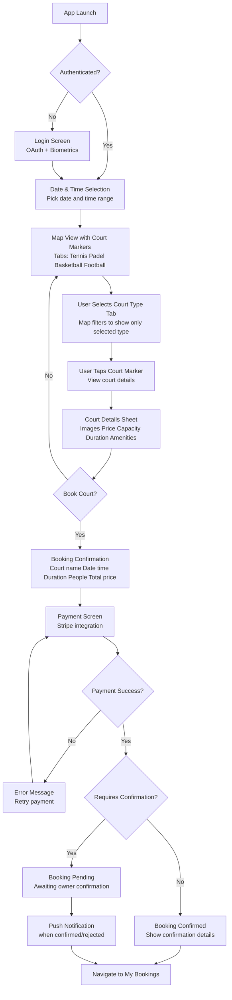

# Requirements Document

## Introduction

A comprehensive court booking platform that enables court owners to register and manage sports facilities (tennis, padel, basketball, 5x5 football) while allowing customers to discover, book, and pay for court reservations through mobile and web applications. The system implements a microservices architecture with real-time capabilities, geospatial queries, and robust payment processing.

## System Architecture Overview

### High-Level Architecture

```mermaid
graph TB
    subgraph "Client Layer"
        MA[Mobile App<br/>Flutter<br/>iOS & Android]
        WA[Admin Web App<br/>React<br/>Field Owner Portal]
        CA[Customer Web App<br/>React<br/>Booking Portal]
    end
    
    subgraph "Ingress Layer"
        LB[DigitalOcean Load Balancer<br/>NGINX Ingress Controller<br/>SSL Termination]
    end
    
    subgraph "Application Layer - DigitalOcean Kubernetes (DOKS)"
        PS[Platform Service<br/>Spring Boot<br/>Auth, Users, Fields]
        TS[Transaction Service<br/>Spring Boot<br/>Bookings, Payments]
        KAFKA[Kafka Cluster<br/>Strimzi Operator<br/>Event Streaming]
    end
    
    subgraph "Data Layer - Managed Services"
        DOPG[(Managed PostgreSQL<br/>with PostGIS<br/>Primary Database)]
        DOREDIS[(Managed Redis<br/>Caching Layer)]
        SPACES[Spaces<br/>S3-Compatible<br/>Field Images & Assets]
    end
    
    subgraph "External Services"
        STRIPE[Stripe API<br/>Payment Processing]
        OAUTH[OAuth Providers<br/>Google, Facebook<br/>Apple ID]
        EMAIL[SendGrid<br/>Email Notifications<br/>100 free/day]
    end
    
    subgraph "Observability Stack - On Kubernetes"
        PROM[Prometheus<br/>Metrics Collection]
        GRAF[Grafana<br/>Dashboards & Alerts]
        JAEGER[Jaeger<br/>Distributed Tracing]
        LOKI[Loki<br/>Log Aggregation]
    end
    
    subgraph "DevOps & Infrastructure"
        TF[Terraform<br/>DigitalOcean<br/>Infrastructure]
        GHA[GitHub Actions<br/>CI/CD Pipeline<br/>Automated Deployment]
        DOREG[DO Container Registry<br/>Docker Images]
    end
    
    subgraph "Local Development Environment"
        COMPOSE[Docker Compose<br/>Local Services<br/>PostgreSQL, Redis, Kafka]
        IDE[IDE Debugging<br/>IntelliJ / VS Code<br/>Remote Cloud Resources]
    end
    
    MA --> LB
    WA --> LB
    CA --> LB
    
    LB --> PS
    LB --> TS
    
    PS --> DOPG
    PS --> DOREDIS
    PS --> KAFKA
    PS --> SPACES
    PS --> OAUTH
    
    TS --> DOPG
    TS --> DOREDIS
    TS --> KAFKA
    TS --> STRIPE
    TS --> EMAIL
    
    PS --> PROM
    TS --> PROM
    PS --> JAEGER
    TS --> JAEGER
    PS --> LOKI
    TS --> LOKI
    
    PROM --> GRAF
    
    TF -.->|Provisions| DOPG
    TF -.->|Provisions| DOREDIS
    TF -.->|Provisions| SPACES
    TF -.->|Provisions| LB
    
    GHA -.->|Builds & Pushes| DOREG
    GHA -.->|Deploys| PS
    GHA -.->|Deploys| TS
    
    COMPOSE -.->|Local Dev| PS
    COMPOSE -.->|Local Dev| TS
    IDE -.->|Debug & Connect| DOPG
    IDE -.->|Debug & Connect| DOREDIS
```



### Service Responsibilities

**Platform Service (Spring Boot)**
- User authentication and authorization (OAuth integration with biometric support)
- User registration with terms and conditions
- Court registration, management, and deletion
- Court type configuration (duration, capacity, sport type)
- Geospatial queries for court discovery
- Availability management and caching
- Manual booking creation for court owners
- Analytics and revenue reporting
- Database schema management (Flyway migrations)

**Transaction Service (Spring Boot)**
- Customer booking creation and management
- Pending confirmation workflow
- Payment processing (Stripe integration)
- Booking modifications and cancellations
- Refund processing and tracking
- Notification publishing and delivery
- Booking history and audit trails
- Revenue split calculations

### DigitalOcean Infrastructure Resources

**Compute Resources**
- **DOKS (Kubernetes)**: Managed Kubernetes cluster in Frankfurt (FRA1) region
- **Worker Nodes**: 2x 4GB RAM droplets with auto-scaling (2-5 nodes)
- **NGINX Ingress Controller**: Path-based routing, SSL termination, rate limiting

**Data Storage**
- **Managed PostgreSQL with PostGIS**: 1GB RAM instance with automatic backups
- **Managed Redis**: 1GB RAM instance with automatic failover
- **Spaces**: S3-compatible object storage with integrated CDN (250GB included)
- **Container Registry**: Private Docker image storage (5GB included)

**Networking & Security**
- **Load Balancer**: Automatic SSL/TLS with Let's Encrypt certificates
- **VPC**: Private networking between services
- **Firewall Rules**: Kubernetes network policies for service isolation
- **Kubernetes Secrets**: Encrypted secrets management with External Secrets Operator support

**Observability & Monitoring**
- **Prometheus**: Metrics collection and storage (self-hosted on Kubernetes)
- **Grafana**: Visualization dashboards and alerting (self-hosted on Kubernetes)
- **Jaeger**: Distributed tracing across microservices (self-hosted on Kubernetes)
- **Loki**: Log aggregation and indexing (self-hosted on Kubernetes)
- **DigitalOcean Monitoring**: Built-in infrastructure metrics

**DevOps & Deployment**
- **Terraform**: Infrastructure as Code for DigitalOcean resource provisioning
- **GitHub Actions**: CI/CD pipeline with automated testing and deployment
- **Container Registry**: Private Docker registry integrated with DOKS
- **doctl CLI**: Command-line tool for DigitalOcean automation

**Local Development Environment**
- **Docker Compose**: Local infrastructure (PostgreSQL, Redis, Kafka) for development
- **Profile-based Configuration**: Spring profiles for local/dev/prod environments
- **Remote Debugging**: IDE integration with cloud-hosted managed services
- **Hot Reload**: Spring Boot DevTools for rapid local development

### Communication Patterns

**Synchronous (REST APIs)**
- Client applications → Platform Service (authentication, field queries)
- Client applications → Transaction Service (booking operations)
- Transaction Service → Platform Service (field validation)
- Transaction Service → Stripe (payment processing)
- Platform Service → OAuth Providers (authentication)

**Asynchronous (Kafka Events)**
- Booking events: Transaction Service → Platform Service (cache updates)
- Notification events: Transaction Service → Email Service
- Analytics events: Both services → Analytics processors
- Confirmation reminders: Transaction Service → Field owners

**Real-time (WebSocket)**
- Availability updates: Platform Service → Connected clients
- Booking status changes: Transaction Service → Field owners and customers

### Local Development Setup

**Docker Compose for Local Infrastructure:**
```yaml
# docker-compose.yml - Run locally for development
services:
  postgres:
    image: postgis/postgis:15-3.3
    ports: ["5432:5432"]
    environment:
      POSTGRES_DB: fieldbooking
      POSTGRES_USER: dev
      POSTGRES_PASSWORD: dev
    volumes:
      - postgres_data:/var/lib/postgresql/data

  redis:
    image: redis:7-alpine
    ports: ["6379:6379"]

  kafka:
    image: confluentinc/cp-kafka:7.5.0
    ports: ["9092:9092"]
    environment:
      KAFKA_BROKER_ID: 1
      KAFKA_ZOOKEEPER_CONNECT: zookeeper:2181
      KAFKA_ADVERTISED_LISTENERS: PLAINTEXT://localhost:9092

  zookeeper:
    image: confluentinc/cp-zookeeper:7.5.0
    ports: ["2181:2181"]
    environment:
      ZOOKEEPER_CLIENT_PORT: 2181
```

**Spring Boot Profile Configuration:**
- **local**: Uses Docker Compose services (PostgreSQL, Redis, Kafka)
- **dev**: Connects to DigitalOcean managed services for testing
- **prod**: Full production configuration on Kubernetes

**Development Workflow:**
1. Run `docker-compose up` for local infrastructure
2. Run Spring Boot services locally with `local` profile
3. Debug in IDE (IntelliJ IDEA, VS Code) with breakpoints
4. Hot reload with Spring Boot DevTools for rapid iteration
5. Optional: Connect to cloud managed services for integration testing

## Customer User Journey

### Overview
The customer booking journey is designed for simplicity and speed, allowing users to find and book courts in just a few taps.

### Journey Flow



### Detailed Step-by-Step Journey

**Step 1: Authentication**
- User opens mobile app
- If not authenticated: Login screen with OAuth options (Google, Facebook, Apple)
- Biometric authentication (fingerprint/face ID) for returning users
- Terms and conditions acceptance for new users

**Step 2: Date & Time Selection**
- Prominent date picker (calendar view)
- Time range selector (start time and duration)
- Default duration based on most popular court type
- "Search Courts" button

**Step 3: Map View with Court Filters**
- Full-screen map centered on user's location
- Court markers color-coded by type
- **Favorite courts highlighted with special icon/color**
- **Interactive map controls:**
  - Zoom in/out buttons or pinch gestures
  - Pan to explore different areas
  - Dynamic marker loading based on visible map bounds
  - Markers update as user zooms and pans
  - Distance filter slider (e.g., "Within 5km")
- Top tabs for filtering:
  - **All Courts** (default)
  - **Favorites** ⭐ (if user has favorites)
  - **Tennis** 🎾
  - **Padel** 🏓
  - **Basketball** 🏀
  - **Football** ⚽
- Selecting a tab filters map markers in real-time
- Cluster markers for multiple courts in same area (expand on zoom)
- Current location button
- Search bar for location/address search
- Settings icon for personalization preferences

**Step 4: Court Selection**
- User taps on court marker
- Bottom sheet slides up with court preview:
  - Court name and type
  - Distance from user
  - Price per session
  - Availability indicator (Available/Pending/Unavailable)
  - "View Details" button

**Step 5: Court Details**
- Full-screen court details:
  - Image carousel
  - Court name, type, and rating
  - **Favorite button (heart icon) to save court**
  - Address with "Get Directions" button
  - **Distance from user's current location**
  - **Court-specific settings:**
    - Session duration (e.g., "90 minutes")
    - Capacity (e.g., "4 people")
    - Price breakdown
  - Amenities (parking, showers, equipment rental)
  - Owner information
  - Reviews and ratings
  - Available time slots for selected date
  - "Book Now" button

**Step 6: Booking Confirmation**
- Booking summary:
  - Court name and image
  - Selected date and time
  - Duration (auto-filled based on court type)
  - Number of people selector (max based on court capacity)
  - Total price calculation
  - Cancellation policy
- "Proceed to Payment" button

**Step 7: Payment**
- Stripe payment interface
- Saved payment methods
- Add new card option
- Apple Pay / Google Pay support
- "Confirm and Pay" button

**Step 8: Booking Result**
- **If immediate confirmation:**
  - Success animation
  - Booking confirmation details
  - Add to calendar option
  - Share booking option
  - "View My Bookings" button
  
- **If pending confirmation:**
  - Pending status message
  - "Your booking is awaiting owner confirmation"
  - Estimated confirmation time
  - Payment held message
  - Push notification when confirmed/rejected

**Step 9: Post-Booking**
- Navigate to "My Bookings" tab
- View booking details
- Options to modify or cancel
- Receive reminders before booking time
- **Access to personalization settings:**
  - Manage favorite courts
  - Set preferred playing days/times
  - Configure maximum search distance
  - Notification preferences for favorites

## Glossary

- **Platform_Service**: Spring Boot microservice handling authentication, user management, and court management
- **Transaction_Service**: Spring Boot microservice handling booking management, payment processing, and notifications
- **Court_Owner**: User who owns and manages sports courts on the platform
- **Customer**: User who books and pays for court reservations
- **Court**: Sports facility (tennis court, padel court, basketball court, or 5x5 football court) available for booking
- **Court_Type**: Category of court with specific attributes (duration, capacity, sport type)
- **Court_Location_Type**: Attribute indicating if a court is in an open space (outdoor) or closed area (indoor)
- **Weather_Forecast**: Real-time weather prediction for the selected booking date and time
- **Booking**: Reservation of a court for a specific time slot
- **Manual_Booking**: Booking created by court owner through admin interface without payment processing
- **Time_Slot**: Specific date and time period when a court can be booked
- **Booking_Duration**: Configurable time length for court reservations (e.g., 60 mins, 90 mins)
- **Court_Capacity**: Maximum number of people allowed per booking (configurable per court type)
- **Payment_Authorization**: Initial payment validation before booking confirmation
- **Booking_Conflict**: Situation where multiple users attempt to book the same time slot
- **Availability_Window**: Time period when a court is available for booking
- **Revenue_Split**: Distribution of payment between platform and court owner
- **Geospatial_Query**: Location-based search using PostGIS extension
- **Real_Time_Update**: Immediate propagation of availability changes via WebSocket
- **Async_Operation**: Background processing via Kafka event streaming
- **Sync_Operation**: Immediate processing requiring direct response
- **PENDING_CONFIRMATION**: Booking status when court owner confirmation is required
- **Confirmation_Timeout**: Configured time period for court owner to confirm pending bookings
- **Cancellation_Policy**: Court owner-defined rules for refund calculations based on cancellation timing
- **Terms_and_Conditions**: Legal agreement users must accept during registration
- **Structured_Logs**: Logs with consistent formatting including correlation IDs and contextual information
- **Log_Indexing**: Process of organizing logs for efficient searching and filtering
- **Alert_Threshold**: Configurable criteria that trigger administrator notifications
- **Device_Registration_Token**: Unique identifier for a user's mobile device used for push notifications (FCM for Android, APNs for iOS)
- **Push_Notification**: Notification sent to a user's device when the app is closed or in background
- **In_App_Notification**: Real-time notification delivered via WebSocket when the app is active
- **DOKS**: DigitalOcean Kubernetes Service - managed Kubernetes cluster
- **Spaces**: DigitalOcean's S3-compatible object storage service with integrated CDN
- **Droplet**: DigitalOcean virtual machine instance
- **NGINX_Ingress**: Kubernetes ingress controller for routing and load balancing
- **Docker_Compose**: Tool for defining and running multi-container Docker applications locally
- **Spring_Profile**: Configuration profile for different environments (local, dev, prod)
- **Hot_Reload**: Automatic application restart on code changes during development
- **Biometric_Authentication**: Fingerprint or face recognition for mobile app login
- **Court_Filter**: Tab-based filtering of courts by type on the map interface
- **User_Journey**: Step-by-step flow of customer interactions from search to booking confirmation
- **Favorite_Court**: Court marked by customer for quick access and priority in search results
- **Preferred_Time**: Customer's saved default days and times for court searches
- **Search_Distance**: Maximum radius from customer's location for court discovery
- **Map_Bounds**: Visible geographic area on the map that determines which courts are loaded
- **Dynamic_Loading**: Real-time loading of court markers as the user zooms and pans the map

## Requirements

### Requirement 1: User Registration and Authentication

**User Story:** As a new user, I want to register and authenticate using OAuth providers and biometrics, so that I can access the platform securely and conveniently.

#### Acceptance Criteria

1. WHEN a user initiates registration, THE Platform_Service SHALL offer OAuth registration options (Google, Facebook, Apple ID)
2. WHEN a user registers via OAuth, THE Platform_Service SHALL create a new user profile with provider information and selected role (court owner or customer)
3. WHEN registration is initiated, THE Platform_Service SHALL present terms and conditions that must be accepted before account creation
4. WHEN terms and conditions are not accepted, THE Platform_Service SHALL prevent account creation and registration completion
5. WHEN a user selects OAuth login, THE Platform_Service SHALL redirect to the selected provider (Google, Facebook, Apple ID)
6. WHEN OAuth authentication succeeds, THE Platform_Service SHALL create or update the user profile with provider information
7. WHEN authentication is complete, THE Platform_Service SHALL issue a JWT token with appropriate role-based permissions
8. WHEN a JWT token expires, THE Platform_Service SHALL require re-authentication before allowing protected operations
9. WHERE a user has multiple OAuth providers linked, THE Platform_Service SHALL allow login through any linked provider
10. WHEN a mobile user enables biometric authentication, THE Platform_Service SHALL store encrypted credentials for biometric login
11. WHEN a returning mobile user opens the app, THE Platform_Service SHALL offer biometric authentication (fingerprint or face recognition) as a login option
12. WHEN biometric authentication succeeds, THE Platform_Service SHALL authenticate the user without requiring OAuth flow

### Requirement 2: Court Registration and Management with Type Configuration

**User Story:** As a court owner, I want to register and manage my sports courts with flexible configuration for duration, capacity, location type, and availability, so that customers can book them according to my specific requirements and make informed decisions based on indoor/outdoor preferences.

#### Acceptance Criteria

1. WHEN a court owner registers a new court, THE Platform_Service SHALL validate court information and store it with geospatial coordinates
2. WHEN a court owner adds multiple courts, THE Platform_Service SHALL support adding courts of the same or different types (tennis, padel, basketball, 5x5 football)
3. WHEN a court owner configures a court, THE Platform_Service SHALL require selection of location type (indoor or outdoor)
4. WHEN a court owner configures a court type, THE Platform_Service SHALL allow setting default booking duration (e.g., 60 minutes, 90 minutes, 120 minutes)
5. WHEN a court owner configures a court type, THE Platform_Service SHALL allow setting maximum capacity (number of people allowed per booking)
6. WHEN a court owner configures court-specific settings, THE Platform_Service SHALL allow overriding default type settings for individual courts
7. WHEN a court owner removes a court, THE Platform_Service SHALL validate that no future confirmed bookings exist before allowing deletion
8. WHEN court information is updated, THE Platform_Service SHALL validate changes and propagate updates to all dependent services
9. THE Platform_Service SHALL support multiple court types (tennis, padel, basketball, 5x5 football) with type-specific attributes
10. WHEN court images are uploaded, THE Platform_Service SHALL store them in Spaces and validate file formats and sizes
11. WHEN availability windows are configured, THE Platform_Service SHALL provide an intuitive interface for setting recurring availability patterns (daily, weekly, custom)
12. WHEN availability windows are configured, THE Platform_Service SHALL validate time ranges and prevent overlapping unavailable periods
13. WHEN a court owner needs to block specific dates or times, THE Platform_Service SHALL allow manual availability overrides for maintenance or private events
14. WHEN court type defaults are defined, THE Platform_Service SHALL include standard configurations (e.g., Padel: 90 mins, 4 people; Basketball: 60 mins, 10 people)

### Requirement 3: Location-Based Court Discovery

**User Story:** As a customer, I want to discover courts near my location, so that I can find convenient booking options.

#### Acceptance Criteria

1. WHEN a customer searches by location, THE Platform_Service SHALL execute geospatial queries using PostGIS to find nearby courts
2. WHEN search results are returned, THE Platform_Service SHALL include distance calculations and court availability status
3. WHEN map integration is requested, THE Platform_Service SHALL provide court coordinates for map rendering
4. WHERE search filters are applied, THE Platform_Service SHALL combine geospatial and attribute-based filtering
5. WHEN search radius is specified, THE Platform_Service SHALL limit results to courts within the specified distance

### Requirement 4: Customer Search and Booking User Journey

**User Story:** As a customer, I want an intuitive search and booking experience with date/time selection, weather forecast display, map-based court discovery with type and location filters, zoom controls, and personalized settings, so that I can quickly find and reserve courts that match my preferences and weather conditions.

#### Acceptance Criteria

1. WHEN a customer opens the mobile app, THE Platform_Service SHALL present a date and time range selector as the primary interface
2. WHEN a customer selects a date and time range, THE Platform_Service SHALL fetch and display weather forecast for the selected date and time
3. WHEN weather forecast is displayed, THE Platform_Service SHALL show temperature, precipitation probability, wind conditions, and weather icon
4. WHEN a customer views the weather forecast, THE Platform_Service SHALL provide visual indicators suggesting indoor or outdoor court suitability
5. WHEN a customer initiates search, THE Platform_Service SHALL display a map view centered on the customer's current location with court markers
6. WHEN the map view is displayed, THE Platform_Service SHALL show court type filter tabs at the top (All, Tennis, Padel, Basketball, Football)
7. WHEN the map view is displayed, THE Platform_Service SHALL provide location type filters (All, Indoor, Outdoor)
8. WHEN a customer selects a court type tab, THE Platform_Service SHALL filter map markers in real-time to show only courts of the selected type
9. WHEN a customer selects a location type filter, THE Platform_Service SHALL filter map markers to show only indoor or outdoor courts
10. WHEN a customer zooms in or out on the map, THE Platform_Service SHALL dynamically load and display courts within the visible map bounds
11. WHEN a customer pans the map to explore different areas, THE Platform_Service SHALL update court markers based on the new visible region
12. WHEN multiple courts exist in close proximity, THE Platform_Service SHALL cluster markers and expand clusters when the user zooms in
13. WHEN a customer taps a court marker, THE Platform_Service SHALL display a bottom sheet with court preview information including location type (indoor/outdoor)
14. WHEN a customer views court details, THE Platform_Service SHALL display court-specific configuration including duration, capacity, and location type
15. WHEN a customer proceeds to booking, THE Platform_Service SHALL pre-fill booking duration based on the court type's default configuration
16. WHEN a customer selects number of people, THE Platform_Service SHALL enforce the maximum capacity defined for that court type
17. WHEN a customer completes booking, THE Platform_Service SHALL display appropriate confirmation or pending status based on court owner settings
18. WHEN a booking requires confirmation, THE Platform_Service SHALL clearly communicate the pending status and expected confirmation timeline

### Requirement 5: User Personalization and Preferences

**User Story:** As a customer, I want to save my favorite courts, preferred times, and search distance settings, so that I can quickly find and book courts that match my regular playing habits.

#### Acceptance Criteria

1. WHEN a customer views a court, THE Platform_Service SHALL provide an option to mark the court as a favorite
2. WHEN a customer marks a court as favorite, THE Platform_Service SHALL save the preference and display a visual indicator on the court
3. WHEN a customer accesses their favorites, THE Platform_Service SHALL display a list of all favorited courts with quick booking options
4. WHEN a customer sets preferred playing days and times, THE Platform_Service SHALL save these preferences and use them as default search parameters
5. WHEN a customer configures maximum search distance, THE Platform_Service SHALL apply this filter to all court searches and map displays
6. WHEN a customer has saved preferences, THE Platform_Service SHALL pre-populate search fields with preferred days, times, and distance on app launch
7. WHEN a customer searches for courts, THE Platform_Service SHALL prioritize favorite courts in search results and highlight them on the map
8. WHEN a customer updates personalization settings, THE Platform_Service SHALL immediately apply changes to the current search and map view
9. THE Platform_Service SHALL allow customers to configure notification preferences for favorite courts (e.g., availability alerts, price changes)
10. WHEN a favorite court becomes available at the customer's preferred time, THE Platform_Service SHALL optionally send a notification based on user preferences

### Requirement 6: Weather Forecast Integration

**User Story:** As a customer, I want to see weather forecasts for my selected booking time, so that I can make informed decisions about booking indoor or outdoor courts.

#### Acceptance Criteria

1. WHEN a customer selects a date and time for court search, THE Platform_Service SHALL integrate with a weather API to fetch forecast data
2. WHEN weather data is retrieved, THE Platform_Service SHALL display temperature, precipitation probability, wind speed, humidity, and weather conditions
3. WHEN weather conditions indicate rain or extreme temperatures, THE Platform_Service SHALL display a recommendation badge suggesting indoor courts
4. WHEN weather conditions are favorable, THE Platform_Service SHALL display a recommendation badge highlighting outdoor courts
5. WHEN weather forecast is unavailable or fails to load, THE Platform_Service SHALL gracefully handle the error and allow search to continue without weather data
6. WHEN a customer views court details for an outdoor court, THE Platform_Service SHALL display the weather forecast prominently
7. WHEN a customer views court details for an indoor court, THE Platform_Service SHALL optionally show weather for context but emphasize indoor protection
8. THE Platform_Service SHALL cache weather forecast data for reasonable periods to minimize API calls and improve performance
9. WHEN weather conditions change significantly, THE Platform_Service SHALL update the forecast and notify users with existing bookings for outdoor courts
10. THE Platform_Service SHALL support multiple weather data providers (e.g., OpenWeatherMap, WeatherAPI) with configurable fallback options

### Requirement 7: Real-Time Availability Management

**User Story:** As a customer, I want to see real-time court availability, so that I can make informed booking decisions.

#### Acceptance Criteria

1. WHEN availability is requested, THE Platform_Service SHALL return current time slot status from cached data
2. WHEN availability changes occur, THE Platform_Service SHALL broadcast updates via WebSocket to all connected clients
3. WHEN multiple users view the same court, THE Platform_Service SHALL ensure all users see consistent availability information
4. WHILE a booking is in progress, THE Platform_Service SHALL mark the time slot as temporarily unavailable
5. WHEN a booking is completed or cancelled, THE Platform_Service SHALL immediately update availability status

### Requirement 8: Atomic Booking Creation with Conflict Prevention

**User Story:** As a customer, I want my booking to be processed atomically, so that double bookings are prevented.

#### Acceptance Criteria

1. WHEN a booking request is received, THE Transaction_Service SHALL acquire an optimistic lock on the requested time slot
2. WHEN payment authorization succeeds, THE Transaction_Service SHALL create the booking record atomically with payment confirmation
3. IF a booking conflict is detected, THEN THE Transaction_Service SHALL reject the request and return a conflict error
4. WHEN booking creation completes, THE Transaction_Service SHALL release the lock and publish booking events asynchronously
5. WHILE processing a booking, THE Transaction_Service SHALL prevent other bookings for the same time slot

### Requirement 9: Manual Booking Creation by Court Owners

**User Story:** As a court owner, I want to create manual bookings through the admin interface, so that I can manage walk-in customers and phone reservations independently.

#### Acceptance Criteria

1. WHEN a court owner creates a manual booking, THE Platform_Service SHALL validate availability and create the booking without payment processing
2. WHEN a manual booking is created, THE Platform_Service SHALL mark the time slot as unavailable for customer bookings
3. WHEN a court owner creates a manual booking, THE Platform_Service SHALL allow optional customer information entry for record-keeping
4. WHEN manual bookings are created, THE Platform_Service SHALL maintain the same conflict prevention mechanisms as customer bookings
5. THE Platform_Service SHALL provide court owners with a standalone booking management interface that works independently of the customer-facing platform
6. WHEN the trial period expires, THE Platform_Service SHALL enforce commercial licensing for continued use of manual booking features

### Requirement 10: Pending Booking Confirmation Workflow

**User Story:** As a customer, I want my booking to be held pending court owner confirmation when immediate availability cannot be guaranteed, so that I have a chance to secure the court even if there are uncertainties.

#### Acceptance Criteria

1. WHEN a booking is created but court availability is uncertain, THE Transaction_Service SHALL hold the full payment amount and create a booking with PENDING_CONFIRMATION status
2. WHEN a booking enters PENDING_CONFIRMATION status, THE Transaction_Service SHALL send confirmation request notifications to the court owner via email and web platform
3. WHEN a pending booking is not confirmed, THE Transaction_Service SHALL send reminder notifications to the court owner at configured intervals
4. WHEN the confirmation timeout period expires without court owner response, THE Transaction_Service SHALL automatically cancel the booking and initiate a full refund
5. WHEN a court owner confirms a pending booking, THE Transaction_Service SHALL change the booking status to CONFIRMED and capture the payment
6. WHEN a court owner rejects a pending booking, THE Transaction_Service SHALL cancel the booking and initiate a full refund immediately
7. THE Platform_Service SHALL allow configuration of confirmation timeout periods per court or court owner

### Requirement 11: Integrated Payment Processing

**User Story:** As a customer, I want to pay for bookings securely, so that my reservations are confirmed.

#### Acceptance Criteria

1. WHEN payment is initiated, THE Transaction_Service SHALL create a Stripe payment intent with booking amount
2. WHEN payment authorization succeeds, THE Transaction_Service SHALL confirm the booking before capturing payment
3. WHEN payment fails, THE Transaction_Service SHALL release the time slot and notify the customer
4. WHEN payment is captured, THE Transaction_Service SHALL calculate revenue split between platform and court owner
5. THE Transaction_Service SHALL maintain PCI compliance throughout the payment process

### Requirement 12: Booking Modification and Cancellation

**User Story:** As a customer or court owner, I want to modify or cancel bookings with appropriate refund handling, so that I can manage changes to my reservations.

#### Acceptance Criteria

1. WHEN a customer requests booking modification, THE Transaction_Service SHALL validate new time slot availability before processing the change
2. WHEN a booking modification is approved, THE Transaction_Service SHALL update the booking atomically and adjust payment if pricing differs
3. WHEN a customer cancels a booking, THE Transaction_Service SHALL apply the court owner's cancellation policy to determine refund amount
4. WHEN a court owner cancels a confirmed booking, THE Transaction_Service SHALL issue a full refund to the customer regardless of cancellation policy
5. WHEN a cancellation is processed, THE Transaction_Service SHALL initiate the refund through Stripe and update booking status to CANCELLED
6. WHEN a refund is initiated, THE Transaction_Service SHALL track refund status and notify the customer when the refund is completed
7. THE Platform_Service SHALL allow court owners to configure cancellation policies including time-based refund percentages
8. WHEN a booking is cancelled within the no-refund window, THE Transaction_Service SHALL still process the cancellation but issue no refund
9. WHEN partial refunds are calculated, THE Transaction_Service SHALL deduct platform fees appropriately and adjust court owner revenue

### Requirement 13: Asynchronous Notification System

**User Story:** As a user, I want to receive timely notifications about my bookings both when the app is active and when it's closed, so that I stay informed about important events regardless of app state.

#### Acceptance Criteria

1. WHEN a user logs into the mobile app, THE Platform_Service SHALL register the device token (FCM for Android, APNs for iOS) and associate it with the customer ID
2. WHEN a user logs in from multiple devices, THE Platform_Service SHALL maintain multiple device registration tokens per customer ID
3. WHEN a user logs out or uninstalls the app, THE Platform_Service SHALL remove the device registration token from the customer's profile
4. WHEN a booking event occurs, THE Transaction_Service SHALL publish notification events to Kafka
5. WHEN notification events are processed and the user's app is CLOSED or in BACKGROUND, THE Transaction_Service SHALL send push notifications to all registered devices using their device tokens
6. WHEN notification events are processed and the user's app is ACTIVE, THE Transaction_Service SHALL send in-app notifications via WebSocket connection
7. WHEN a user has the app active, THE Platform_Service SHALL maintain a persistent WebSocket connection for real-time notifications
8. WHEN a WebSocket connection is established, THE Platform_Service SHALL authenticate the connection using the user's JWT token
9. WHEN booking reminders are due, THE Transaction_Service SHALL send notifications through both push (if app closed) and WebSocket (if app active)
10. WHERE push notification delivery fails, THE Transaction_Service SHALL implement retry logic with exponential backoff
11. WHERE WebSocket delivery fails, THE Transaction_Service SHALL fall back to push notification delivery
12. WHEN users configure notification preferences, THE Transaction_Service SHALL respect user preferences for notification types and channels
13. WHEN a booking enters PENDING_CONFIRMATION status, THE Transaction_Service SHALL send confirmation request notifications to court owners via both push and WebSocket
14. WHEN pending bookings are not confirmed, THE Transaction_Service SHALL send reminder notifications at configured intervals
15. WHEN bookings are cancelled by either party, THE Transaction_Service SHALL send cancellation notifications to all affected parties
16. WHEN refunds are processed, THE Transaction_Service SHALL send refund confirmation notifications to customers
17. THE Platform_Service SHALL store device registration tokens securely with encryption at rest
18. WHEN device tokens expire or become invalid, THE Platform_Service SHALL automatically remove them and request re-registration on next app launch

### Requirement 14: Booking Management and History

**User Story:** As a customer, I want to view and manage my booking history, so that I can track my reservations and make changes when needed.

#### Acceptance Criteria

1. WHEN booking history is requested, THE Transaction_Service SHALL return paginated booking records for the authenticated user
2. WHEN booking details are viewed, THE Transaction_Service SHALL display complete booking information including court details and payment status
3. WHERE cancellation is allowed, THE Transaction_Service SHALL process cancellations according to court owner policies
4. WHEN booking modifications are requested, THE Transaction_Service SHALL validate availability and process changes atomically
5. THE Transaction_Service SHALL maintain complete audit trails for all booking operations
6. WHEN court owners view their bookings, THE Platform_Service SHALL display both customer bookings and manual bookings in a unified interface
7. WHEN court owners need to confirm pending bookings, THE Platform_Service SHALL provide a clear interface showing all pending confirmation requests

### Requirement 15: Analytics and Revenue Tracking

**User Story:** As a court owner, I want to track booking analytics and revenue, so that I can optimize my court management and pricing.

#### Acceptance Criteria

1. WHEN analytics are requested, THE Platform_Service SHALL aggregate booking data and calculate key performance metrics
2. WHEN revenue reports are generated, THE Platform_Service SHALL include detailed breakdowns of earnings and platform fees
3. THE Platform_Service SHALL provide time-based analytics showing booking patterns and peak usage periods
4. WHEN pricing strategies are evaluated, THE Platform_Service SHALL show revenue impact of different pricing configurations
5. WHERE data export is requested, THE Platform_Service SHALL generate reports in standard formats (CSV, PDF)

### Requirement 16: System Observability and Monitoring

**User Story:** As a system administrator, I want comprehensive monitoring and tracing, so that I can maintain system health and performance.

#### Acceptance Criteria

1. THE Platform_Service SHALL emit OpenTelemetry traces for all critical operations including authentication and court management
2. THE Transaction_Service SHALL emit OpenTelemetry traces for all booking and payment operations
3. WHEN system metrics are collected, THE Platform_Service SHALL expose Prometheus metrics for performance monitoring
4. WHEN errors occur, THE Transaction_Service SHALL log structured error information with correlation IDs
5. THE Platform_Service SHALL integrate with Jaeger for distributed tracing across microservices

### Requirement 17: Centralized Logging and Alerting

**User Story:** As a system administrator, I want centralized logging with indexing and alerting capabilities, so that I can quickly identify and respond to system issues.

#### Acceptance Criteria

1. WHEN any service operation occurs, THE Platform_Service and Transaction_Service SHALL produce structured logs with consistent formatting
2. WHEN logs are generated, BOTH services SHALL include correlation IDs, timestamps, log levels, and contextual information
3. THE Platform_Service SHALL integrate with a centralized logging system (Loki or CloudWatch Logs) for log aggregation
4. WHEN logs are collected, THE logging system SHALL index logs for efficient searching and filtering
5. WHEN ERROR or WARN level logs are generated, THE logging system SHALL trigger alerts to notify administrators
6. THE Platform_Service SHALL provide configurable alert thresholds for different error types and severity levels
7. WHEN critical errors occur, THE logging system SHALL send immediate notifications via multiple channels (email, Slack, PagerDuty)
8. THE Platform_Service SHALL maintain log retention policies compliant with data protection regulations
9. WHEN administrators search logs, THE logging system SHALL provide full-text search capabilities across all indexed fields

### Requirement 18: Database Management and Migrations

**User Story:** As a developer, I want automated database schema management, so that deployments are consistent and reliable.

#### Acceptance Criteria

1. WHEN the Platform_Service starts, THE Platform_Service SHALL execute Flyway migrations to ensure schema consistency
2. WHEN schema changes are deployed, THE Platform_Service SHALL validate migration scripts before execution
3. THE Platform_Service SHALL maintain migration history and prevent conflicting schema changes
4. WHERE rollback is required, THE Platform_Service SHALL support reversible migration scripts
5. WHEN PostGIS extensions are required, THE Platform_Service SHALL ensure geospatial capabilities are properly configured

### Requirement 19: Caching and Performance Optimization

**User Story:** As a user, I want fast response times for court searches and availability checks, so that I have a smooth booking experience.

#### Acceptance Criteria

1. WHEN court data is requested, THE Platform_Service SHALL serve frequently accessed data from Redis cache
2. WHEN availability is checked, THE Platform_Service SHALL use cached availability data with real-time updates
3. WHEN cache entries expire, THE Platform_Service SHALL refresh data from the primary database
4. WHERE cache invalidation is needed, THE Platform_Service SHALL remove stale entries and update dependent caches
5. WHEN high load occurs, THE Platform_Service SHALL maintain performance through effective caching strategies

### Requirement 20: Local Development Environment

**User Story:** As a developer, I want to run the entire application stack locally with easy debugging capabilities, so that I can develop and test features efficiently without deploying to the cloud.

#### Acceptance Criteria

1. WHEN a developer runs the local setup, THE system SHALL provide a Docker Compose configuration that starts all required infrastructure services (PostgreSQL, Redis, Kafka)
2. WHEN Spring Boot services are started locally, THE services SHALL support profile-based configuration (local, dev, prod) for different environments
3. WHEN running in local mode, THE services SHALL connect to local Docker Compose infrastructure by default
4. WHEN running in dev mode, THE services SHALL optionally connect to DigitalOcean managed services for integration testing
5. WHEN debugging is needed, THE services SHALL support IDE integration (IntelliJ IDEA, VS Code) with breakpoints and hot reload
6. WHEN frontend applications are run locally, THE applications SHALL connect to locally running backend services via configurable API endpoints
7. WHEN local infrastructure is started, THE Docker Compose setup SHALL include sample data seeding for development
8. THE local development setup SHALL include a README with clear instructions for setup, running, and debugging
9. WHEN developers need to test cloud integrations, THE system SHALL support hybrid mode connecting local services to cloud-hosted managed databases