```mermaid
graph TD
    START[App Launch] --> AUTH{Authenticated?}
    AUTH -->|No| LOGIN[Login Screen<br/>OAuth + Biometrics]
    AUTH -->|Yes| HOME[Home Screen<br/>Date & Time Selection]
    LOGIN --> TC{Terms Accepted?}
    TC -->|No| TERMS[Accept Terms & Conditions]
    TC -->|Yes| HOME
    TERMS --> HOME
    
    HOME --> WEATHER{Date within 7 days?}
    WEATHER -->|Yes| FORECAST[Show Weather Forecast<br/>Indoor/Outdoor Recommendation]
    WEATHER -->|No| NO_FORECAST[Forecast Not Yet Available]
    FORECAST --> MAP
    NO_FORECAST --> MAP
    
    MAP[Map View<br/>Court & Open Match Markers<br/>Type Tabs + Indoor/Outdoor Filter]
    
    MAP --> COURT_TAP{Tap Marker Type?}
    COURT_TAP -->|Court| PREVIEW[Court Preview Bottom Sheet<br/>Name Type Price Distance]
    COURT_TAP -->|Open Match| MATCH_PREVIEW[Match Preview<br/>Skill Level Players Cost]
    
    MATCH_PREVIEW --> JOIN_MATCH[Join Match Flow<br/>Pay Share]
    
    PREVIEW --> DETAILS[Court Details<br/>Images Ratings Amenities Slots]
    
    DETAILS --> SLOT{Slot Available?}
    SLOT -->|Available| CONFIRM[Booking Confirmation<br/>Duration People Open Match Split Pay Promo]
    SLOT -->|Fully Booked| WAITLIST[Join Waitlist]
    
    CONFIRM --> PAYMENT[Payment<br/>Stripe / Apple Pay / Google Pay]
    
    PAYMENT --> RESULT{Payment OK?}
    RESULT -->|No| RETRY[Error → Retry Payment]
    RETRY --> PAYMENT
    
    RESULT -->|Yes| MODE{Court Confirmation Mode?}
    MODE -->|Instant| SUCCESS[Booking Confirmed ✓<br/>Receipt + Calendar + Share]
    MODE -->|Manual| PENDING[Booking Pending ⏳<br/>Awaiting Owner Confirmation<br/>Push Notification on Decision]
    
    SUCCESS --> BOOKINGS[My Bookings Tab]
    PENDING --> BOOKINGS
    WAITLIST --> BOOKINGS
    JOIN_MATCH --> BOOKINGS
```

# Requirements Document

## Introduction

A comprehensive court booking platform that enables court owners to register and manage sports facilities (tennis, padel, basketball, 5x5 football) while allowing customers to discover, book, and pay for court reservations through mobile and web applications. The system implements a microservices architecture with real-time capabilities, geospatial queries, and robust payment processing.

## System Architecture Overview

### High-Level Architecture


### Service Responsibilities

**Platform Service (Spring Boot)**
- User authentication and authorization (OAuth integration with biometric support)
- User registration with terms and conditions
- User account management (profile updates, account deletion, GDPR compliance)
- Player skill level management and matchmaking profiles
- Court registration, management, and deletion
- Court type configuration (duration, capacity, sport type, location type)
- Court owner verification and approval
- Court ratings and reviews
- Geospatial queries for court discovery
- Aggregated map API endpoint (courts + open matches + weather in single response)
- Availability management and caching
- Weather forecast integration and caching
- Dynamic pricing and promotional code management
- Analytics and revenue reporting (using read replica for heavy queries)
- Database schema management (Flyway migrations)
- Feature flag management (advertisements, premium features)
- Multi-language content management

**Transaction Service (Spring Boot)**
- Customer booking creation and management
- Manual booking creation for court owners (via admin API)
- Recurring booking management
- Pending confirmation workflow
- Payment processing (Stripe integration, webhooks, disputes)
- Split payment management between players
- Booking modifications and cancellations
- Refund processing and tracking
- Notification publishing and delivery (push via FCM, in-app via WebSocket, email via SendGrid)
- WebSocket connection management backed by Redis Pub/Sub for horizontal scaling
- Open match management (creation, join requests, player coordination)
- Waitlist management (queue, auto-notify, slot holding)
- Scheduled job execution via Quartz Scheduler (timeouts, deadlines, reminders)
- Booking history and audit trails
- Revenue split calculations
- Invoice and receipt generation

**Health & Readiness (Both Services)**
- Both services expose Spring Boot Actuator endpoints for Kubernetes probes:
  - **Liveness probe**: `GET /actuator/health/liveness` — checks application is running (restarts pod if failing)
  - **Readiness probe**: `GET /actuator/health/readiness` — checks database connectivity, Redis connectivity, and Kafka broker availability (removes pod from load balancer if failing)
  - **Startup probe**: `GET /actuator/health` with 60-second initial delay — allows time for Flyway migrations and application warmup
- Custom health indicators for external dependencies: Stripe API reachability (Transaction Service), OAuth provider reachability (Platform Service), Weather API reachability (Platform Service)

### DigitalOcean Infrastructure Resources

**Compute Resources**
- **DOKS (Kubernetes)**: Managed Kubernetes cluster in Frankfurt (FRA1) region
- **Production Cluster**: Dedicated cluster with 3x 8GB RAM droplets, auto-scaling (3-6 nodes) to accommodate application pods, Istio sidecars, and observability stack
- **Dev/Test/Staging Cluster**: Shared cluster with namespace-based isolation, 2x 4GB RAM droplets with auto-scaling (2-4 nodes). Istio disabled in dev/test namespaces to conserve resources; enabled in staging namespace for pre-production validation
- **NGINX Ingress Controller**: Path-based routing with defined rules (`/api/auth/*`, `/api/fields/*`, `/api/users/*`, `/api/weather/*` → Platform Service; `/api/bookings/*`, `/api/payments/*`, `/api/notifications/*`, `/api/waitlist/*`, `/api/matches/*` → Transaction Service), SSL termination, rate limiting

**Data Storage**
- **Managed PostgreSQL with PostGIS**: 2GB RAM instance with automatic backups and read replica for analytics queries
  - **Backup Strategy**: Daily automated backups with 7-day retention, point-in-time recovery (PITR) enabled with 7-day window
  - **Recovery Targets**: Recovery Point Objective (RPO) = 1 hour (via WAL archiving), Recovery Time Objective (RTO) = 30 minutes (managed failover)
  - **Backup Testing**: Quarterly backup restoration tests to a temporary instance to validate data integrity
- **Managed Redis**: 2GB RAM instance with automatic failover (handles caching, waitlist queues, WebSocket session tracking, rate limiting, feature flags)
- **Spaces**: S3-compatible object storage with integrated CDN (250GB included)
- **Container Registry**: Private Docker image storage (5GB included)

**Event Streaming**
- **Upstash Kafka**: Serverless Kafka for MVP (pay-per-message, ~$10-30/month, zero operational overhead)
- Migration path to self-hosted Strimzi Kafka on Kubernetes when event volume justifies operational cost

**Networking & Security**
- **Load Balancer**: Automatic SSL/TLS with Let's Encrypt certificates
- **VPC**: Private networking between services
- **Firewall Rules**: Kubernetes network policies for service isolation
- **Secrets Management**: Application secrets (Stripe API keys, OAuth client secrets, database passwords, FCM server keys, SendGrid API keys) stored as DigitalOcean environment variables or in a dedicated secrets store. Synced to Kubernetes via External Secrets Operator. For MVP, Kubernetes Sealed Secrets (encrypted in Git) are acceptable. Migration path to HashiCorp Vault when operational maturity justifies it.
- **Secret Rotation**: Database passwords and API keys should support rotation without service restart via External Secrets Operator refresh intervals

**Observability & Monitoring**
- **Prometheus**: Metrics collection and storage (self-hosted on production cluster; lightweight instance on shared cluster)
- **Grafana**: Visualization dashboards and alerting (self-hosted on production cluster). For MVP, consider Grafana Cloud free tier (50GB logs, 10k metrics series) to reduce cluster resource pressure
- **Jaeger**: Distributed tracing across microservices (self-hosted on production cluster; optional on shared cluster)
- **Loki**: Log aggregation and indexing (self-hosted on production cluster). For dev/test, DigitalOcean built-in monitoring + application log forwarding is sufficient
- **DigitalOcean Monitoring**: Built-in infrastructure metrics for all clusters
- **Resource Budget**: Observability stack should be allocated a dedicated node pool or resource quota (~4GB RAM, 2 CPU) on the production cluster to avoid competing with application pods

**DevOps & Deployment**
- **Terraform**: Infrastructure as Code for DigitalOcean resource provisioning. Terraform plan output posted as PR comment for review before apply.
- **GitHub Actions**: CI/CD pipeline with automated testing and deployment
  - **Build Step**: Compile, run unit tests, run property-based tests, build Docker image
  - **Image Tagging**: Git commit SHA for all builds; semantic version tags (e.g., `v1.2.3`) for release branches
  - **Security Scan**: Container image vulnerability scanning via Trivy before pushing to registry
  - **Migration Validation**: Flyway migration dry-run (`flyway validate`) in CI against a temporary database to catch schema issues before deployment
  - **Terraform Review**: `terraform plan` output posted as PR comment; `terraform apply` requires manual approval for staging/production
- **Container Registry**: Private Docker registry integrated with DOKS
- **doctl CLI**: Command-line tool for DigitalOcean automation

**Local Development Environment**
- **Docker Compose**: Local infrastructure (PostgreSQL, Redis, Kafka) for development
- **Profile-based Configuration**: Spring profiles for local/dev/test/staging/prod environments
- **Remote Debugging**: IDE integration with cloud-hosted managed services
- **Hot Reload**: Spring Boot DevTools for rapid local development

### Communication Patterns

**Synchronous (REST APIs)**
- Client applications → NGINX Ingress (path-based routing) → Platform Service or Transaction Service
- **Routing Rules (NGINX Ingress):**
  - `/api/auth/*`, `/api/users/*`, `/api/fields/*`, `/api/weather/*`, `/api/analytics/*`, `/api/promo-codes/*`, `/api/feature-flags/*` → Platform Service
  - `/api/bookings/*`, `/api/payments/*`, `/api/notifications/*`, `/api/waitlist/*`, `/api/matches/*`, `/api/split-payments/*` → Transaction Service
  - `/ws/*` (WebSocket upgrade) → Transaction Service
- **Auth token validation**: Both services validate JWT tokens independently using a shared public key. NGINX Ingress performs initial token presence check; services perform full validation and role-based authorization.
- Transaction Service → Platform Service (court validation, pricing rules, player skill levels) — internal HTTP calls within the cluster, bypassing ingress
- Transaction Service → Stripe (payment authorization and capture)
- Platform Service → OAuth Providers (authentication)
- Platform Service → Weather API (forecast data)

**Asynchronous (Kafka Events via Upstash)**
- Booking events: Transaction Service → Platform Service (cache invalidation, availability updates)
- Notification events: Transaction Service → FCM/SendGrid (push notifications, emails)
- Analytics events: Both services → Analytics processors
- Court/pricing updates: Platform Service → Transaction Service (pricing rule changes, court updates)
- Waitlist events: Transaction Service → Waitlist processor (cancellation triggers)
- Open match events: Transaction Service → Platform Service (match status updates for map display)
- **Partitioning Strategy:**
  - `booking-events` topic: partitioned by `fieldId` to guarantee ordering per court (ensures availability updates are processed in sequence)
  - `notification-events` topic: partitioned by `userId` to guarantee notification ordering per user
  - `analytics-events` topic: partitioned by `fieldId` for court-level aggregation
- **Latency Expectations**: Upstash Kafka operates over HTTPS, adding ~50-100ms latency per message compared to self-hosted. Availability updates should propagate to connected clients within 2 seconds of booking completion. If latency exceeds this threshold consistently, migrate to self-hosted Strimzi Kafka on Kubernetes.

**Real-time (WebSocket - Managed by Transaction Service, backed by Redis Pub/Sub)**
- Availability updates: Transaction Service → Connected clients (triggered by booking events)
- Booking status changes: Transaction Service → Court owners and customers
- In-app notifications: Transaction Service → Active app users
- Open match updates: Transaction Service → Players in match (join/leave events)
- Redis Pub/Sub enables horizontal WebSocket scaling across multiple Transaction Service pods
- **Connection Management:**
  - Maximum concurrent WebSocket connections per pod: 10,000 (configurable)
  - Heartbeat/ping interval: 30 seconds; connections closed after 2 missed heartbeats
  - Graceful shutdown: during rolling deployments, pods drain WebSocket connections with a 30-second grace period, sending reconnect signals to clients before termination
  - Clients implement automatic reconnection with exponential backoff (1s, 2s, 4s, max 30s)

**Scheduled Jobs (Quartz Scheduler in Transaction Service)**
- Pending booking confirmation timeouts (auto-cancel and refund)
- Split payment deadlines (charge booking creator for unpaid shares)
- Waitlist slot hold expiration (move to next in queue)
- Recurring booking creation (weekly advance scheduling)
- Booking reminders (pre-booking notifications)
- **Clustering**: Quartz SHALL use JDBC-based job store with `org.quartz.jobStore.isClustered=true` to ensure only one pod executes each scheduled job when running multiple Transaction Service replicas

**Database Ownership (Shared PostgreSQL, Separate Schemas)**
- Platform Service schema: users, courts, availability_windows, favorites, preferences, oauth_providers, skill_levels, court_ratings, promo_codes, pricing_rules, translations
- Transaction Service schema: bookings, payments, notifications, device_tokens, audit_logs, waitlists, open_matches, split_payments, scheduled_jobs
- **Cross-schema access rule**: Transaction Service schema has read-only access to Platform Service schema through defined database views (e.g., `platform.v_court_summary`, `platform.v_user_basic`). This avoids HTTP round-trips for simple data lookups (receipt generation, booking display) while maintaining strict write ownership boundaries. Platform Service owns all write operations to its schema.
- Read replica used by Platform Service for analytics queries to avoid impacting booking performance

### Local Development Setup

**Docker Compose for Local Infrastructure:**
```yaml
# docker-compose.yml - Run locally for development
services:
  postgres:
    image: postgis/postgis:15-3.3
    ports: ["5432:5432"]
    environment:
      POSTGRES_DB: fieldbooking
      POSTGRES_USER: dev
      POSTGRES_PASSWORD: dev
    volumes:
      - postgres_data:/var/lib/postgresql/data

  redis:
    image: redis:7-alpine
    ports: ["6379:6379"]

  kafka:
    image: confluentinc/cp-kafka:7.6.0
    ports: ["9092:9092"]
    environment:
      KAFKA_NODE_ID: 1
      KAFKA_PROCESS_ROLES: broker,controller
      KAFKA_LISTENERS: PLAINTEXT://0.0.0.0:9092,CONTROLLER://0.0.0.0:9093
      KAFKA_ADVERTISED_LISTENERS: PLAINTEXT://localhost:9092
      KAFKA_CONTROLLER_LISTENER_NAMES: CONTROLLER
      KAFKA_LISTENER_SECURITY_PROTOCOL_MAP: PLAINTEXT:PLAINTEXT,CONTROLLER:PLAINTEXT
      KAFKA_CONTROLLER_QUORUM_VOTERS: 1@kafka:9093
      KAFKA_OFFSETS_TOPIC_REPLICATION_FACTOR: 1
      CLUSTER_ID: "local-dev-cluster-id-001"
```

**Spring Boot Profile Configuration:**
- **local**: Uses Docker Compose services (PostgreSQL, Redis, Kafka)
- **dev**: Connects to DigitalOcean dev environment managed services
- **test**: Connects to DigitalOcean test environment managed services
- **staging**: Connects to DigitalOcean staging environment managed services
- **prod**: Full production configuration on Kubernetes

**Development Workflow:**
1. Run `docker-compose up` for local infrastructure
2. Run Spring Boot services locally with `local` profile
3. Debug in IDE (IntelliJ IDEA, VS Code) with breakpoints
4. Hot reload with Spring Boot DevTools for rapid iteration
5. Optional: Connect to cloud managed services for integration testing

### Repository Structure

The project uses a multi-repository architecture to enforce clear ownership boundaries and enable independent CI/CD pipelines:

**Application Repositories (GitHub)**
- **`field-booking-platform-service`**: Platform Service Spring Boot application (auth, users, courts, availability, analytics). Contains service code, unit tests, property-based tests (jqwik), Flyway migrations for the platform schema, and Dockerfile.
- **`field-booking-transaction-service`**: Transaction Service Spring Boot application (bookings, payments, notifications, waitlist, open matches). Contains service code, unit tests, property-based tests (jqwik), Flyway migrations for the transaction schema, and Dockerfile.
- **`field-booking-mobile-app`**: Flutter mobile application (iOS, Android, Web). Contains client code, widget tests, and integration tests.
- **`field-booking-admin-web`**: React admin web application (court owner portal). Contains client code, unit tests, and Playwright UI tests.
- **`field-booking-qa`**: QA test suite (pytest functional tests, Locust stress tests, contract tests). Independent from service repositories; tests APIs externally.

**Infrastructure Repository (GitHub)**
- **`field-booking-infrastructure`**: All Terraform code for DigitalOcean resource provisioning, organized by environment:
  - `modules/` — Reusable Terraform modules (DOKS cluster, managed PostgreSQL, managed Redis, Spaces, Load Balancer, VPC, DNS)
  - `environments/shared/` — Shared cluster configuration (dev/test/staging namespaces)
  - `environments/production/` — Production cluster configuration
  - `kubernetes/` — Kubernetes manifests, Helm charts, NGINX Ingress configuration, Istio configuration, namespace definitions
  - `scripts/` — Operational scripts (backup verification, secret rotation, cluster maintenance)
  - CI/CD: Terraform plan on PR, manual approval for apply. Separate GitHub Actions workflows per environment.

**Shared Libraries (optional, as needed)**
- **`field-booking-common`**: Shared Java library published to a private Maven repository (GitHub Packages). Contains shared DTOs, event schemas, exception types, and utility classes used by both services. Versioned independently with semantic versioning.

**Repository Conventions:**
- Each application repository has its own GitHub Actions CI/CD pipeline
- Docker images are tagged with Git commit SHA and pushed to DigitalOcean Container Registry
- Release branches use semantic version tags (e.g., `v1.2.3`)
- Infrastructure changes require PR review with Terraform plan output before merge
- Branch strategy: `main` (production-ready), `develop` (integration), feature branches from `develop`

## Customer User Journey

### Overview
The customer booking journey is designed for simplicity and speed, allowing users to find and book courts in just a few taps.

### Journey Flow



### Detailed Step-by-Step Journey

**Step 1: Authentication**
- User opens mobile app
- If not authenticated: Login screen with OAuth options (Google, Facebook, Apple)
- Biometric authentication (fingerprint/face ID) for returning users
- Terms and conditions acceptance for new users (must accept before proceeding)
- Role selection during first registration (customer or court owner)

**Step 2: Date & Time Selection**
- Prominent date picker (calendar view)
- Time range selector (start time and duration)
- Default duration based on most popular court type
- **Weather forecast preview** for selected date/time (temperature, rain probability, wind) — only shown for dates within 7-day forecast window
- **"Forecast not yet available"** message for dates beyond 7 days
- **Indoor/outdoor recommendation** based on weather conditions
- "Search Courts" button

**Step 3: Map View with Court Filters**
- Full-screen map centered on user's location
- **Weather forecast banner** showing conditions for selected date/time with indoor/outdoor recommendation
- Court markers color-coded by type
- **Open match markers** with "Join" badges showing available matches
- **Favorite courts highlighted with special icon/color**
- **Interactive map controls:**
  - Zoom in/out buttons or pinch gestures
  - Pan to explore different areas
  - Dynamic marker loading based on visible map bounds
  - Markers update as user zooms and pans
  - Distance filter slider (e.g., "Within 5km")
- Top tabs for filtering:
  - **All Courts** (default)
  - **Open Matches** 🤝 (matches seeking players)
  - **Favorites** ⭐ (if user has favorites)
  - **Tennis** 🎾
  - **Padel** 🏓
  - **Basketball** 🏀
  - **Football** ⚽
- Sub-filters: Indoor/Outdoor toggle
- Selecting a tab filters map markers in real-time
- Cluster markers for multiple courts in same area (expand on zoom)
- Current location button
- Search bar for location/address search
- Settings icon for personalization preferences

**Step 4: Court Selection**
- User taps on court marker
- Bottom sheet slides up with court preview:
  - Court name and type
  - **Indoor/Outdoor badge**
  - Distance from user
  - Price per session (with dynamic pricing indicator if applicable)
  - Availability indicator (Available/Pending/Unavailable/Waitlist)
  - "View Details" button
- **Or user taps on open match marker:**
  - Match creator name and skill level
  - Court name and type
  - Players joined / spots remaining
  - Cost per player
  - "Join Match" button → triggers join request (auto-accept or manual approval)

**Step 5: Court Details**
- Full-screen court details:
  - Image carousel
  - Court name, type, and rating
  - **Indoor/Outdoor badge with weather forecast for outdoor courts**
  - **Favorite button (heart icon) to save court**
  - Address with "Get Directions" button
  - **Distance from user's current location**
  - **Court-specific settings:**
    - Session duration (e.g., "90 minutes")
    - Capacity (e.g., "4 people")
    - Price breakdown (with peak/off-peak indicators)
  - Amenities (parking, showers, equipment rental)
  - Owner information
  - **Reviews and ratings from other players**
  - Available time slots for selected date
  - **Waitlist indicator for fully booked slots** (if waitlist enabled by court owner)
  - **Cancellation policy summary** (e.g., "Full refund if cancelled 24h+ before")
  - "Book Now" button (or "Join Waitlist" if fully booked)

**Step 6: Booking Confirmation**
- Booking summary:
  - Court name and image
  - Selected date and time
  - Duration (auto-filled based on court type)
  - Number of people selector (max based on court capacity)
  - **Open match toggle** (make booking public for others to join)
    - If enabled: skill range selector for auto-accept
  - **Split payment option** (invite friends to share cost)
    - If enabled: invite players by username/email, show per-person cost
  - **Promo code field** (apply discount codes)
  - Total price calculation (with dynamic pricing and discounts shown)
  - Cancellation policy details
  - **Confirmation mode indicator** ("Instant confirmation" or "Requires owner approval")
- "Proceed to Payment" button

**Step 7: Payment**
- Stripe payment interface
- Saved payment methods
- Add new card option
- Apple Pay / Google Pay support
- "Confirm and Pay" button

**Step 8: Booking Result**
- **If instant confirmation (court configured for instant):**
  - Success animation
  - Booking confirmation details
  - Digital receipt (also sent via email)
  - Add to calendar option
  - Share booking option
  - "View My Bookings" button
  
- **If pending confirmation (court configured for manual):**
  - Pending status message
  - "Your booking is awaiting owner confirmation"
  - Estimated confirmation time (based on court's timeout setting)
  - Payment held message
  - Push notification when confirmed/rejected
  - If timeout expires: automatic cancellation + full refund + notification

**Step 9: Post-Booking**
- Navigate to "My Bookings" tab
- View booking details (including recurring booking instances)
- Options to modify or cancel (with cancellation policy shown)
- Receive reminders before booking time
- Rate and review court after completed booking
- **Access to personalization settings:**
  - Manage favorite courts
  - Set preferred playing days/times
  - Configure maximum search distance
  - Notification preferences (booking events, favorites alerts, promotions)
  - Do-not-disturb hours configuration

## Court Owner Admin Journey

### Overview
The court owner admin journey covers the complete lifecycle from registration through daily court management, designed for the React web admin portal.

### Journey Flow


### Detailed Step-by-Step Journey

**Step 1: Registration & Verification**
- Court owner opens admin web portal
- Registers via OAuth (Google, Facebook, Apple) with "Court Owner" role
- Accepts terms and conditions
- Enters business information for verification
- Verification status: Pending → can set up courts but they remain hidden from customers
- Verification status: Approved → courts become publicly visible

**Step 2: Stripe Connect Onboarding**
- Prominent banner: "Complete payment setup to accept customer bookings"
- Redirects to Stripe's hosted onboarding flow
- Identity verification (government ID, business details)
- Bank account linking for payouts
- Status tracking: Pending → Active → (Restricted if compliance issues)
- Until complete: manual bookings work, customer bookings blocked

**Step 3: Trial & Subscription**
- 30-day free trial starts on registration
- Trial banner shows remaining days
- When trial expires: prompt to subscribe (Basic/Pro tiers)
- If subscription lapses: read-only access to existing data, no new manual bookings, customer-facing courts remain visible

**Step 4: Dashboard**
- Overview metrics: today's bookings, pending confirmations, revenue this month
- Quick actions: confirm pending bookings, create manual booking
- Notifications feed: new bookings, cancellations, payment disputes
- Payout status and next scheduled payout date

**Step 5: Court Management**
- **Add Court:**
  - Court name and description (multi-language: Greek + English)
  - Court type selection (Tennis, Padel, Basketball, 5x5 Football)
  - Location type (Indoor/Outdoor)
  - Address with map pin for geospatial coordinates
  - Image upload (validated formats and sizes)
  - Booking duration (override type default or use standard)
  - Maximum capacity (override type default or use standard)
  - Base price setting
  - Booking confirmation mode (Instant / Manual)
  - Waitlist enabled/disabled
- **Edit Court:** Update any field, with validation that changes don't break existing bookings
- **Remove Court:** Only allowed if no future confirmed bookings exist
- **Availability Management:**
  - Recurring weekly schedule (e.g., Mon-Fri 8:00-22:00, Sat-Sun 9:00-20:00)
  - Manual date/time overrides for maintenance, holidays, private events
  - Visual calendar showing availability windows and existing bookings

**Step 6: Booking Management**
- **Calendar View:** Daily/weekly/monthly view of all bookings across all courts
  - Color-coded by status: Confirmed (green), Pending (yellow), Cancelled (red), Manual (blue)
  - Filter by court, court type, status
- **Pending Bookings Queue:**
  - List of bookings awaiting confirmation (for courts in "manual" mode)
  - Customer details, requested time, payment held amount
  - Confirm or Reject buttons with optional message to customer
  - Countdown timer showing time until auto-cancellation
- **Manual Booking Creation:**
  - Select court and time slot
  - Optional customer name/phone/email for records
  - No payment processing — just blocks the slot
  - Same conflict prevention as customer bookings
- **Booking Details:** Full view with customer info, payment status, audit trail

**Step 7: Pricing & Policies**
- **Dynamic Pricing:**
  - Configure peak/off-peak multipliers by day of week and time of day
  - Special pricing for holidays and events
  - Preview how pricing affects displayed prices
- **Cancellation Policy:**
  - Configure time-based refund tiers (e.g., 24h+ = 100%, 12-24h = 50%, <12h = 0%)
  - Platform fee always non-refundable (shown as info)
  - Default policy applied if not configured
- **Promotional Codes:**
  - Create codes with discount type (% or fixed), validity period, usage limits
  - Track usage and redemption analytics
  - Applicable court type restrictions

**Step 8: Analytics & Revenue**
- **Revenue Dashboard:**
  - Total earnings, platform fees deducted, net payouts
  - Payout history and schedule (daily/weekly/monthly via Stripe Connect)
  - Revenue breakdown by court and court type
- **Usage Analytics:**
  - Booking patterns: peak hours, busiest days
  - Occupancy rates per court
  - Customer demographics and repeat booking rates
- **Export:** Download reports in CSV or PDF format

**Step 9: Settings & Notifications**
- Booking confirmation mode per court (Instant/Manual)
- Waitlist enable/disable per court
- Notification preferences (email, push, in-app for booking events)
- Court ownership transfer to another verified account
- Account management (profile, linked OAuth providers, account deletion)

## Glossary

- **Platform_Service**: Spring Boot microservice handling authentication, user management, and court management
- **Transaction_Service**: Spring Boot microservice handling booking management, payment processing, and notifications
- **Court_Owner**: User who owns and manages sports courts on the platform
- **Customer**: User who books and pays for court reservations
- **Court**: Sports facility (tennis court, padel court, basketball court, or 5x5 football court) available for booking
- **Court_Type**: Category of court with specific attributes (duration, capacity, sport type)
- **Court_Location_Type**: Attribute indicating if a court is in an open space (outdoor) or closed area (indoor)
- **Weather_Forecast**: Real-time weather prediction for the selected booking date and time
- **Booking**: Reservation of a court for a specific time slot
- **Manual_Booking**: Booking created by court owner through admin interface without payment processing
- **Time_Slot**: Specific date and time period when a court can be booked
- **Booking_Duration**: Configurable time length for court reservations (e.g., 60 mins, 90 mins)
- **Court_Capacity**: Maximum number of people allowed per booking (configurable per court type)
- **Payment_Authorization**: Initial payment validation before booking confirmation
- **Booking_Conflict**: Situation where multiple users attempt to book the same time slot
- **Availability_Window**: Time period when a court is available for booking
- **Revenue_Split**: Distribution of payment between platform and court owner
- **Geospatial_Query**: Location-based search using PostGIS extension
- **Real_Time_Update**: Immediate propagation of availability changes via WebSocket
- **Async_Operation**: Background processing via Kafka event streaming
- **Sync_Operation**: Immediate processing requiring direct response
- **PENDING_CONFIRMATION**: Booking status when court owner confirmation is required
- **Confirmation_Timeout**: Configured time period for court owner to confirm pending bookings
- **Cancellation_Policy**: Court owner-defined rules for refund calculations based on cancellation timing
- **Terms_and_Conditions**: Legal agreement users must accept during registration
- **Structured_Logs**: Logs with consistent formatting including correlation IDs and contextual information
- **Log_Indexing**: Process of organizing logs for efficient searching and filtering
- **Alert_Threshold**: Configurable criteria that trigger administrator notifications
- **Device_Registration_Token**: Unique identifier for a user's mobile device used for push notifications (FCM for Android, APNs for iOS)
- **Push_Notification**: Notification sent to a user's device when the app is closed or in background
- **In_App_Notification**: Real-time notification delivered via WebSocket when the app is active
- **DOKS**: DigitalOcean Kubernetes Service - managed Kubernetes cluster
- **Spaces**: DigitalOcean's S3-compatible object storage service with integrated CDN
- **Droplet**: DigitalOcean virtual machine instance
- **NGINX_Ingress**: Kubernetes ingress controller for routing and load balancing
- **Docker_Compose**: Tool for defining and running multi-container Docker applications locally
- **Spring_Profile**: Configuration profile for different environments (local, dev, prod)
- **Hot_Reload**: Automatic application restart on code changes during development
- **Biometric_Authentication**: Fingerprint or face recognition for mobile app login
- **Court_Filter**: Tab-based filtering of courts by type on the map interface
- **User_Journey**: Step-by-step flow of customer interactions from search to booking confirmation
- **Favorite_Court**: Court marked by customer for quick access and priority in search results
- **Preferred_Time**: Customer's saved default days and times for court searches
- **Search_Distance**: Maximum radius from customer's location for court discovery
- **Map_Bounds**: Visible geographic area on the map that determines which courts are loaded
- **Dynamic_Loading**: Real-time loading of court markers as the user zooms and pans the map
- **Recurring_Booking**: Repeated booking of the same court at the same time on a weekly basis
- **Booking_Window**: Maximum number of days in advance a booking can be made
- **Minimum_Notice**: Minimum time before court start time that a booking can be created
- **Payment_Dispute**: Chargeback or dispute initiated by a customer through their payment provider
- **Digital_Receipt**: Automatically generated payment confirmation document with booking and transaction details
- **Account_Deletion**: GDPR-compliant process of removing user data and anonymizing records
- **Court_Rating**: Customer-submitted score and review for a court after a completed booking
- **Court_Verification**: Approval process for new court owners before their courts become publicly visible
- **Do_Not_Disturb**: User-configured quiet hours during which non-urgent notifications are queued
- **Open_Match**: A booking created by a player seeking other players to join and share the court
- **Player_Skill_Level**: Self-declared or verified skill rating (1-7 scale) used for matchmaking
- **Split_Payment**: Feature allowing booking cost to be divided among multiple players
- **Waitlist**: Queue of customers waiting for a fully booked time slot to become available
- **Promo_Code**: Discount code created by court owners or platform for promotional pricing
- **Dynamic_Pricing**: Automatic price adjustment based on peak/off-peak hours and demand
- **Functional_Test**: External API test that validates end-to-end business workflows
- **Stress_Test**: Performance test that validates system behavior under high load
- **UI_Test**: Automated test that validates user interface behavior and interactions
- **Test_Environment**: Isolated environment for running QA tests without affecting production
- **Istio**: Service mesh providing traffic management, security, and observability for microservices
- **Service_Mesh**: Infrastructure layer that handles service-to-service communication
- **Pod_Replica**: Instance of a containerized service running in Kubernetes
- **Environment_Promotion**: Process of deploying code from one environment to the next (dev → test → staging → production)
- **Advertisement**: Promotional content displayed to users within the application
- **Feature_Flag**: Configuration toggle that enables or disables specific features without code deployment
- **Ad_Placement**: Designated location within the UI where advertisements can be displayed
- **Ad_Provider**: Third-party service that supplies advertisement content (e.g., Google AdMob, Facebook Audience Network)
- **Stripe_Connect**: Stripe's platform for marketplace payments, enabling court owners to receive payouts directly to their bank accounts
- **Stripe_Connect_Express**: A Stripe Connect account type where Stripe hosts the onboarding flow for identity verification and bank account linking
- **Booking_Confirmation_Mode**: Court-level setting that determines whether bookings are confirmed instantly or require manual court owner approval
- **Cancellation_Policy_Tier**: A time-based refund rule specifying a threshold (hours before booking) and corresponding refund percentage
- **Trial_Period**: Free access period granted to new court owners for full platform features including manual booking management
- **Notification_Urgency_Level**: Classification of notifications as CRITICAL (always immediate), STANDARD (respects quiet hours), or PROMOTIONAL (respects opt-out)

## Requirements

### Requirement 1: User Registration, Authentication, and Account Management

**User Story:** As a new user, I want to register and authenticate using OAuth providers and biometrics, and manage my account including deletion, so that I can access the platform securely and maintain control over my personal data.

#### Acceptance Criteria

1. WHEN a user initiates registration, THE Platform_Service SHALL offer OAuth registration options (Google, Facebook, Apple ID)
2. WHEN a user registers via OAuth, THE Platform_Service SHALL create a new user profile with provider information and selected role (court owner or customer)
3. WHEN registration is initiated, THE Platform_Service SHALL present terms and conditions that must be accepted before account creation
4. WHEN terms and conditions are not accepted, THE Platform_Service SHALL prevent account creation and registration completion
5. WHEN a user selects OAuth login, THE Platform_Service SHALL redirect to the selected provider (Google, Facebook, Apple ID)
6. WHEN OAuth authentication succeeds, THE Platform_Service SHALL create or update the user profile with provider information
7. WHEN authentication is complete, THE Platform_Service SHALL issue a JWT token with appropriate role-based permissions
8. WHEN a JWT token expires, THE Platform_Service SHALL require re-authentication before allowing protected operations
9. WHERE a user has multiple OAuth providers linked, THE Platform_Service SHALL allow login through any linked provider
10. WHEN a mobile user enables biometric authentication, THE Platform_Service SHALL store encrypted credentials for biometric login
11. WHEN a returning mobile user opens the app, THE Platform_Service SHALL offer biometric authentication (fingerprint or face recognition) as a login option
12. WHEN biometric authentication succeeds, THE Platform_Service SHALL authenticate the user without requiring OAuth flow
13. WHEN a user requests account deletion, THE Platform_Service SHALL process the request in compliance with GDPR right to be forgotten
14. WHEN account deletion is requested, THE Platform_Service SHALL cancel all future bookings, process refunds, and anonymize personal data
15. WHEN a court owner requests account deletion, THE Platform_Service SHALL validate that all future bookings are resolved before allowing deletion
16. WHEN account deletion is processed, THE Platform_Service SHALL anonymize the user's personal data in historical records (bookings, reviews, payments) while preserving the records themselves for analytics and audit trail integrity
17. WHEN a court owner's account is deleted, THE Platform_Service SHALL retain anonymized court and revenue data for platform analytics and reassign or archive courts as appropriate
18. THE Platform_Service SHALL limit concurrent active sessions to a configurable maximum (default: 5 devices)
19. WHEN the concurrent session limit is exceeded, THE Platform_Service SHALL invalidate the oldest session
20. THE Platform_Service SHALL implement rate limiting on authentication endpoints to prevent brute force attacks
21. WHEN an OAuth provider becomes unavailable, THE Platform_Service SHALL allow users to link an alternative provider for account recovery
22. THE Platform_Service SHALL support user profile updates including name, email, phone number, and notification preferences

### Requirement 2: Court Registration and Management with Type Configuration

**User Story:** As a court owner, I want to register and manage my sports courts with flexible configuration for duration, capacity, location type, and availability, so that customers can book them according to my specific requirements and make informed decisions based on indoor/outdoor preferences.

#### Acceptance Criteria

1. WHEN a court owner registers a new court, THE Platform_Service SHALL validate court information and store it with geospatial coordinates
2. WHEN a court owner adds multiple courts, THE Platform_Service SHALL support adding courts of the same or different types (tennis, padel, basketball, 5x5 football)
3. WHEN a court owner configures a court, THE Platform_Service SHALL require selection of location type (indoor or outdoor)
4. WHEN a court owner configures a court type, THE Platform_Service SHALL allow setting default booking duration (e.g., 60 minutes, 90 minutes, 120 minutes)
5. WHEN a court owner configures a court type, THE Platform_Service SHALL allow setting maximum capacity (number of people allowed per booking)
6. WHEN a court owner configures court-specific settings, THE Platform_Service SHALL allow overriding default type settings for individual courts
7. WHEN a court owner removes a court, THE Platform_Service SHALL validate that no future confirmed bookings exist before allowing deletion
8. WHEN court information is updated, THE Platform_Service SHALL validate changes and propagate updates to all dependent services
9. THE Platform_Service SHALL support multiple court types (tennis, padel, basketball, 5x5 football) with type-specific attributes
10. WHEN court images are uploaded, THE Platform_Service SHALL store them in Spaces and validate file formats and sizes
11. WHEN availability windows are configured, THE Platform_Service SHALL provide an intuitive interface for setting recurring availability patterns (daily, weekly, custom)
12. WHEN availability windows are configured, THE Platform_Service SHALL validate time ranges and prevent overlapping unavailable periods
13. WHEN a court owner needs to block specific dates or times, THE Platform_Service SHALL allow manual availability overrides for maintenance or private events
14. WHEN court type defaults are defined, THE Platform_Service SHALL include standard configurations (e.g., Padel: 90 mins, 4 people; Basketball: 60 mins, 10 people)
15. WHEN a new court owner registers, THE Platform_Service SHALL require a verification process before courts become publicly visible
16. WHEN court owner verification is pending, THE Platform_Service SHALL allow court setup but restrict public visibility
17. WHEN court type settings are changed, THE Platform_Service SHALL validate that existing future bookings are not affected or notify affected customers
18. THE Platform_Service SHALL support court ownership transfer to another verified court owner account
19. THE Platform_Service SHALL allow customers to rate and review courts after completed bookings
20. THE Platform_Service SHALL display average ratings and recent reviews on court detail pages

### Requirement 3: Location-Based Court Discovery

**User Story:** As a customer, I want to discover courts near my location, so that I can find convenient booking options.

#### Acceptance Criteria

1. WHEN a customer searches by location, THE Platform_Service SHALL execute geospatial queries using PostGIS to find nearby courts
2. WHEN search results are returned, THE Platform_Service SHALL include distance calculations and court availability status
3. WHEN map integration is requested, THE Platform_Service SHALL provide court coordinates for map rendering
4. WHERE search filters are applied, THE Platform_Service SHALL combine geospatial and attribute-based filtering
5. WHEN search radius is specified, THE Platform_Service SHALL limit results to courts within the specified distance

### Requirement 4: Customer Search and Booking User Journey

**User Story:** As a customer, I want an intuitive search and booking experience with date/time selection, weather forecast display, map-based court discovery with type and location filters, zoom controls, and personalized settings, so that I can quickly find and reserve courts that match my preferences and weather conditions.

#### Acceptance Criteria

1. WHEN a customer opens the mobile app, THE Platform_Service SHALL present a date and time range selector as the primary interface
2. WHEN a customer selects a date and time range, THE Platform_Service SHALL fetch and display weather forecast for the selected date and time
3. WHEN weather forecast is displayed, THE Platform_Service SHALL show temperature, precipitation probability, wind conditions, and weather icon
4. WHEN a customer views the weather forecast, THE Platform_Service SHALL provide visual indicators suggesting indoor or outdoor court suitability
5. WHEN a customer initiates search, THE Platform_Service SHALL display a map view centered on the customer's current location with court markers
6. WHEN the map view is displayed, THE Platform_Service SHALL show court type filter tabs at the top (All, Tennis, Padel, Basketball, Football)
7. WHEN the map view is displayed, THE Platform_Service SHALL provide location type filters (All, Indoor, Outdoor)
8. WHEN a customer selects a court type tab, THE Platform_Service SHALL filter map markers in real-time to show only courts of the selected type
9. WHEN a customer selects a location type filter, THE Platform_Service SHALL filter map markers to show only indoor or outdoor courts
10. WHEN a customer zooms in or out on the map, THE Platform_Service SHALL dynamically load and display courts within the visible map bounds
11. WHEN a customer pans the map to explore different areas, THE Platform_Service SHALL update court markers based on the new visible region
12. WHEN multiple courts exist in close proximity, THE Platform_Service SHALL cluster markers and expand clusters when the user zooms in
13. WHEN a customer taps a court marker, THE Platform_Service SHALL display a bottom sheet with court preview information including location type (indoor/outdoor)
14. WHEN a customer views court details, THE Platform_Service SHALL display court-specific configuration including duration, capacity, and location type
15. WHEN a customer proceeds to booking, THE Platform_Service SHALL pre-fill booking duration based on the court type's default configuration
16. WHEN a customer selects number of people, THE Platform_Service SHALL enforce the maximum capacity defined for that court type
17. WHEN a customer completes booking, THE Platform_Service SHALL display appropriate confirmation or pending status based on court owner settings
18. WHEN a booking requires confirmation, THE Platform_Service SHALL clearly communicate the pending status and expected confirmation timeline

### Requirement 5: User Personalization and Preferences

**User Story:** As a customer, I want to save my favorite courts, preferred times, and search distance settings, so that I can quickly find and book courts that match my regular playing habits.

#### Acceptance Criteria

1. WHEN a customer views a court, THE Platform_Service SHALL provide an option to mark the court as a favorite
2. WHEN a customer marks a court as favorite, THE Platform_Service SHALL save the preference and display a visual indicator on the court
3. WHEN a customer accesses their favorites, THE Platform_Service SHALL display a list of all favorited courts with quick booking options
4. WHEN a customer sets preferred playing days and times, THE Platform_Service SHALL save these preferences and use them as default search parameters
5. WHEN a customer configures maximum search distance, THE Platform_Service SHALL apply this filter to all court searches and map displays
6. WHEN a customer has saved preferences, THE Platform_Service SHALL pre-populate search fields with preferred days, times, and distance on app launch
7. WHEN a customer searches for courts, THE Platform_Service SHALL prioritize favorite courts in search results and highlight them on the map
8. WHEN a customer updates personalization settings, THE Platform_Service SHALL immediately apply changes to the current search and map view
9. THE Platform_Service SHALL allow customers to configure notification preferences for favorite courts (e.g., availability alerts, price changes)
10. WHEN a favorite court becomes available at the customer's preferred time, THE Platform_Service SHALL optionally send a notification based on user preferences

### Requirement 6: Weather Forecast Integration

**User Story:** As a customer, I want to see weather forecasts for my selected booking time, so that I can make informed decisions about booking indoor or outdoor courts.

#### Acceptance Criteria

1. WHEN a customer selects a date and time for court search, THE Platform_Service SHALL integrate with a weather API to fetch forecast data for dates within the reliable forecast window (up to 7 days ahead)
2. WHEN the selected date is beyond the weather API's reliable forecast range (more than 7 days ahead), THE Platform_Service SHALL display a "Forecast not yet available — check back closer to your booking date" message instead of weather data
3. WHEN weather data is retrieved, THE Platform_Service SHALL display temperature, precipitation probability, wind speed, humidity, and weather conditions
4. WHEN weather conditions indicate rain or extreme temperatures, THE Platform_Service SHALL display a recommendation badge suggesting indoor courts
5. WHEN weather conditions are favorable, THE Platform_Service SHALL display a recommendation badge highlighting outdoor courts
6. WHEN weather forecast is unavailable or fails to load, THE Platform_Service SHALL gracefully handle the error and allow search to continue without weather data
7. WHEN a customer views court details for an outdoor court, THE Platform_Service SHALL display the weather forecast prominently
8. WHEN a customer views court details for an indoor court, THE Platform_Service SHALL optionally show weather for context but emphasize indoor protection
9. THE Platform_Service SHALL cache weather forecast data for reasonable periods to minimize API calls and improve performance
10. WHEN weather conditions change significantly, THE Platform_Service SHALL update the forecast and notify users with existing bookings for outdoor courts
11. THE Platform_Service SHALL support multiple weather data providers (e.g., OpenWeatherMap, WeatherAPI) with configurable fallback options

### Requirement 7: Real-Time Availability Management

**User Story:** As a customer, I want to see real-time court availability, so that I can make informed booking decisions.

#### Acceptance Criteria

1. WHEN availability is requested, THE Platform_Service SHALL return current time slot status from cached data
2. WHEN availability changes occur, THE Transaction_Service SHALL broadcast updates via WebSocket to all connected clients
3. WHEN multiple users view the same court, THE Platform_Service SHALL ensure all users see consistent availability information
4. WHILE a booking is in progress, THE Transaction_Service SHALL mark the time slot as temporarily unavailable and broadcast the change
5. WHEN a booking is completed or cancelled, THE Transaction_Service SHALL immediately update availability status and broadcast via WebSocket
6. WHEN a booking event changes availability, THE Transaction_Service SHALL publish a Kafka event to Platform_Service for cache invalidation

### Requirement 8: Atomic Booking Creation with Conflict Prevention

**User Story:** As a customer, I want my booking to be processed atomically with proper time constraints, so that double bookings are prevented and bookings are made within reasonable timeframes.

#### Acceptance Criteria

1. WHEN a booking request is received, THE Transaction_Service SHALL acquire an optimistic lock on the requested time slot
2. WHEN payment authorization succeeds, THE Transaction_Service SHALL create the booking record atomically with payment confirmation
3. IF a booking conflict is detected, THEN THE Transaction_Service SHALL reject the request and return a conflict error
4. WHEN booking creation completes, THE Transaction_Service SHALL release the lock and publish booking events asynchronously
5. WHILE processing a booking, THE Transaction_Service SHALL prevent other bookings for the same time slot
6. THE Transaction_Service SHALL enforce a configurable maximum advance booking window (default: 30 days)
7. THE Transaction_Service SHALL enforce a configurable minimum booking notice period (default: 1 hour before start time)
8. THE Transaction_Service SHALL support recurring bookings allowing customers to reserve the same court at the same time on a weekly basis for a configurable duration (default: 4 weeks, maximum: 12 weeks)
9. WHEN a recurring booking is created, THE Transaction_Service SHALL validate availability for all requested dates and create individual booking records, each charged separately at the time of creation
10. WHEN a recurring booking conflicts with an existing booking on some dates, THE Transaction_Service SHALL inform the customer of the conflicting dates and allow partial recurring booking creation for available dates only
11. WHEN a court owner blocks a date that conflicts with an existing recurring booking, THE Transaction_Service SHALL cancel the affected individual booking, process a refund per the cancellation policy (court-owner-initiated = full refund), and notify the customer
12. WHEN pricing changes after a recurring booking is created, THE Transaction_Service SHALL apply the new pricing only to future unconfirmed recurring instances and notify the customer of the price change
13. THE Transaction_Service SHALL allow customers to cancel individual instances of a recurring booking independently without affecting other instances
14. THE Transaction_Service SHALL operate in the court's configured timezone for all booking time calculations
15. WHEN a customer and court are in different timezones, THE Transaction_Service SHALL display times in the court's local timezone with the customer's timezone shown for reference

### Requirement 9: Manual Booking Creation by Court Owners

**User Story:** As a court owner, I want to create manual bookings through the admin interface, so that I can manage walk-in customers and phone reservations independently.

#### Acceptance Criteria

1. WHEN a court owner creates a manual booking, THE Transaction_Service SHALL validate availability and create the booking without payment processing
2. WHEN a manual booking is created, THE Transaction_Service SHALL mark the time slot as unavailable for customer bookings
3. WHEN a court owner creates a manual booking, THE Transaction_Service SHALL allow optional customer information entry for record-keeping
4. WHEN manual bookings are created, THE Transaction_Service SHALL maintain the same conflict prevention mechanisms as customer bookings
5. THE admin web application SHALL provide court owners with a standalone booking management interface that works independently of the customer-facing platform
6. WHEN a new court owner registers, THE Platform_Service SHALL grant a configurable free trial period (default: 30 days) for full platform access including manual booking features
7. WHEN the trial period expires, THE Platform_Service SHALL require the court owner to subscribe to a paid plan to continue using the admin interface and manual booking features
8. WHEN the trial period is active, THE Platform_Service SHALL display remaining trial days prominently in the admin interface
9. THE Platform_Service SHALL support configurable subscription tiers (e.g., Basic, Pro) with different feature access levels, managed through the admin portal
10. WHEN a court owner's subscription lapses, THE Platform_Service SHALL restrict access to manual booking creation while preserving existing booking data and customer-facing court visibility

### Requirement 10: Pending Booking Confirmation Workflow

**User Story:** As a customer, I want my booking to be held pending court owner confirmation when immediate availability cannot be guaranteed, so that I have a chance to secure the court even if there are uncertainties.

#### Acceptance Criteria

1. THE Platform_Service SHALL allow court owners to configure a booking confirmation mode per court: "instant confirmation" (default) or "manual confirmation required"
2. WHEN a court is configured with "manual confirmation required" mode, THE Transaction_Service SHALL create all bookings for that court with PENDING_CONFIRMATION status and hold the full payment amount
3. WHEN a court is configured with "instant confirmation" mode, THE Transaction_Service SHALL confirm bookings immediately upon successful payment
4. WHEN a booking enters PENDING_CONFIRMATION status, THE Transaction_Service SHALL send confirmation request notifications to the court owner via push notification, email, and web platform
5. WHEN a pending booking is not confirmed, THE Transaction_Service SHALL send reminder notifications to the court owner at configured intervals (default: 1 hour, 4 hours, 12 hours after booking creation)
6. WHEN the confirmation timeout period expires without court owner response, THE Transaction_Service SHALL automatically cancel the booking and initiate a full refund
7. WHEN a court owner confirms a pending booking, THE Transaction_Service SHALL change the booking status to CONFIRMED and capture the payment
8. WHEN a court owner rejects a pending booking, THE Transaction_Service SHALL cancel the booking and initiate a full refund immediately
9. THE Platform_Service SHALL allow configuration of confirmation timeout periods per court or court owner (default: 24 hours)
10. WHEN a court owner changes confirmation mode from "instant" to "manual", THE Platform_Service SHALL apply the change only to future bookings

### Requirement 11: Integrated Payment Processing

**User Story:** As a customer, I want to pay for bookings securely with proper receipt generation and dispute handling, so that my reservations are confirmed and I have a clear payment record.

#### Acceptance Criteria

1. WHEN payment is initiated, THE Transaction_Service SHALL create a Stripe payment intent with booking amount
2. WHEN payment authorization succeeds, THE Transaction_Service SHALL confirm the booking before capturing payment
3. WHEN payment fails, THE Transaction_Service SHALL release the time slot and notify the customer
4. WHEN payment is captured, THE Transaction_Service SHALL calculate revenue split between platform and court owner
5. THE Transaction_Service SHALL maintain PCI compliance throughout the payment process
6. THE Transaction_Service SHALL implement Stripe webhook handlers for asynchronous payment events (payment_intent.succeeded, payment_intent.payment_failed, charge.dispute.created)
7. WHEN a Stripe webhook is missed or fails, THE Transaction_Service SHALL implement idempotent retry logic and reconciliation checks
8. WHEN a payment dispute or chargeback is received, THE Transaction_Service SHALL freeze the booking, notify the court owner, and provide dispute evidence submission
9. THE Transaction_Service SHALL operate in a single configured currency (EUR) with the ability to add multi-currency support in the future
10. WHEN a booking is confirmed, THE Transaction_Service SHALL generate a digital receipt with booking details, payment amount, and transaction ID
11. WHEN a receipt is generated, THE Transaction_Service SHALL send it via email and make it available in the booking history
12. WHEN a customer's saved payment method expires between booking creation and pending confirmation capture, THE Transaction_Service SHALL notify the customer to update payment and extend the confirmation window
13. THE Transaction_Service SHALL support Apple Pay and Google Pay as payment methods through Stripe

### Requirement 11a: Court Owner Payment Onboarding (Stripe Connect)

**User Story:** As a court owner, I want to set up my payment account so that I can receive payouts from customer bookings directly to my bank account.

#### Acceptance Criteria

1. WHEN a court owner completes registration and verification, THE Platform_Service SHALL initiate Stripe Connect onboarding using Stripe Connect Express accounts
2. WHEN Stripe Connect onboarding is initiated, THE Platform_Service SHALL redirect the court owner to Stripe's hosted onboarding flow for identity verification and bank account linking
3. WHEN a court owner has not completed Stripe Connect onboarding, THE Platform_Service SHALL prevent their courts from accepting customer bookings (manual bookings remain available)
4. WHEN Stripe Connect onboarding is incomplete, THE Platform_Service SHALL display a prominent banner in the admin interface prompting the court owner to complete setup
5. WHEN Stripe sends account update webhooks, THE Platform_Service SHALL update the court owner's payment status accordingly (pending, active, restricted, disabled)
6. WHEN a court owner's Stripe account becomes restricted (e.g., due to compliance issues), THE Platform_Service SHALL pause customer bookings for their courts and notify the court owner
7. THE Platform_Service SHALL provide a dashboard section where court owners can view their payout schedule, payout history, and Stripe account status
8. THE Transaction_Service SHALL use Stripe Connect transfers to automatically route the court owner's share of each payment to their connected account
9. THE Platform_Service SHALL support configurable payout schedules (daily, weekly, monthly) through Stripe Connect settings

### Requirement 12: Booking Modification and Cancellation

**User Story:** As a customer or court owner, I want to modify or cancel bookings with appropriate refund handling, so that I can manage changes to my reservations.

#### Acceptance Criteria

1. WHEN a customer requests booking modification, THE Transaction_Service SHALL validate new time slot availability before processing the change
2. WHEN a booking modification is approved, THE Transaction_Service SHALL update the booking atomically and adjust payment if pricing differs
3. WHEN a customer cancels a booking, THE Transaction_Service SHALL apply the court owner's cancellation policy to determine refund amount
4. WHEN a court owner cancels a confirmed booking, THE Transaction_Service SHALL issue a full refund to the customer regardless of cancellation policy
5. WHEN a cancellation is processed, THE Transaction_Service SHALL initiate the refund through Stripe and update booking status to CANCELLED
6. WHEN a refund is initiated, THE Transaction_Service SHALL track refund status and notify the customer when the refund is completed
7. THE Platform_Service SHALL allow court owners to configure cancellation policies as a set of time-based refund tiers, each specifying: a time threshold (hours before booking start) and a refund percentage (0-100%). Example: [{threshold: 24h, refund: 100%}, {threshold: 12h, refund: 50%}, {threshold: 0h, refund: 0%}]
8. THE Platform_Service SHALL enforce a platform minimum: the platform fee is always non-refundable regardless of the court owner's cancellation policy
9. WHEN a booking is cancelled within the no-refund window, THE Transaction_Service SHALL still process the cancellation but issue no refund
10. WHEN partial refunds are calculated, THE Transaction_Service SHALL deduct platform fees first and refund the remaining amount proportionally to the court owner's policy tier
11. WHEN a court owner has not configured a cancellation policy, THE Platform_Service SHALL apply a default policy: 100% refund if cancelled 24+ hours before, 50% if 12-24 hours, 0% if less than 12 hours

### Requirement 13: Asynchronous Notification System

**User Story:** As a user, I want to receive timely notifications about my bookings both when the app is active and when it's closed, so that I stay informed about important events regardless of app state.

#### Acceptance Criteria

1. WHEN a user logs into the mobile app, THE Transaction_Service SHALL register the device token via Firebase Cloud Messaging (FCM) and associate it with the customer ID
2. WHEN a user logs in from multiple devices, THE Transaction_Service SHALL maintain multiple device registration tokens per customer ID
3. WHEN a user logs out or uninstalls the app, THE Transaction_Service SHALL remove the device registration token from the customer's profile
4. WHEN a booking event occurs, THE Transaction_Service SHALL publish notification events to Kafka
5. WHEN notification events are processed and the user's app is CLOSED or in BACKGROUND, THE Transaction_Service SHALL send push notifications to all registered devices using their device tokens
6. WHEN notification events are processed and the user's app is ACTIVE, THE Transaction_Service SHALL send in-app notifications via WebSocket connection
7. WHEN a user has the app active, THE Transaction_Service SHALL maintain a persistent WebSocket connection for real-time notifications
8. WHEN a WebSocket connection is established, THE Transaction_Service SHALL authenticate the connection using the user's JWT token
9. WHEN booking reminders are due, THE Transaction_Service SHALL send notifications through both push (if app closed) and WebSocket (if app active)
10. WHERE push notification delivery fails, THE Transaction_Service SHALL implement retry logic with exponential backoff
11. WHERE WebSocket delivery fails, THE Transaction_Service SHALL fall back to push notification delivery
12. WHEN users configure notification preferences, THE Transaction_Service SHALL respect user preferences for notification types and channels. Notification preferences are managed centrally through the user's profile (see Requirement 5, criterion 9) and apply across all notification types including booking events, favorite court alerts, and promotional notifications
13. THE Transaction_Service SHALL categorize notifications into urgency levels: CRITICAL (booking confirmations, payment failures, cancellations — always delivered immediately), STANDARD (reminders, waitlist updates — respect do-not-disturb), and PROMOTIONAL (availability alerts, price changes — respect opt-out preferences)
14. WHEN a booking enters PENDING_CONFIRMATION status, THE Transaction_Service SHALL send confirmation request notifications to court owners via both push and WebSocket
15. WHEN pending bookings are not confirmed, THE Transaction_Service SHALL send reminder notifications at configured intervals
16. WHEN bookings are cancelled by either party, THE Transaction_Service SHALL send cancellation notifications to all affected parties
17. WHEN refunds are processed, THE Transaction_Service SHALL send refund confirmation notifications to customers
18. THE Transaction_Service SHALL store device registration tokens securely with encryption at rest
19. WHEN device tokens expire or become invalid, THE Transaction_Service SHALL automatically remove them and request re-registration on next app launch
20. WHEN users configure do-not-disturb hours, THE Transaction_Service SHALL queue non-urgent notifications and deliver them after the quiet period ends
21. THE Transaction_Service SHALL send email notifications to court owners for all booking-related events in addition to push and in-app notifications

### Requirement 14: Booking Management and History

**User Story:** As a customer, I want to view and manage my booking history, so that I can track my reservations and make changes when needed.

#### Acceptance Criteria

1. WHEN booking history is requested, THE Transaction_Service SHALL return paginated booking records for the authenticated user
2. WHEN booking details are viewed, THE Transaction_Service SHALL display complete booking information including court details and payment status
3. WHERE cancellation is allowed, THE Transaction_Service SHALL process cancellations according to court owner policies
4. WHEN booking modifications are requested, THE Transaction_Service SHALL validate availability and process changes atomically
5. THE Transaction_Service SHALL maintain complete audit trails for all booking operations
6. WHEN court owners view their bookings, THE Transaction_Service SHALL display both customer bookings and manual bookings in a unified interface
7. WHEN court owners need to confirm pending bookings, THE Transaction_Service SHALL provide a clear API for confirming or rejecting pending bookings
8. THE Transaction_Service SHALL support filtering bookings by status (confirmed, pending, cancelled, completed)
9. THE Transaction_Service SHALL support filtering bookings by date range, court, and court type

### Requirement 15: Analytics and Revenue Tracking

**User Story:** As a court owner, I want to track booking analytics and revenue, so that I can optimize my court management and pricing.

#### Acceptance Criteria

1. WHEN analytics are requested, THE Platform_Service SHALL aggregate booking data and calculate key performance metrics
2. WHEN revenue reports are generated, THE Platform_Service SHALL include detailed breakdowns of earnings and platform fees
3. THE Platform_Service SHALL provide time-based analytics showing booking patterns and peak usage periods
4. WHEN pricing strategies are evaluated, THE Platform_Service SHALL show revenue impact of different pricing configurations
5. WHERE data export is requested, THE Platform_Service SHALL generate reports in standard formats (CSV, PDF)

### Requirement 16: System Observability and Monitoring

**User Story:** As a system administrator, I want comprehensive monitoring and tracing, so that I can maintain system health and performance.

#### Acceptance Criteria

1. THE Platform_Service SHALL emit OpenTelemetry traces for all critical operations including authentication and court management
2. THE Transaction_Service SHALL emit OpenTelemetry traces for all booking and payment operations
3. WHEN system metrics are collected, THE Platform_Service SHALL expose Prometheus metrics for performance monitoring
4. WHEN errors occur, THE Transaction_Service SHALL log structured error information with correlation IDs
5. THE Platform_Service SHALL integrate with Jaeger for distributed tracing across microservices

### Requirement 17: Centralized Logging and Alerting

**User Story:** As a system administrator, I want centralized logging with indexing and alerting capabilities, so that I can quickly identify and respond to system issues.

#### Acceptance Criteria

1. WHEN any service operation occurs, THE Platform_Service and Transaction_Service SHALL produce structured logs with consistent formatting
2. WHEN logs are generated, BOTH services SHALL include correlation IDs, timestamps, log levels, and contextual information
3. THE Platform_Service SHALL integrate with a centralized logging system (Loki with Grafana) for log aggregation
4. WHEN logs are collected, THE logging system SHALL index logs for efficient searching and filtering
5. WHEN ERROR or WARN level logs are generated, THE logging system SHALL trigger alerts to notify administrators
6. THE Platform_Service SHALL provide configurable alert thresholds for different error types and severity levels
7. WHEN critical errors occur, THE logging system SHALL send immediate notifications via multiple channels (email, Slack, PagerDuty)
8. THE Platform_Service SHALL maintain log retention policies compliant with data protection regulations
9. WHEN administrators search logs, THE logging system SHALL provide full-text search capabilities across all indexed fields

### Requirement 18: Database Management and Migrations

**User Story:** As a developer, I want automated database schema management with clear service ownership, so that deployments are consistent and reliable.

#### Acceptance Criteria

1. WHEN the Platform_Service starts, THE Platform_Service SHALL execute Flyway migrations to ensure schema consistency
2. WHEN schema changes are deployed, THE Platform_Service SHALL validate migration scripts before execution
3. THE Platform_Service SHALL maintain migration history and prevent conflicting schema changes
4. WHERE rollback is required, THE Platform_Service SHALL support reversible migration scripts
5. WHEN PostGIS extensions are required, THE Platform_Service SHALL ensure geospatial capabilities are properly configured
6. THE database SHALL use separate schemas per service (platform schema and transaction schema) to enforce clear data ownership
7. THE Platform_Service schema SHALL own users, courts, availability_windows, favorites, preferences, and oauth_providers tables
8. THE Transaction_Service schema SHALL own bookings, payments, notifications, device_tokens, and audit_logs tables
9. THE Transaction_Service SHALL execute its own Flyway migrations independently from Platform_Service

### Requirement 19: Caching and Performance Optimization

**User Story:** As a user, I want fast response times for court searches, map interactions, and availability checks, so that I have a smooth booking experience.

#### Acceptance Criteria

1. WHEN court data is requested, THE Platform_Service SHALL serve frequently accessed data from Redis cache
2. WHEN availability is checked, THE Platform_Service SHALL use cached availability data with real-time updates
3. WHEN cache entries expire, THE Platform_Service SHALL refresh data from the primary database
4. WHERE cache invalidation is needed, THE Platform_Service SHALL remove stale entries and update dependent caches
5. WHEN high load occurs, THE Platform_Service SHALL maintain performance through effective caching strategies
6. WHEN the map view is loaded, THE Platform_Service SHALL provide an aggregated API endpoint that returns courts, open matches, and weather data in a single response to minimize round trips
7. THE Platform_Service SHALL cache weather forecast data in Redis with a 5-10 minute TTL to minimize external API calls
8. THE Platform_Service SHALL cache court data in Redis with event-driven invalidation (courts change infrequently)
9. THE Transaction_Service SHALL use Redis for waitlist queue management with fast enqueue/dequeue operations
10. THE Transaction_Service SHALL use Redis Pub/Sub as the WebSocket backend to enable horizontal scaling of real-time connections across multiple pods
11. THE Platform_Service SHALL use the PostgreSQL read replica for analytics and reporting queries to avoid impacting booking performance
12. THE Platform_Service SHALL cache open match data in Redis with short TTL and Kafka-driven invalidation on match status changes
13. WHEN Redis becomes unavailable, THE system SHALL degrade gracefully: cache misses fall through to PostgreSQL queries, rate limiting switches to in-memory per-pod limits, WebSocket connections continue on the local pod but without cross-pod broadcasting via Pub/Sub, and waitlist operations return a temporary unavailability error with retry guidance to the client
14. WHEN Redis recovers from an outage, THE Platform_Service SHALL automatically resume caching and THE Transaction_Service SHALL re-establish Pub/Sub subscriptions without requiring pod restarts

### Requirement 20: Local Development Environment

**User Story:** As a developer, I want to run the entire application stack locally with easy debugging capabilities, so that I can develop and test features efficiently without deploying to the cloud.

#### Acceptance Criteria

1. WHEN a developer runs the local setup, THE system SHALL provide a Docker Compose configuration that starts all required infrastructure services (PostgreSQL, Redis, Kafka)
2. WHEN Spring Boot services are started locally, THE services SHALL support profile-based configuration (local, dev, prod) for different environments
3. WHEN running in local mode, THE services SHALL connect to local Docker Compose infrastructure by default
4. WHEN running in dev mode, THE services SHALL optionally connect to DigitalOcean managed services for integration testing
5. WHEN debugging is needed, THE services SHALL support IDE integration (IntelliJ IDEA, VS Code) with breakpoints and hot reload
6. WHEN frontend applications are run locally, THE applications SHALL connect to locally running backend services via configurable API endpoints
7. WHEN local infrastructure is started, THE Docker Compose setup SHALL include sample data seeding for development
8. THE local development setup SHALL include a README with clear instructions for setup, running, and debugging
9. WHEN developers need to test cloud integrations, THE system SHALL support hybrid mode connecting local services to cloud-hosted managed databases

### Requirement 21: QA Testing Framework and Automation

**User Story:** As a QA engineer, I want a comprehensive testing framework with functional API tests, stress tests, and UI tests, so that I can validate system quality and performance before production releases.

#### Acceptance Criteria

**Functional API Testing:**
1. THE QA framework SHALL use pytest for external API testing, maintained as a separate project in the QA repository independent of service unit tests
2. WHEN functional tests are executed, THE framework SHALL test APIs externally through the load balancer/ingress endpoint
3. THE QA framework SHALL include end-to-end test scenarios covering complete user workflows (registration, search, booking, payment, cancellation)
4. WHEN API tests run, THE framework SHALL validate response status codes, response schemas, and business logic correctness
5. THE QA framework SHALL test authentication flows including OAuth providers (using mock OAuth server in test environment) and biometric authentication simulation
6. THE QA framework SHALL test booking conflict scenarios and verify atomic transaction behavior
7. THE QA framework SHALL test payment processing flows using Stripe test mode API keys, including success, failure, and refund scenarios
8. THE QA framework SHALL test notification delivery for both push notifications (using FCM test tokens) and WebSocket messages
9. THE QA framework SHALL test geospatial queries and verify correct distance calculations and filtering
10. THE QA framework SHALL test weather API integration using a mock weather service (Wiremock) with deterministic responses

**External Service Test Strategy:**
11. THE test environment SHALL use Stripe test mode for all payment-related tests (no real charges)
12. THE test environment SHALL use a mock OAuth server (e.g., Keycloak in test mode or custom mock) for authentication flow testing
13. THE test environment SHALL use Wiremock or equivalent for Weather API and FCM mocking with configurable response scenarios (success, failure, timeout)
14. THE QA framework SHALL support configurable test profiles: "mocked" (all external services mocked for speed) and "integration" (real test-mode APIs for pre-release validation)

**Stress and Performance Testing:**
15. THE QA framework SHALL include stress tests using Locust for load testing with detailed reporting
16. WHEN stress tests are executed, THE framework SHALL simulate high concurrent booking attempts for the same time slot
17. THE QA framework SHALL test system behavior under load with configurable user counts (100, 500, 1000+ concurrent users)
18. WHEN stress tests run, THE framework SHALL measure response times, throughput, and error rates
19. THE QA framework SHALL enforce performance baselines: p95 response time < 200ms for availability checks, < 500ms for court search, < 1000ms for booking creation, < 2000ms for payment processing
20. THE QA framework SHALL test WebSocket connection scalability with multiple concurrent connections (target: 5,000 concurrent connections)
21. THE QA framework SHALL test database connection pool behavior under high load
22. THE QA framework SHALL test cache performance and hit rates under various load patterns
23. WHEN performance degradation is detected, THE framework SHALL generate detailed performance reports with Locust HTML reports

**Contract Testing:**
24. THE QA framework SHALL include contract tests (using Pact or Spring Cloud Contract) to validate API compatibility between Platform Service and Transaction Service
25. WHEN a service changes its API, THE contract tests SHALL detect breaking changes in CI before deployment
26. THE contract tests SHALL cover both synchronous HTTP APIs and asynchronous Kafka event schemas between services

**UI Testing:**
27. THE QA framework SHALL include UI tests for the admin web application using Playwright
28. THE QA framework SHALL include UI tests for the mobile application using Flutter integration_test package (with Patrol for native interaction testing)
29. WHEN UI tests are executed, THE framework SHALL test complete user journeys from login to booking confirmation
30. THE QA framework SHALL test map interactions including zoom, pan, marker selection, and filtering
31. THE QA framework SHALL test form validations, error messages, and user feedback
32. THE QA framework SHALL test responsive design across different screen sizes and devices
33. THE QA framework SHALL test accessibility compliance (WCAG 2.1 Level AA)
34. WHEN UI tests run, THE framework SHALL capture screenshots and videos for failed tests

**Test Environment and CI/CD Integration:**
35. THE QA framework SHALL run against the dedicated test namespace in the shared DOKS cluster, separate from production
36. THE test namespace SHALL use a persistent infrastructure (PostgreSQL, Redis) with automated data reset (truncate + reseed) between test runs rather than full environment provisioning
37. THE QA framework SHALL integrate with GitHub Actions for automated test execution on pull requests
38. WHEN tests fail, THE framework SHALL provide detailed failure reports with logs, screenshots, and reproduction steps
39. THE QA framework SHALL support test data management with setup and teardown fixtures using factory patterns (e.g., pytest-factoryboy)
40. THE QA framework SHALL generate test coverage reports showing API endpoint coverage
41. WHEN all tests pass, THE CI/CD pipeline SHALL proceed with deployment approval
42. THE QA framework SHALL support smoke tests for quick validation after deployments (subset of functional tests targeting critical paths: auth, search, booking)


### Requirement 22: Multi-Environment Deployment with Service Mesh

**User Story:** As a DevOps engineer, I want to deploy the application across multiple environments (dev, test, staging, production) with Istio service mesh and appropriate resource allocation, so that I can ensure proper testing, staging, and production operations.

#### Acceptance Criteria

**Environment Configuration:**
1. THE deployment infrastructure SHALL support four distinct environments: dev, test, staging, and production
2. THE deployment infrastructure SHALL use two DOKS clusters: one shared cluster for dev/test/staging (namespace-based isolation) and one dedicated cluster for production, to optimize costs while maintaining production isolation
3. WHEN services are deployed to dev environment, THE system SHALL run 1 pod replica per service in the `dev` namespace
4. WHEN services are deployed to test environment, THE system SHALL run 1 pod replica per service in the `test` namespace
5. WHEN services are deployed to staging environment, THE system SHALL run 3 pod replicas per service in the `staging` namespace
6. WHEN services are deployed to production environment, THE system SHALL run 3 pod replicas per service in the dedicated production cluster
7. WHEN multiple replicas are deployed, THE system SHALL distribute pods across different worker nodes for high availability
8. THE staging namespace SHALL mirror production configuration exactly (same resource limits, same replica count)

**Istio Service Mesh Integration:**
9. THE deployment infrastructure SHALL install and configure Istio service mesh in the staging namespace and production cluster. Dev and test namespaces SHALL use NGINX Ingress with Kubernetes NetworkPolicies instead of Istio to conserve resources.
10. WHEN services are deployed to staging or production, THE system SHALL inject Istio sidecar proxies into all service pods automatically
11. WHEN Istio is configured, THE system SHALL enable mutual TLS (mTLS) for service-to-service communication
11. THE Istio configuration SHALL implement traffic management rules including retry policies, timeouts, and circuit breakers
12. THE Istio configuration SHALL implement canary deployments for gradual rollout of new versions
13. WHEN traffic routing is configured, THE system SHALL support A/B testing and blue-green deployments through Istio VirtualServices
14. THE Istio configuration SHALL collect distributed tracing data and send to Jaeger
15. THE Istio configuration SHALL collect service mesh metrics and expose to Prometheus
16. WHEN service mesh is active, THE system SHALL provide traffic visualization through Kiali dashboard

**Environment-Specific Configuration:**
17. THE dev namespace SHALL use minimal resource limits (0.5 CPU, 1GB RAM per pod) for cost optimization
18. THE test namespace SHALL use minimal resource limits (0.5 CPU, 1GB RAM per pod) for cost optimization
19. THE staging namespace SHALL use production-equivalent resource limits (1 CPU, 2GB RAM per pod)
20. THE production cluster SHALL use production resource limits (1 CPU, 2GB RAM per pod) with auto-scaling enabled
21. WHEN auto-scaling is configured, THE production cluster SHALL scale from 3 to 10 replicas based on CPU and memory utilization
22. THE staging namespace SHALL use separate managed databases (PostgreSQL, Redis) from production
23. THE dev and test namespaces SHALL share managed database instances with separate schemas

**Environment Promotion and CI/CD:**
24. THE CI/CD pipeline SHALL automatically deploy to dev environment on merge to develop branch
25. THE CI/CD pipeline SHALL deploy to test environment after successful dev deployment and automated tests
26. THE CI/CD pipeline SHALL deploy to staging environment on merge to main branch with manual approval
27. THE CI/CD pipeline SHALL deploy to production environment after successful staging validation with manual approval
28. WHEN deploying to any environment, THE system SHALL execute Istio-aware health checks before routing traffic
29. WHEN deployment fails, THE system SHALL automatically rollback using Istio traffic shifting
30. THE deployment process SHALL use Terraform to provision environment-specific infrastructure

**Service Mesh Observability:**
31. THE Istio configuration SHALL provide request-level metrics including latency, error rates, and traffic volume
32. THE Istio configuration SHALL enable distributed tracing with correlation IDs across all services
33. WHEN service mesh observability is active, THE system SHALL visualize service dependencies and traffic flow
34. THE Istio configuration SHALL generate access logs for all service-to-service communication
35. WHEN anomalies are detected, THE service mesh SHALL trigger alerts based on configurable thresholds

**Security and Policy Enforcement:**
36. THE Istio configuration SHALL enforce authentication policies requiring valid JWT tokens for all API requests
37. THE Istio configuration SHALL implement authorization policies restricting service-to-service communication
38. WHEN security policies are violated, THE service mesh SHALL deny requests and log security events
39. THE Istio configuration SHALL implement rate limiting at the service mesh level to prevent abuse
40. THE production environment SHALL enforce strict security policies while dev/test environments MAY use relaxed policies for development convenience


### Requirement 23: Optional Advertisement System with Feature Flags

**User Story:** As a platform owner, I want the ability to enable advertisements in the future with minimal code changes, so that I can monetize the platform when ready without disrupting the user experience.

#### Acceptance Criteria

**Feature Flag Configuration:**
1. THE Platform_Service SHALL implement a feature flag system for enabling/disabling advertisements globally
2. WHEN the advertisement feature flag is disabled (default), THE system SHALL not display any advertisements or make calls to ad providers
3. WHEN the advertisement feature flag is enabled, THE system SHALL activate advertisement functionality across all client applications
4. THE feature flag configuration SHALL be manageable through environment variables or configuration files without code deployment
5. THE Platform_Service SHALL support per-environment feature flag configuration (e.g., ads disabled in dev/test, enabled in production)

**Advertisement Integration Architecture:**
6. THE mobile applications SHALL integrate with ad provider SDKs (Google AdMob for Android/iOS, or equivalent)
7. THE web applications SHALL integrate with web-based ad networks (Google AdSense or equivalent)
8. WHEN advertisements are enabled, THE system SHALL support multiple ad providers with configurable priority and fallback
9. THE Platform_Service SHALL provide an API endpoint to check advertisement feature flag status
10. WHEN ad providers are unavailable, THE system SHALL gracefully degrade and hide ad placements without affecting core functionality

**Advertisement Placement Strategy:**
11. THE system SHALL define non-intrusive ad placements that do not interfere with core booking functionality
12. WHEN advertisements are displayed, THE mobile app SHALL show banner ads at the bottom of search results and court listings
13. WHEN advertisements are displayed, THE mobile app MAY show interstitial ads between major workflow transitions (e.g., after booking confirmation)
14. THE system SHALL NOT display advertisements during critical booking flows (payment, booking confirmation)
15. THE system SHALL limit advertisement frequency to maintain positive user experience (e.g., maximum 1 interstitial per session)
16. WHEN users have active bookings or premium subscriptions, THE system MAY reduce or eliminate advertisement display

**Advertisement Content and Compliance:**
17. THE system SHALL only display advertisements appropriate for sports and recreation context
18. THE Platform_Service SHALL implement content filtering to block inappropriate advertisement categories
19. THE system SHALL comply with GDPR, CCPA, and other privacy regulations regarding advertisement tracking
20. WHEN users are in regions with strict privacy laws, THE system SHALL request consent before displaying personalized advertisements
21. THE system SHALL provide users with the ability to opt-out of personalized advertisements while still showing contextual ads

**Advertisement Analytics and Revenue Tracking:**
22. WHEN advertisements are enabled, THE Platform_Service SHALL track advertisement impressions and click-through rates
23. THE Platform_Service SHALL integrate with ad provider analytics to monitor revenue and performance
24. THE system SHALL provide dashboard metrics showing advertisement revenue alongside booking revenue
25. WHEN advertisement performance is poor, THE system SHALL provide alerts and recommendations for optimization

**User Experience Considerations:**
26. THE system SHALL ensure advertisements do not slow down application performance or increase load times significantly
27. WHEN advertisements fail to load, THE system SHALL collapse ad placements to avoid blank spaces
28. THE system SHALL implement ad caching to minimize network requests and improve performance
29. THE mobile applications SHALL respect user's battery and data usage by limiting ad refresh rates
30. THE system SHALL provide a "Report Ad" functionality for users to flag inappropriate content

**Future Premium/Ad-Free Option:**
31. THE system architecture SHALL support future implementation of premium subscriptions that remove advertisements
32. THE Platform_Service SHALL include a user preference flag for ad-free experience (initially unused, for future premium feature)
33. WHEN checking advertisement display eligibility, THE system SHALL consider user subscription status for future extensibility


### Requirement 24: Player Matchmaking and Open Matches

**User Story:** As a customer, I want to create open matches seeking other players or join existing matches near me, so that I can find playing partners at my skill level without having to organize games manually.

#### Acceptance Criteria

1. WHEN a customer creates a booking, THE Transaction_Service SHALL offer the option to create an "open match" seeking additional players
2. WHEN an open match is created, THE Platform_Service SHALL display it on the map and in search results with a "Join" indicator
3. WHEN a customer sets up their profile, THE Platform_Service SHALL allow self-declaration of skill level on a 1-7 scale per sport type
4. WHEN open matches are displayed, THE Platform_Service SHALL show the match creator's skill level and preferred skill range for joining players
5. WHEN a customer searches for courts, THE Platform_Service SHALL also display nearby open matches that match the customer's skill level and sport preference
6. WHEN a customer requests to join an open match, THE Transaction_Service SHALL notify the match creator for approval (unless auto-accept is enabled)
7. THE Transaction_Service SHALL allow match creators to configure an "auto-accept" mode that automatically approves join requests from players within a specified skill range
8. WHEN a join request is sent and auto-accept is not enabled, THE Transaction_Service SHALL enforce a configurable response timeout (default: 4 hours) after which the request is automatically declined
9. WHEN a join request is approved (manually or via auto-accept), THE Transaction_Service SHALL add the player to the booking and initiate their share of the payment
10. WHEN an open match reaches the court's maximum capacity, THE Transaction_Service SHALL automatically close the match to new join requests
11. WHEN a player leaves an open match before the booking time, THE Transaction_Service SHALL reopen the match for new players and handle payment adjustments
12. THE Platform_Service SHALL allow filtering open matches by sport type, skill level, distance, and date/time
13. WHEN a customer has a skill level set, THE Platform_Service SHALL provide personalized match recommendations based on skill compatibility and location
14. THE Platform_Service SHALL support in-app messaging between players in the same open match for coordination

### Requirement 25: Split Payment Between Players

**User Story:** As a customer booking a court with friends, I want to split the payment among all players, so that each person pays their fair share without manual coordination.

#### Acceptance Criteria

1. WHEN a customer creates a booking, THE Transaction_Service SHALL offer the option to split payment among multiple players
2. WHEN split payment is selected, THE Transaction_Service SHALL allow the booking creator to invite other players by username or email
3. WHEN split payment invitations are sent, THE Transaction_Service SHALL notify invited players with their share amount and a payment link
4. WHEN a split payment is initiated, THE Transaction_Service SHALL hold the full amount from the booking creator's payment method as a guarantee
5. WHEN invited players pay their share, THE Transaction_Service SHALL release the corresponding amount from the booking creator's hold
6. THE Transaction_Service SHALL enforce a configurable deadline for co-players to pay their share (default: 2 hours after match ends)
7. WHEN the payment deadline expires and co-players have not paid, THE Transaction_Service SHALL attempt to charge the full remaining amount to the booking creator
8. WHEN the booking creator's payment method fails during deadline enforcement, THE Transaction_Service SHALL retry the charge with exponential backoff and notify the booking creator to update their payment method within 24 hours before escalating to platform support
9. WHEN all players have paid their share, THE Transaction_Service SHALL release the booking creator's hold completely
10. THE Transaction_Service SHALL calculate each player's share equally by default, with the option for custom split amounts where each player's share must be at least €1.00
11. WHEN a player cancels their participation in a split-payment booking, THE Transaction_Service SHALL redistribute the cost among remaining players and notify them of the updated share amount
12. WHEN a split-payment booking is cancelled, THE Transaction_Service SHALL refund each co-player who has already paid their share directly to their original payment method, and release the booking creator's hold for any unpaid shares
13. WHEN a co-player disputes their share payment, THE Transaction_Service SHALL handle the dispute independently without affecting other players' payments or the booking status

### Requirement 26: Waitlist for Fully Booked Courts

**User Story:** As a customer, I want to join a waitlist when my preferred court and time slot is fully booked, so that I can automatically get the booking if a cancellation occurs.

#### Acceptance Criteria

1. WHEN a time slot is fully booked, THE Transaction_Service SHALL display a "Join Waitlist" option instead of "Book Now" (unless the court owner has disabled waitlists for that court)
2. THE Platform_Service SHALL allow court owners to enable or disable waitlist functionality per court
3. WHEN a customer joins a waitlist, THE Transaction_Service SHALL record their position and notify them of their queue position
4. WHEN a booking is cancelled by a customer for a waitlisted time slot, THE Transaction_Service SHALL automatically notify the first person on the waitlist
5. WHEN a booking is cancelled by a court owner for a waitlisted time slot, THE Transaction_Service SHALL allow the court owner to choose whether to release the slot to the waitlist or keep it blocked
6. THE Transaction_Service SHALL process waitlist entries strictly in FIFO (first-in, first-out) order with no priority overrides
7. WHEN a waitlisted customer is notified of availability, THE Transaction_Service SHALL hold the slot for a configurable time period (default: 15 minutes) for them to confirm
8. WHEN the hold period expires without confirmation, THE Transaction_Service SHALL move to the next person on the waitlist
9. WHEN a waitlisted customer confirms, THE Transaction_Service SHALL process the booking and payment normally
10. THE Transaction_Service SHALL allow customers to view and manage their active waitlist entries
11. THE Transaction_Service SHALL allow customers to set a maximum number of concurrent waitlist entries (default: 5)
12. WHEN a customer successfully books through a waitlist, THE Transaction_Service SHALL automatically remove them from other waitlists for the same time slot
13. THE Transaction_Service SHALL automatically expire waitlist entries after the time slot has passed

### Requirement 27: Promotional Codes and Dynamic Pricing

**User Story:** As a court owner, I want to create promotional codes and configure dynamic pricing based on demand, so that I can attract more customers during off-peak hours and reward loyal players.

#### Acceptance Criteria

**Promotional Codes:**
1. THE Platform_Service SHALL allow court owners to create promotional codes with configurable discount types (percentage or fixed amount)
2. THE Platform_Service SHALL allow court owners to set promo code validity periods, usage limits, and applicable court types
3. WHEN a customer applies a promo code during booking, THE Transaction_Service SHALL validate the code and apply the discount to the booking amount
4. WHEN a promo code is invalid or expired, THE Transaction_Service SHALL display a clear error message and allow the customer to proceed without discount
5. THE Platform_Service SHALL allow the platform administrator to create platform-wide promotional codes (e.g., first-booking discount, referral codes)
6. THE Platform_Service SHALL track promo code usage and provide analytics to court owners

**Dynamic Pricing:**
7. THE Platform_Service SHALL allow court owners to configure peak and off-peak pricing multipliers based on day of week and time of day
8. WHEN dynamic pricing is configured, THE Platform_Service SHALL display the adjusted price clearly to customers during search and booking
9. THE Platform_Service SHALL allow court owners to set special pricing for holidays and events
10. WHEN demand is high for a specific time slot, THE Platform_Service SHALL optionally suggest alternative times with lower pricing to customers
11. THE Platform_Service SHALL provide court owners with pricing analytics showing revenue impact of different pricing strategies
12. THE Transaction_Service SHALL calculate the final booking amount based on all applicable pricing rules and discounts

### Requirement 28: Multi-Language Support

**User Story:** As a user in Greece, I want to use the application in my preferred language, so that I can navigate and book courts comfortably.

#### Acceptance Criteria

1. THE system SHALL support Greek and English as the initial languages for all client applications
2. WHEN a user first opens the application, THE system SHALL detect the device language and set the default language accordingly
3. WHEN a user changes their language preference, THE system SHALL immediately update all UI text without requiring app restart
4. THE Platform_Service SHALL serve all API error messages and notifications in the user's preferred language
5. THE Transaction_Service SHALL generate receipts, booking confirmations, and email notifications in the user's preferred language
6. THE system architecture SHALL support easy addition of new languages through externalized translation files
7. WHEN court owners enter court descriptions and amenities, THE Platform_Service SHALL support multi-language content entry
8. WHEN a court description is not available in the customer's preferred language, THE Platform_Service SHALL fall back to the court owner's primary language and display a "translated content not available" indicator
9. THE admin web application SHALL support the same languages as the mobile application
