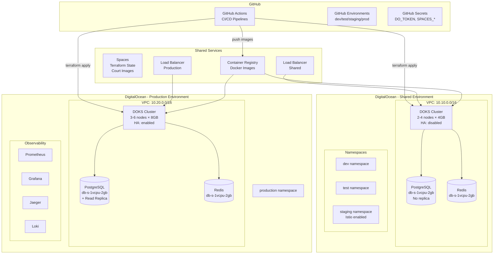
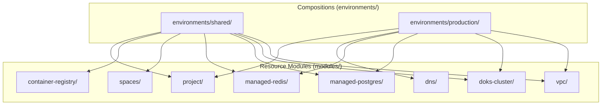
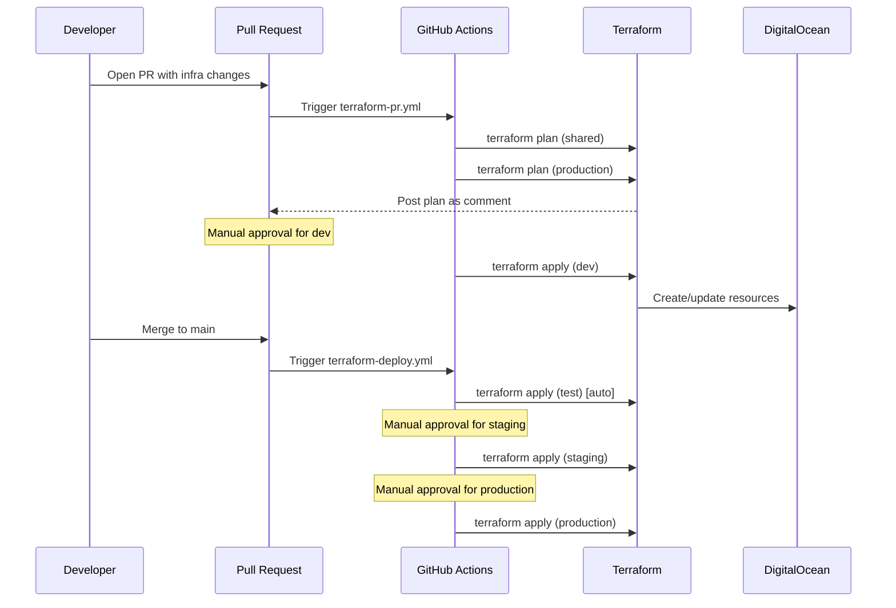

# Design Document: Phase 1 Foundation Infrastructure

## Overview

This design document details the technical implementation of the Court Booking Platform's foundational infrastructure on DigitalOcean. The infrastructure follows Infrastructure-as-Code (IaC) principles using Terraform, with a modular architecture that enables reusability across environments. The design adheres to patterns from antonbabenko's Terraform Best Practices, Gruntwork's infrastructure-modules pattern, and terraform-aws-modules' module design conventions.

The infrastructure supports two deployment environments:
- **Shared Environment**: A single DOKS cluster with namespace-based isolation for dev, test, and staging workloads
- **Production Environment**: A dedicated DOKS cluster with full high-availability and observability stack

### Design Principles (from Steering File)

| Principle | Implementation |
|-----------|----------------|
| Resource Hierarchy | Composition → Infrastructure Module → Resource Module → Resources |
| Monorepo Structure | Single repo for all infrastructure (single team, atomic changes) |
| Conditional Creation | Every module has `create` variable with `count` pattern |
| Safe Outputs | Always use `try()` for conditional resource outputs |
| Naming Convention | Underscores for HCL identifiers, dashes for cloud resource names |
| State Isolation | Separate state files for shared and production environments |
| Two-Stage Apply | Infrastructure first, then Kubernetes resources |
| VPC Isolation | All managed services placed in VPC with firewall rules |

## Architecture

### High-Level Infrastructure Architecture



### Terraform Module Hierarchy



### CI/CD Pipeline Flow



## Components and Interfaces

### Terraform Module Interfaces

#### VPC Module

```hcl
# modules/vpc/variables.tf
variable "create" {
  description = "Whether to create the VPC"
  type        = bool
  default     = true
}

variable "vpc_name" {
  description = "Name of the VPC"
  type        = string
}

variable "region" {
  description = "DigitalOcean region"
  type        = string
  default     = "fra1"
}

variable "ip_range" {
  description = "IP range for the VPC in CIDR notation"
  type        = string
}

variable "description" {
  description = "Description of the VPC"
  type        = string
  default     = ""
}

variable "tags" {
  description = "Additional tags to apply"
  type        = list(string)
  default     = []
}

# modules/vpc/outputs.tf
output "vpc_id" {
  description = "The ID of the VPC"
  value       = try(digitalocean_vpc.this[0].id, null)
}

output "vpc_urn" {
  description = "The URN of the VPC"
  value       = try(digitalocean_vpc.this[0].urn, null)
}
```

#### DOKS Cluster Module

```hcl
# modules/doks-cluster/variables.tf
variable "create" {
  description = "Whether to create the cluster"
  type        = bool
  default     = true
}

variable "cluster_name" {
  description = "Name of the Kubernetes cluster"
  type        = string
}

variable "region" {
  description = "DigitalOcean region"
  type        = string
  default     = "fra1"
}

variable "kubernetes_version" {
  description = "Kubernetes version"
  type        = string
}

variable "vpc_id" {
  description = "VPC ID for the cluster"
  type        = string
}

variable "enable_ha" {
  description = "Enable high availability for control plane"
  type        = bool
  default     = false
}

variable "auto_upgrade" {
  description = "Enable automatic Kubernetes version upgrades"
  type        = bool
  default     = true
}

variable "surge_upgrade" {
  description = "Enable surge upgrades"
  type        = bool
  default     = false
}

variable "default_node_size" {
  description = "Droplet size for default node pool"
  type        = string
  default     = "s-4vcpu-8gb"
}

variable "enable_autoscaling" {
  description = "Enable autoscaling for default node pool"
  type        = bool
  default     = false
}

variable "node_count" {
  description = "Number of nodes (when autoscaling disabled)"
  type        = number
  default     = 2
}

variable "min_nodes" {
  description = "Minimum nodes (when autoscaling enabled)"
  type        = number
  default     = 2
}

variable "max_nodes" {
  description = "Maximum nodes (when autoscaling enabled)"
  type        = number
  default     = 4
}

variable "registry_integration" {
  description = "Enable container registry integration"
  type        = bool
  default     = true
}

variable "maintenance_day" {
  description = "Day for maintenance window"
  type        = string
  default     = "sunday"
}

variable "maintenance_start_time" {
  description = "Start time for maintenance window (HH:MM)"
  type        = string
  default     = "04:00"
}

variable "additional_node_pools" {
  description = "Map of additional node pools"
  type = map(object({
    name       = string
    size       = string
    auto_scale = optional(bool, false)
    min_nodes  = optional(number, 1)
    max_nodes  = optional(number, 3)
    node_count = optional(number, 1)
    labels     = optional(map(string), {})
    tags       = optional(list(string), [])
    taints = optional(list(object({
      key    = string
      value  = string
      effect = string
    })), [])
  }))
  default = {}
}

variable "tags" {
  description = "Additional tags to apply"
  type        = list(string)
  default     = []
}

# modules/doks-cluster/outputs.tf
output "cluster_id" {
  description = "The ID of the Kubernetes cluster"
  value       = try(digitalocean_kubernetes_cluster.this[0].id, null)
}

output "cluster_endpoint" {
  description = "The API endpoint of the cluster"
  value       = try(digitalocean_kubernetes_cluster.this[0].endpoint, null)
}

output "cluster_token" {
  description = "The token for cluster authentication"
  value       = try(digitalocean_kubernetes_cluster.this[0].kube_config[0].token, null)
  sensitive   = true
}

output "cluster_ca_certificate" {
  description = "The CA certificate for the cluster"
  value       = try(digitalocean_kubernetes_cluster.this[0].kube_config[0].cluster_ca_certificate, null)
  sensitive   = true
}

output "kubeconfig" {
  description = "Raw kubeconfig for the cluster"
  value       = try(digitalocean_kubernetes_cluster.this[0].kube_config[0].raw_config, null)
  sensitive   = true
}
```

#### Managed PostgreSQL Module

```hcl
# modules/managed-postgres/variables.tf
variable "create" {
  description = "Whether to create the database cluster"
  type        = bool
  default     = true
}

variable "cluster_name" {
  description = "Name of the PostgreSQL cluster"
  type        = string
}

variable "region" {
  description = "DigitalOcean region"
  type        = string
  default     = "fra1"
}

variable "postgres_version" {
  description = "PostgreSQL version"
  type        = string
  default     = "16"
}

variable "size" {
  description = "Droplet size for database nodes"
  type        = string
  default     = "db-s-1vcpu-2gb"
}

variable "node_count" {
  description = "Number of nodes in the cluster"
  type        = number
  default     = 1
}

variable "vpc_id" {
  description = "VPC ID for private networking"
  type        = string
}

variable "project_id" {
  description = "DigitalOcean project ID"
  type        = string
  default     = null
}

variable "create_read_replica" {
  description = "Whether to create a read replica"
  type        = bool
  default     = false
}

variable "replica_size" {
  description = "Size for read replica (defaults to primary size)"
  type        = string
  default     = null
}

variable "firewall_rules" {
  description = "Firewall rules for database access"
  type = list(object({
    type  = string
    value = string
  }))
  default = []
}

variable "maintenance_day" {
  description = "Day for maintenance window"
  type        = string
  default     = "sunday"
}

variable "maintenance_hour" {
  description = "Hour for maintenance window (UTC)"
  type        = string
  default     = "03:00"
}

variable "tags" {
  description = "Additional tags to apply"
  type        = list(string)
  default     = []
}

# modules/managed-postgres/outputs.tf
output "cluster_id" {
  description = "The ID of the PostgreSQL cluster"
  value       = try(digitalocean_database_cluster.this[0].id, null)
}

output "host" {
  description = "The hostname of the PostgreSQL cluster"
  value       = try(digitalocean_database_cluster.this[0].host, null)
}

output "private_host" {
  description = "The private hostname of the PostgreSQL cluster"
  value       = try(digitalocean_database_cluster.this[0].private_host, null)
}

output "port" {
  description = "The port of the PostgreSQL cluster"
  value       = try(digitalocean_database_cluster.this[0].port, null)
}

output "database" {
  description = "The default database name"
  value       = try(digitalocean_database_cluster.this[0].database, null)
}

output "user" {
  description = "The default user"
  value       = try(digitalocean_database_cluster.this[0].user, null)
}

output "password" {
  description = "The default password"
  value       = try(digitalocean_database_cluster.this[0].password, null)
  sensitive   = true
}

output "uri" {
  description = "The connection URI"
  value       = try(digitalocean_database_cluster.this[0].uri, null)
  sensitive   = true
}

output "private_uri" {
  description = "The private connection URI"
  value       = try(digitalocean_database_cluster.this[0].private_uri, null)
  sensitive   = true
}

output "replica_host" {
  description = "The hostname of the read replica"
  value       = try(digitalocean_database_replica.read_replica[0].host, null)
}

output "platform_service_user" {
  description = "Username for platform service"
  value       = try(digitalocean_database_user.platform_service[0].name, null)
}

output "transaction_service_user" {
  description = "Username for transaction service"
  value       = try(digitalocean_database_user.transaction_service[0].name, null)
}
```

#### Managed Redis Module

```hcl
# modules/managed-redis/variables.tf
variable "create" {
  description = "Whether to create the Redis cluster"
  type        = bool
  default     = true
}

variable "cluster_name" {
  description = "Name of the Redis cluster"
  type        = string
}

variable "region" {
  description = "DigitalOcean region"
  type        = string
  default     = "fra1"
}

variable "redis_version" {
  description = "Redis version"
  type        = string
  default     = "7"
}

variable "size" {
  description = "Droplet size for Redis nodes"
  type        = string
  default     = "db-s-1vcpu-2gb"
}

variable "node_count" {
  description = "Number of nodes in the cluster"
  type        = number
  default     = 1
}

variable "vpc_id" {
  description = "VPC ID for private networking"
  type        = string
}

variable "eviction_policy" {
  description = "Redis eviction policy"
  type        = string
  default     = "allkeys_lru"
}

variable "firewall_rules" {
  description = "Firewall rules for Redis access"
  type = list(object({
    type  = string
    value = string
  }))
  default = []
}

variable "tags" {
  description = "Additional tags to apply"
  type        = list(string)
  default     = []
}

# modules/managed-redis/outputs.tf
output "cluster_id" {
  description = "The ID of the Redis cluster"
  value       = try(digitalocean_database_cluster.this[0].id, null)
}

output "host" {
  description = "The hostname of the Redis cluster"
  value       = try(digitalocean_database_cluster.this[0].host, null)
}

output "private_host" {
  description = "The private hostname of the Redis cluster"
  value       = try(digitalocean_database_cluster.this[0].private_host, null)
}

output "port" {
  description = "The port of the Redis cluster"
  value       = try(digitalocean_database_cluster.this[0].port, null)
}

output "password" {
  description = "The Redis password"
  value       = try(digitalocean_database_cluster.this[0].password, null)
  sensitive   = true
}

output "uri" {
  description = "The connection URI"
  value       = try(digitalocean_database_cluster.this[0].uri, null)
  sensitive   = true
}

output "private_uri" {
  description = "The private connection URI"
  value       = try(digitalocean_database_cluster.this[0].private_uri, null)
  sensitive   = true
}
```

### Environment Composition Interface

```hcl
# environments/shared/main.tf (structure)
locals {
  environment = "shared"
  project     = "court-booking"
  region      = "fra1"
}

module "vpc" {
  source      = "../../modules/vpc"
  vpc_name    = "${local.project}-${local.environment}"
  region      = local.region
  ip_range    = "10.10.0.0/16"
  description = "VPC for shared dev/test/staging environments"
}

module "doks" {
  source             = "../../modules/doks-cluster"
  cluster_name       = "${local.project}-${local.environment}"
  region             = local.region
  kubernetes_version = var.kubernetes_version
  vpc_id             = module.vpc.vpc_id
  enable_ha          = false
  enable_autoscaling = true
  min_nodes          = 2
  max_nodes          = 4
  # ...
}

module "postgres" {
  source              = "../../modules/managed-postgres"
  cluster_name        = "${local.project}-${local.environment}-pg"
  region              = local.region
  vpc_id              = module.vpc.vpc_id
  create_read_replica = false
  firewall_rules = [
    { type = "k8s", value = module.doks.cluster_id }
  ]
  # ...
}

module "redis" {
  source       = "../../modules/managed-redis"
  cluster_name = "${local.project}-${local.environment}-redis"
  region       = local.region
  vpc_id       = module.vpc.vpc_id
  firewall_rules = [
    { type = "k8s", value = module.doks.cluster_id }
  ]
  # ...
}
```

### Kubernetes Manifest Structure

```
kubernetes/
├── base/
│   ├── namespaces/
│   │   └── kustomization.yaml
│   ├── nginx-ingress/
│   │   ├── namespace.yaml
│   │   └── kustomization.yaml
│   ├── cert-manager/
│   │   ├── namespace.yaml
│   │   ├── cluster-issuer.yaml
│   │   └── kustomization.yaml
│   └── sealed-secrets/
│       └── kustomization.yaml
├── overlays/
│   ├── dev/
│   │   └── kustomization.yaml
│   ├── test/
│   │   └── kustomization.yaml
│   ├── staging/
│   │   └── kustomization.yaml
│   └── production/
│       ├── kustomization.yaml
│       └── observability/
│           └── kustomization.yaml
└── helm-values/
    ├── nginx-ingress-values.yaml
    ├── cert-manager-values.yaml
    ├── prometheus-values.yaml
    ├── grafana-values.yaml
    ├── jaeger-values.yaml
    ├── loki-values.yaml
    └── sealed-secrets-values.yaml
```

## Data Models

### Terraform State Structure

```
court-booking-terraform-state/
├── shared/
│   └── terraform.tfstate
└── production/
    └── terraform.tfstate
```

### Resource Naming Convention

| Resource Type | Pattern | Example |
|---------------|---------|---------|
| VPC | `{project}-{environment}` | `court-booking-shared` |
| DOKS Cluster | `{project}-{environment}` | `court-booking-production` |
| PostgreSQL | `{project}-{environment}-pg` | `court-booking-shared-pg` |
| Redis | `{project}-{environment}-redis` | `court-booking-production-redis` |
| Spaces Bucket | `{project}-{purpose}` | `court-booking-terraform-state` |
| Load Balancer | `{project}-{environment}-lb` | `court-booking-production-lb` |

### Tag Schema

All resources receive these tags:
```hcl
tags = [
  "managed-by:terraform",
  "project:court-booking",
  "environment:${var.environment}"
]
```

### GitHub Secrets Schema

| Secret Name | Description | Used By |
|-------------|-------------|---------|
| `DO_TOKEN` | DigitalOcean API token | Terraform provider |
| `SPACES_ACCESS_ID` | Spaces access key ID | Terraform backend, Spaces module |
| `SPACES_SECRET_KEY` | Spaces secret access key | Terraform backend, Spaces module |

### GitHub Environments Schema

| Environment | Protection Rules | Deployment Branch |
|-------------|------------------|-------------------|
| `dev` | Optional reviewers | Any |
| `test` | None | Any |
| `staging` | Required reviewers | Any |
| `production` | Required reviewers | `main` only |

## Correctness Properties

*A property is a characteristic or behavior that should hold true across all valid executions of a system—essentially, a formal statement about what the system should do. Properties serve as the bridge between human-readable specifications and machine-verifiable correctness guarantees.*

### Property 1: Module File Structure Compliance

*For any* Terraform module in the `modules/` directory, the module SHALL contain exactly these files: `main.tf`, `variables.tf`, `outputs.tf`, `versions.tf`, and `README.md`.

**Validates: Requirements 1.3**

### Property 2: Conditional Creation Pattern Compliance

*For any* Terraform module, when the `create` variable is set to `false`, running `terraform plan` SHALL show zero resources to be created, and all outputs SHALL return `null` or empty values without causing errors.

**Validates: Requirements 2.1, 2.2, 2.3, 2.4**

### Property 3: Terraform Identifier Naming Convention

*For any* Terraform identifier (resource name, variable name, output name, local name) in the codebase, the identifier SHALL use underscores (`_`) as word separators and SHALL NOT contain dashes (`-`).

**Validates: Requirements 1.8**

### Property 4: Cloud Resource Naming Convention

*For any* cloud resource with a `name` attribute visible in DigitalOcean console, the name SHALL use dashes (`-`) as word separators and SHALL follow the pattern `{project}-{environment}-{purpose}`.

**Validates: Requirements 1.9**

### Property 5: Resource Tagging Compliance

*For any* DigitalOcean resource that supports tags, the resource SHALL have at minimum these tags: `managed-by:terraform`, `project:court-booking`, and `environment:{env}`.

**Validates: Requirements 21.1, 21.2, 21.3, 21.4**

### Property 6: Database Firewall Isolation

*For any* database cluster (PostgreSQL or Redis), the firewall rules SHALL allow connections only from DOKS cluster resources (type `k8s`) and SHALL NOT include any public access rules.

**Validates: Requirements 20.1, 20.2, 20.3, 20.4**

### Property 7: Safe Output Access Pattern

*For any* module output that references a conditionally created resource (using `count`), the output SHALL use the `try()` function to safely handle the case when `count = 0`.

**Validates: Requirements 2.3**

### Property 8: Variable Declaration Completeness

*For any* variable declared in a module's `variables.tf`, the variable block SHALL include a `description` attribute and a `type` attribute.

**Validates: Requirements 1.5**

## Error Handling

### Terraform Apply Failures

| Error Scenario | Detection | Recovery |
|----------------|-----------|----------|
| Resource creation timeout | Terraform timeout error | Increase timeout in resource block, retry apply |
| API rate limiting | 429 response from DO API | Wait and retry with exponential backoff |
| Insufficient quota | Quota exceeded error | Request quota increase from DigitalOcean |
| State lock conflict | Lock acquisition failure | Wait for other operation to complete |
| Invalid credentials | Authentication error | Verify and update GitHub secrets |

### CI/CD Pipeline Failures

| Error Scenario | Detection | Recovery |
|----------------|-----------|----------|
| Plan fails | Non-zero exit code | Fix Terraform code, push new commit |
| Apply fails after plan | Drift between plan and apply | Re-run pipeline from plan stage |
| Artifact upload fails | GitHub Actions error | Retry workflow |
| Environment approval timeout | Workflow stuck | Manually approve or cancel |

### Kubernetes Deployment Failures

| Error Scenario | Detection | Recovery |
|----------------|-----------|----------|
| Helm release fails | Helm error output | Check values, fix and retry |
| Pod scheduling fails | Pending pods | Check node resources, scale cluster |
| Ingress not routing | 502/503 errors | Check ingress controller logs |
| Certificate issuance fails | cert-manager events | Check DNS, ClusterIssuer config |

## Testing Strategy

### Code Quality & Validation (from Steering File)

**Pre-commit Hooks**
```yaml
# .pre-commit-config.yaml
repos:
  - repo: https://github.com/antonbabenko/pre-commit-terraform
    rev: v1.96.0
    hooks:
      - id: terraform_fmt
      - id: terraform_validate
      - id: terraform_tflint
      - id: terraform_docs
```

**TFLint Configuration**
```hcl
# .tflint.hcl
config {
  call_module_type = "local"
}

plugin "terraform" {
  enabled = true
  preset  = "recommended"
}

rule "terraform_naming_convention" {
  enabled = true
}

rule "terraform_documented_variables" {
  enabled = true
}

rule "terraform_documented_outputs" {
  enabled = true
}

rule "terraform_unused_declarations" {
  enabled = true
}

rule "terraform_standard_module_structure" {
  enabled = true
}
```

### Terraform Testing Approach

**Unit Testing (terraform validate)**
- Run `terraform validate` on all modules
- Verify HCL syntax is correct
- Verify variable references are valid

**Integration Testing (terraform plan)**
- Run `terraform plan` with test fixtures
- Verify expected resources are created
- Verify no unexpected changes

**Property-Based Testing (custom scripts)**
- Validate module file structure compliance
- Validate naming conventions
- Validate tagging compliance
- Validate conditional creation patterns

### Test Execution

```bash
# Pre-commit hooks (run on every commit)
pre-commit run --all-files

# Module structure validation
./scripts/validate-module-structure.sh

# Naming convention validation
./scripts/validate-naming-conventions.sh

# Terraform validation
cd environments/shared && terraform init -backend=false && terraform validate
cd environments/production && terraform init -backend=false && terraform validate

# TFLint validation
tflint --recursive

# Plan verification (in CI)
terraform plan -detailed-exitcode
```

### Property Test Implementation

Property tests will be implemented as shell scripts that:
1. Parse Terraform files using `terraform-config-inspect` or `hcl2json`
2. Validate structural properties (file existence, naming patterns)
3. Run `terraform plan` with `create = false` to verify conditional creation
4. Check outputs for proper `try()` usage

### Test Coverage Matrix

| Requirement | Test Type | Automation |
|-------------|-----------|------------|
| Module structure | Property test | CI script + TFLint |
| Naming conventions | Property test | CI script + TFLint |
| Conditional creation | Integration test | terraform plan |
| Tagging compliance | Property test | CI script |
| Firewall rules | Integration test | terraform plan |
| CI/CD workflows | Manual verification | GitHub Actions |
| Kubernetes manifests | Dry-run apply | kubectl --dry-run |
| Code formatting | Pre-commit | terraform_fmt |
| Documentation | Pre-commit | terraform_docs |


## Additional Module Interfaces (from Steering File)

### DNS Module

```hcl
# modules/dns/variables.tf
variable "create" {
  description = "Whether to create DNS resources"
  type        = bool
  default     = true
}

variable "domain_name" {
  description = "The domain name to manage (e.g., courtbooking.app)"
  type        = string
}

variable "a_records" {
  description = "Map of A record names to IP addresses"
  type        = map(string)
  default     = {}
}

variable "cname_records" {
  description = "Map of CNAME record names to target hostnames"
  type        = map(string)
  default     = {}
}

variable "txt_records" {
  description = "Map of TXT record names to values"
  type        = map(string)
  default     = {}
}

variable "ttl" {
  description = "TTL for DNS records in seconds"
  type        = number
  default     = 300
}

# modules/dns/outputs.tf
output "domain_id" {
  description = "The ID of the domain"
  value       = try(digitalocean_domain.this[0].id, null)
}

output "domain_urn" {
  description = "The URN of the domain"
  value       = try(digitalocean_domain.this[0].urn, null)
}
```

### Spaces Module

```hcl
# modules/spaces/variables.tf
variable "create" {
  description = "Whether to create the Spaces bucket"
  type        = bool
  default     = true
}

variable "bucket_name" {
  description = "Name of the Spaces bucket (must be globally unique)"
  type        = string
}

variable "region" {
  description = "DigitalOcean region"
  type        = string
  default     = "fra1"
}

variable "acl" {
  description = "Access control list (private or public-read)"
  type        = string
  default     = "private"
}

variable "enable_cdn" {
  description = "Whether to enable CDN for the bucket"
  type        = bool
  default     = false
}

variable "cdn_custom_domain" {
  description = "Custom domain for CDN"
  type        = string
  default     = null
}

variable "cors_rules" {
  description = "CORS rules for the bucket"
  type = list(object({
    allowed_headers = list(string)
    allowed_methods = list(string)
    allowed_origins = list(string)
    max_age_seconds = number
  }))
  default = []
}

variable "lifecycle_rules" {
  description = "Lifecycle rules for automatic cleanup"
  type = list(object({
    enabled         = bool
    prefix          = string
    expiration_days = number
  }))
  default = []
}

# modules/spaces/outputs.tf
output "bucket_name" {
  description = "The name of the Spaces bucket"
  value       = try(digitalocean_spaces_bucket.this[0].name, null)
}

output "bucket_domain_name" {
  description = "The domain name of the bucket"
  value       = try(digitalocean_spaces_bucket.this[0].bucket_domain_name, null)
}

output "cdn_endpoint" {
  description = "The CDN endpoint (if enabled)"
  value       = try(digitalocean_cdn.this[0].endpoint, null)
}
```

### Container Registry Module

```hcl
# modules/container-registry/variables.tf
variable "create" {
  description = "Whether to create the container registry"
  type        = bool
  default     = true
}

variable "registry_name" {
  description = "Name of the container registry"
  type        = string
}

variable "subscription_tier" {
  description = "Subscription tier (starter, basic, professional)"
  type        = string
  default     = "basic"
}

variable "region" {
  description = "DigitalOcean region"
  type        = string
  default     = "fra1"
}

# modules/container-registry/outputs.tf
output "registry_endpoint" {
  description = "The endpoint of the container registry"
  value       = try(digitalocean_container_registry.this[0].endpoint, null)
}

output "registry_name" {
  description = "The name of the container registry"
  value       = try(digitalocean_container_registry.this[0].name, null)
}
```

### Project Module

```hcl
# modules/project/variables.tf
variable "create" {
  description = "Whether to create the project"
  type        = bool
  default     = true
}

variable "project_name" {
  description = "Name of the DigitalOcean project"
  type        = string
}

variable "description" {
  description = "Description of the project"
  type        = string
  default     = ""
}

variable "purpose" {
  description = "Purpose of the project (e.g., 'Service or API')"
  type        = string
  default     = "Service or API"
}

variable "environment" {
  description = "Environment for the project (Development, Staging, Production)"
  type        = string
  default     = "Development"
}

variable "resource_urns" {
  description = "List of resource URNs to associate with the project"
  type        = list(string)
  default     = []
}

# modules/project/outputs.tf
output "project_id" {
  description = "The ID of the project"
  value       = try(digitalocean_project.this[0].id, null)
}

output "project_urn" {
  description = "The URN of the project"
  value       = try(digitalocean_project.this[0].urn, null)
}
```

## Secrets Management (from Steering File)

Terraform does NOT store secrets. Secrets flow through CI/CD environment variables.

### Secret Injection Flow

```
┌─────────────────┐     ┌─────────────────┐     ┌─────────────────┐
│ GitHub Secrets  │────►│ GitHub Actions  │────►│ Terraform Vars  │
│ (encrypted)     │     │ (workflow env)  │     │ (TF_VAR_*)      │
└─────────────────┘     └─────────────────┘     └────────┬────────┘
                                                         │
                                                         ▼
                                               ┌─────────────────┐
                                               │ K8s Secrets     │
                                               │ (via Helm/Kust) │
                                               └─────────────────┘
```

### GitHub Secrets Required

| Secret Name | Used By | Description |
|-------------|---------|-------------|
| `DO_TOKEN` | Terraform | DigitalOcean API token |
| `SPACES_ACCESS_ID` | Terraform | Spaces access key |
| `SPACES_SECRET_KEY` | Terraform | Spaces secret key |
| `STRIPE_SECRET_KEY` | K8s Secret | Stripe API key (Phase 4) |
| `STRIPE_WEBHOOK_SECRET` | K8s Secret | Stripe webhook signing secret (Phase 4) |
| `SENDGRID_API_KEY` | K8s Secret | SendGrid API key (Phase 5) |
| `FCM_SERVICE_ACCOUNT` | K8s Secret | Firebase service account JSON (Phase 5) |
| `OPENWEATHERMAP_API_KEY` | K8s Secret | Weather API key (Phase 3) |
| `KAFKA_SASL_PASSWORD` | K8s Secret | Redpanda Serverless password |
| `JWT_PRIVATE_KEY` | K8s Secret | RS256 private key for signing (Phase 2) |
| `JWT_PUBLIC_KEY` | K8s Secret | RS256 public key for verification (Phase 2) |

### CI/CD Secret Injection

```yaml
# .github/workflows/terraform-deploy.yml
env:
  TF_VAR_do_token: ${{ secrets.DO_TOKEN }}
  TF_VAR_spaces_access_id: ${{ secrets.SPACES_ACCESS_ID }}
  TF_VAR_spaces_secret_key: ${{ secrets.SPACES_SECRET_KEY }}

jobs:
  apply:
    steps:
      - name: Terraform Apply
        run: terraform apply -auto-approve
        working-directory: environments/production
```

## External Services (Not Managed by Terraform)

### Redpanda Serverless (Kafka-Compatible)

Redpanda Serverless is provisioned via the Redpanda Cloud console, not Terraform. The platform uses Redpanda for event streaming due to its Kafka compatibility, native protocol (lower latency than HTTP-based alternatives), and serverless pricing model.

**Configuration approach:**
- Create Kafka cluster and topics via Redpanda Cloud dashboard (https://cloud.redpanda.com)
- Store connection credentials in GitHub Secrets
- Inject into Kubernetes as `Secret` resources via Helm values or Kustomize

**Required topics (create in Redpanda Cloud console):**

| Topic | Partitions | Retention |
|-------|------------|-----------|
| `booking-events` | 3 | 7 days |
| `notification-events` | 3 | 3 days |
| `court-update-events` | 3 | 7 days |
| `analytics-events` | 3 | 30 days |
| `security-events` | 3 | 30 days |

**Environment variables for services:**
```yaml
# Injected via Kubernetes Secret
KAFKA_BOOTSTRAP_SERVERS: "xxx.cloud.redpanda.com:9092"
KAFKA_SASL_USERNAME: "from-redpanda-dashboard"
KAFKA_SASL_PASSWORD: "from-redpanda-dashboard"
KAFKA_SECURITY_PROTOCOL: "SASL_SSL"
KAFKA_SASL_MECHANISM: "SCRAM-SHA-256"
```

### External APIs (Credentials Only)

| Service | Purpose | Credential Storage |
|---------|---------|-------------------|
| Stripe | Payments, Connect | GitHub Secrets → K8s Secret |
| SendGrid | Email notifications | GitHub Secrets → K8s Secret |
| Firebase | Push notifications (FCM) | GitHub Secrets → K8s Secret |
| OpenWeatherMap | Weather forecasts | GitHub Secrets → K8s Secret |
| OAuth providers | Google, Facebook, Apple | GitHub Secrets → K8s Secret |

## Kubernetes Manifest Orchestration

### Two-Stage Apply in CI/CD

Infrastructure and Kubernetes resources are applied in separate stages to avoid circular dependencies:

```yaml
# .github/workflows/deploy-production.yml
jobs:
  terraform-infra:
    name: "Stage 1: Infrastructure"
    runs-on: ubuntu-latest
    steps:
      - name: Terraform Apply (DOKS, PG, Redis, Spaces)
        run: terraform apply -auto-approve
        working-directory: environments/production

      - name: Export kubeconfig
        run: |
          doctl kubernetes cluster kubeconfig save court-booking-production

  kubernetes-resources:
    name: "Stage 2: Kubernetes Resources"
    needs: terraform-infra
    runs-on: ubuntu-latest
    steps:
      - name: Apply Kustomize base
        run: kubectl apply -k kubernetes/base/namespaces

      - name: Install NGINX Ingress (Helm)
        run: |
          helm upgrade --install nginx-ingress ingress-nginx/ingress-nginx \
            -f kubernetes/helm-values/nginx-ingress-values.yaml \
            -n ingress-nginx --create-namespace

      - name: Install cert-manager (Helm)
        run: |
          helm upgrade --install cert-manager jetstack/cert-manager \
            -f kubernetes/helm-values/cert-manager-values.yaml \
            -n cert-manager --create-namespace

      - name: Apply Kustomize overlay
        run: kubectl apply -k kubernetes/overlays/production

      - name: Install observability stack (Helm)
        run: |
          helm upgrade --install prometheus prometheus-community/kube-prometheus-stack \
            -f kubernetes/helm-values/prometheus-values.yaml \
            -n monitoring --create-namespace
```

### Kustomize vs Helm Decision

| Use Kustomize For | Use Helm For |
|-------------------|--------------|
| Namespaces | NGINX Ingress Controller |
| ConfigMaps | cert-manager |
| Service accounts | Prometheus + Grafana |
| Network policies | Jaeger |
| Ingress resources | Loki |
| Application deployments | Sealed Secrets |

### Observability Stack Resource Sizing (Production)

```yaml
# kubernetes/helm-values/prometheus-values.yaml
prometheus:
  prometheusSpec:
    resources:
      requests:
        cpu: 500m
        memory: 1Gi
      limits:
        cpu: 1000m
        memory: 2Gi
    retention: 15d
    storageSpec:
      volumeClaimTemplate:
        spec:
          storageClassName: do-block-storage
          resources:
            requests:
              storage: 50Gi
    nodeSelector:
      workload: observability
    tolerations:
      - key: dedicated
        value: observability
        effect: NoSchedule

grafana:
  resources:
    requests:
      cpu: 100m
      memory: 256Mi
    limits:
      cpu: 200m
      memory: 512Mi
  nodeSelector:
    workload: observability
  tolerations:
    - key: dedicated
      value: observability
      effect: NoSchedule
```

## DigitalOcean Resource Reference

### Droplet Sizes for DOKS Node Pools

| Size Slug | vCPUs | RAM | Use Case |
|-----------|-------|-----|----------|
| `s-2vcpu-4gb` | 2 | 4GB | Dev/test minimal |
| `s-4vcpu-8gb` | 4 | 8GB | Production workers, shared cluster |
| `s-2vcpu-2gb` | 2 | 2GB | Observability dedicated pool |

### Database Sizes

| Size Slug | vCPUs | RAM | Use Case |
|-----------|-------|-----|----------|
| `db-s-1vcpu-1gb` | 1 | 1GB | Dev/test |
| `db-s-1vcpu-2gb` | 1 | 2GB | Production (as per requirements) |
| `db-s-2vcpu-4gb` | 2 | 4GB | Future scaling |

### Container Registry Tiers

| Tier | Storage | Price |
|------|---------|-------|
| `starter` | 500MB | Free |
| `basic` | 5GB | $5/mo |
| `professional` | 50GB | $12/mo |

## Quick Reference — Decision Rules (from Steering File)

| When you need to... | Do this |
|---------------------|---------|
| Create a new resource type | Create a resource module in `modules/` with main.tf, variables.tf, outputs.tf, versions.tf |
| Add a resource to an environment | Call the module from `environments/<env>/main.tf` |
| Share data between environments | Use `terraform_remote_state` data source |
| Make a resource optional | Add `create` boolean variable, use `count = var.create ? 1 : 0` |
| Access a conditional resource output | Use `try(resource.this[0].attribute, default)` |
| Name a cloud resource | Use dashes: `"court-booking-prod-postgres"` |
| Name a Terraform identifier | Use underscores: `resource "type" "primary_database" {}` |
| Store state | DigitalOcean Spaces with S3-compatible backend |
| Deploy K8s resources | Separate Terraform apply from cluster creation, use data sources |
| Install Helm charts | Use `helm_release` resource with external values files |
| Restrict database access | Always use `digitalocean_database_firewall` with `type = "k8s"` |
| Place resources in network | Always set `vpc_uuid` / `private_network_uuid` |
| Handle secrets | Use `sensitive = true` on variables and outputs, never hardcode |
| Run CI/CD | Post `terraform plan` as PR comment, require approval for apply |
| Validate code | `terraform fmt`, `terraform validate`, TFLint, pre-commit hooks |
| Version pin providers | Use `~>` pessimistic constraint (e.g., `~> 2.75`) |
| Version pin Terraform | Use `required_version = ">= 1.5.0"` |
| Tag resources | Always include `managed-by:terraform`, `project:court-booking`, `environment:<env>` |
